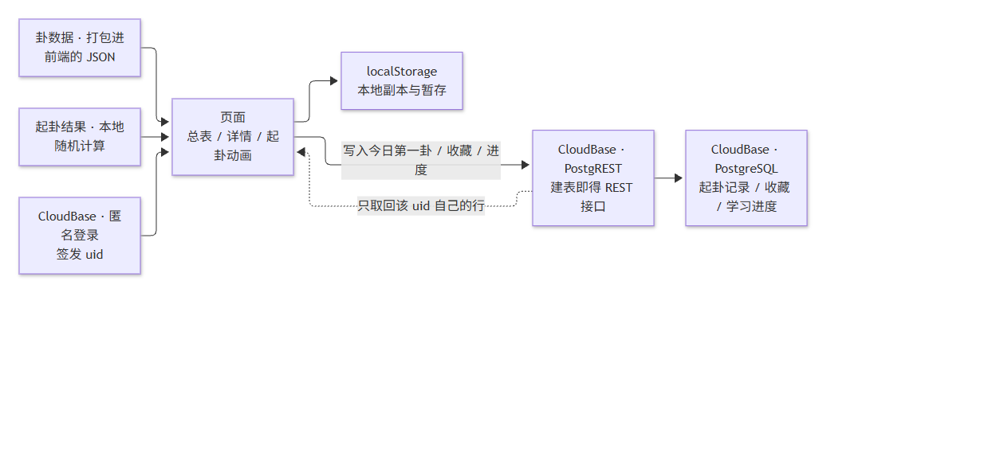
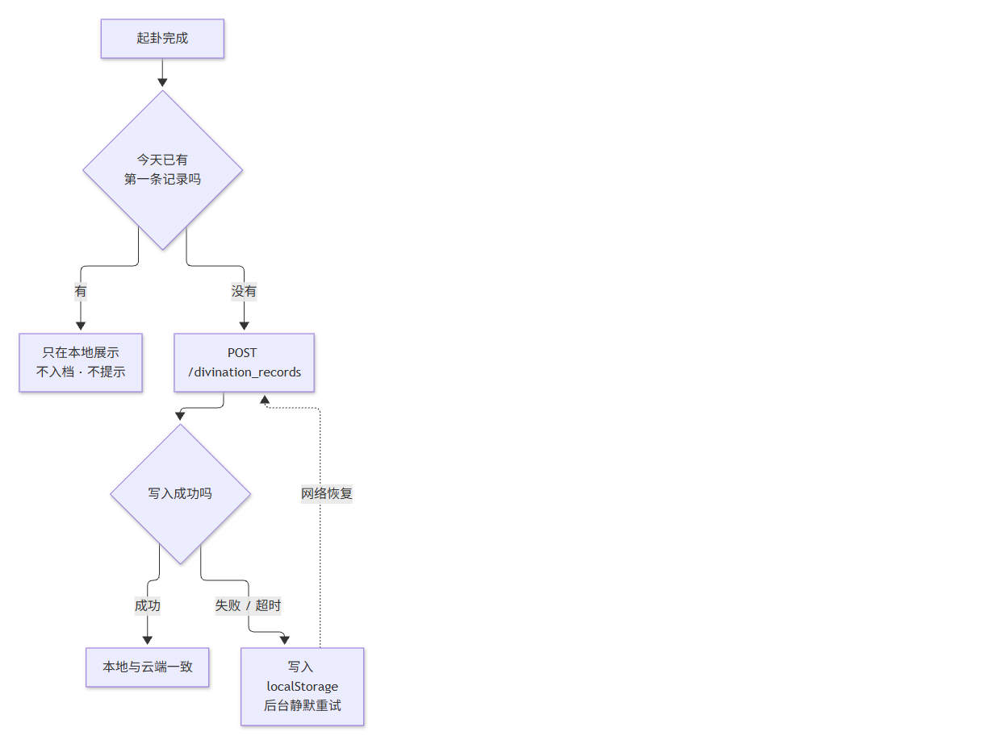

# 技术方案（TECH_DESIGN）· 易经六十四卦学习

> **项目名称**：易经六十四卦学习
> 文档版本：**v2.14** ｜ 日期：2026-09-26 ｜ 阶段：Day 8（**v2.14：总表→详情的墨侵染转场**）
>
> **v2.5** 随 PRD v1.4 在**文档层**砍掉白话（§5.1 / §5.2 由三类收为**两类**，§13.3「补上白话」一行改为取消），
> 并登记 **G8** 作为待做的代码 / 数据清理项；**v2.6 把 G8 做完**（界面块、`plain`、`meta.pending`、CSS 全清）。
> **v2.7** 把总表每行从「序号 + 卦符 + 卦名」补齐到 **F1 要求的五项**（+ 上下卦 + 卦辞），窄屏折成卡片不横滚。
>
> **v2.4 只做一件事：把悬了很久的两个待核实项——「地域」与「计费」——查清并订正**
> （§6.1 / §6.2 / §14.1 / §14.2 / §16.2 / §17）。其中包含**一处我自己错误估算的更正**（§14.2 的「82 倍」），详见 §18。
> ⚠️ 版本号此前停在 v2.0 —— v2.1–v2.3 只写进了 §18，页头没跟着升，本次一并拉平。
> 上游文档：[`docs/PRD.md`](PRD.md) v1.3（产品需求与验收标准）
> **本文档只回答「怎么落」。** 「做成什么样才算完成」以 PRD 为准。
>
> **v2.0 补齐了四件事**：方案 A / B 四维比较（§2）、项目结构（§4）、已做网页内容与字段（§5）、数据流图（§10）；
> 另把错误处理（§11）、环境变量（§12）、迁移注意事项（§13）从零散段落提升为独立小节，并新增待确认问题清单（§16）。

---

## 0. 三条硬约束（先立规矩）

| # | 约束 | 来源 |
| --- | --- | --- |
| 1 | **只用免费额度**；不开按量计费、不设预置并发 | 用户要求 + PRD §7.3 |
| 2 | **不采集身份信息**；数据库里不出现 IP、设备指纹、邮箱、手机号 | PRD §3.2 / §7.3 |
| 3 | **服务端不可用时核心功能不受影响**（起卦、看卦、答题照常，数据暂存本地） | PRD §6 F6 |

---

## 1. 技术路线（一句话）

> **前端 React + Vite 静态站点（卦数据打包进前端）＋ 后端零云函数（CloudBase PostgreSQL 的 PostgREST 自动出接口 + RLS 行级权限）＋ 部署到 CloudBase 静态网站托管。**

三条配套主张：

| 主张 | 理由 |
| --- | --- |
| **卦数据不进数据库**，打包进前端 | 64 卦约 23KB、永不变更。放数据库只会多一次网络往返、多一份计费、多一个「数据库挂了就看不了卦」的故障点 |
| **本期不写云函数** | PostgREST 建表即得 REST 接口，配合 RLS 已够用。少一层就少一个故障点和一份计费项 |
| **身份用平台匿名登录**，不自造 ID | 自造标识由前端自报、可伪造，RLS 形同虚设。详见 §8 |

---

## 2. 技术路线比较：方案 A / 方案 B（★ v2.0 新增）

> **说明**：任务清单里「方案 A / 方案 B」是空占位符，未指定具体是哪两个方案。
> 我按本项目的实际决策点定义为下面两个——**它们正好是「用不用云端持久化」这一条分岔**。
> 如果你说的 A / B 是别的组合，告诉我，我重做这一节。

### 2.1 两个方案分别是什么

| | 方案 A · 纯前端 + 本地存储 | 方案 B · 前端 + CloudBase PostgreSQL |
| --- | --- | --- |
| 数据存哪 | 浏览器 `localStorage` | 云数据库（本地仅作缓存） |
| 服务端 | **没有** | PostgREST + RLS（不写云函数） |
| 需要开通云资源 | 不需要 | 需要（1 个免费环境） |
| 需要实名 / 授权 | 不需要 | **需要** |
| 交付形态 | 一份静态文件，扔哪都能跑 | 静态文件 + 一个云环境 |

### 2.2 四维比较

| 维度 | 方案 A · 纯前端本地存储 | 方案 B · CloudBase PostgreSQL |
| --- | --- | --- |
| **学习成本** | **低。** 只需 `localStorage.setItem/getItem`，已完全掌握，当天可交付 | **中。** 需要额外学四样：① 匿名登录的调用与生命周期 ② PostgREST 的查询语法（`eq` / `order` / `limit`）③ RLS 策略的写法 ④ CLI 登录与部署流程 |
| **线上持久化** | **✗ 弱。** 清缓存 / 换浏览器 / 换设备 → **全丢**。且这是「静默丢失」，用户不知道哪天就没了 | **✓ 强。** 数据落在云端，只要匿名标识在就还在；且清理浏览器缓存不影响云端记录。**但注意：匿名标识本身仍绑当前浏览器**（见 §17 R1） |
| **费用** | **¥0，且零计费风险**。无任何资源可被计费 | **¥0（免费档）**，但有两个成本口子：① PG 的 CPU 计费口径未知（**§14.2 最大风险**）② 免费环境**有到期时间**，需续期 |
| **排错难度** | **低。** 出错只可能在前端，DevTools 一看便知，问题面 1 层 | **中高。** 故障面 4 层：前端 → 匿名登录 → REST 鉴权 → RLS 策略。**最坑的是 RLS 写错时不报错、只静默返回空数组**，看着像「没数据」，实际是权限拒绝 |

### 2.3 推荐：方案 B，理由是它是方案 A 的超集

**推荐方案 B。** 四条理由，按重要性排序：

**① 方案 B 天然包含方案 A，反过来不成立。**
本方案的降级策略（§11）就是「云端写不进去 → 写 `localStorage`」。也就是说**选了 B，等于同时拿到 A 的全部好处**（离线可用、零延迟、无网也能起卦），只是多了一层「写成功就上云」。
**这是最关键的一条：B 不是「A 之外再加东西」，而是「A 之上加了一个不那么容易丢的副本」。**

**② 产品核心卖点直接依赖「留存」，而 A 的留存是易失的。**
PRD v1.3 的功能主线是：

```
一键起卦（愿意打开）→ 三层解读 → 每日第一卦存档（愿意再打开）→ 回看时进总表深读
```

F8「过往起卦记录」的价值**全部来自「用户下次还看得到」**——回看「那天起的正是这一卦」，才是加深理解的机制。
用方案 A 意味着：**用户清了浏览器缓存，这个产品的核心卖点就归零了，而且他不知道发生了什么。** 这不是体验瑕疵，是把卖点做成了一次性的。

**③ 费用风险有封顶动作，不是开放式的。**
免费档**官方明确不支持按量计费**（§6.1），所以「账单失控」这条路本身是堵死的。剩下的风险是「额度被耗尽 → 服务停用」，而这有明确红线与回退路径（§14.3）。**最坏结果是退到方案 A，产品功能不受影响。**

**④ 唯一真实代价是排错难度，而这个可以用顺序压低。**
做法：**先建 1 张表、先跑通 1 条读写、再加第 2 张表**。把 4 层故障面拆成「一次只引入一层」，而不是一次性铺开三张表和四套策略。

### 2.4 回退条件（写清楚，这样推荐才是可证伪的）

| 触发条件 | 动作 |
| --- | --- |
| **若控制台实测** PG 的 CPU **按常驻计费**（官方口径是「共享实例按使用计量」，见 §14.2 —— 仅当实测与之相反时触发） | **立刻回退方案 A**：前端全本地存储，F6/F8 的云端部分暂缓。**产品功能一点不受影响**，只是回到 PRD v1.0 的存储方式，并在 PRD 记一笔 |
| V2 证实免费档**不能用静态托管** | 不构成回退理由。拆开处理：前端托管到别处，数据库仍在 CloudBase |
| V1 证实 PG **只在新加坡** | 不构成回退理由，只是延迟升高 |
| 云端不可达 | 不构成回退理由，走 §11 降级 |

### 2.5 被排除的方案 C：云函数路线

| | 方案 C · 前端 + 云函数 + 数据库 |
| --- | --- |
| 为什么排除 | PostgREST + RLS 已经能满足本期的全部读写需求（三张表、无跨行统计、无隐藏密钥）。走云函数等于**多一层故障点、多一份计费项、多一套部署流程**，换来的只是「逻辑更熟悉」 |

**保留的例外**：若将来出现「必须服务端计算」的需求（如全站正确率统计、调用第三方密钥服务），再补云函数。**本期没有这类需求**（PRD §6 F6 已明确不做学习报告图表）。

---

## 3. 技术栈与选型理由

| 层 | 选型 | 理由 |
| --- | --- | --- |
| 前端框架 | React 19 + Vite 8（**已实现**） | 已跑通；构建产物为纯静态文件 |
| 卦数据 | 项目内 JSON（`data/64卦.json` + `data/64卦-爻辞.json`） | 数据量小且不变，打包进前端 → **零延迟、零请求、零计费** |
| 数据库 | CloudBase PostgreSQL | 用户指定。关系型、标准 SQL、**建表即得 REST 接口** |
| 权限 | PostgreSQL RLS | 用同一套 SQL 表达「谁能看什么」，不需要自建鉴权服务 |
| 身份 | CloudBase 匿名登录（见 §8） | 满足「打开即用、无注册登录」，同时让 RLS 有主体可依 |
| 托管 | CloudBase 静态网站托管 | 用户指定。HTTPS + CDN |
| 前端依赖 | **本期不新增** | PostgREST 用普通 `fetch` 即可；是否需要 SDK 待 V4 核实后再定，**不预先写死包名** |

---

## 4. 项目结构（★ v2.0 新增）

```
yijing-64/
├─ index.html                  # Vite 入口：中文 lang、viewport、挂载 #root
├─ package.json                # 依赖：react/react-dom ^19.3；devDep：vite ^8.3 + @vitejs/plugin-react ^6.1
├─ vite.config.js              # 端口 5173、strictPort；**无代理、无后端**
├─ README.md                   # 项目说明、本地运行、产品边界、进度表
├─ AGENTS.md                   # 给 AI 的规则：Day 1 基线 6 条 + R1–R4 + 检查项（只允许追加）
├─ .gitignore                  # 排除 .workbuddy/ · Claw/ · .env · 密钥 · node_modules · dist · data/__*.json
│
├─ src/                        # 前端源码（共 2083 行，v2.10 按实际重数）
│  ├─ main.jsx                 # 挂载入口（10 行）
│  ├─ App.jsx                  # 总表页 + 详情页 + 起卦逻辑 + **hash 路由**（401 行）
│  ├─ CastingAnimation.jsx     # F7 起卦动画：太极 + 三圈爻 + 虚圆 + 水墨云团（508 行）
│  ├─ CastResult.jsx           # 起卦结果页：三层解读 / 两个交互键 / 边界声明（215 行）
│  ├─ Records.jsx              # F8 过往起卦记录与收藏（184 行）
│  ├─ storage.js               # 本地存储层：接口按**云端形状**设计，将来只换这一层（108 行）
│  ├─ mockApi.js               # 主视图的 mock 数据接口（v2.13：加载/空/错误/成功四态；F6 时只换这层）
│  ├─ InkTransition.jsx        # 总表→详情的墨侵染转场（v2.14：涟漪/侵染/墨散/归位，?transFreeze 逐帧核对）
│  ├─ HexagramFigure.jsx       # 六爻卦象图组件，从下往上渲染（40 行）
│  ├─ SourceTag.jsx            # 来源标注（只有两类：《周易》原文 / 本项目的理解）（21 行）
│  ├─ index.css                # 主样式：总表、详情、起卦按钮（332 行）
│  └─ casting.css              # 起卦动画样式：宣纸底、虚圆、动画按钮（264 行）
│
├─ data/                       # 数据（前端直接 import，不走网络）
│  ├─ 64卦.json                # 64 卦：结构 + 拼音 + 卦辞 + 象辞 + 吉凶平（24KB）
│  ├─ 64卦-爻辞.json           # 384 条爻辞 + 小象（55KB）
│  └─ 64卦总表.csv             # 原始索引：序号 / 卦名 / 卦符 / 篇章（1.2KB）
│
├─ db/
│  └─ schema.sql               # ★ 建表 + RLS（§7 的可执行版）—— §15 第 5 步执行件，**尚未在真库跑过**
│
├─ docs/                       # 文档（与代码同等重要）
│  ├─ research.md              # Day 3 需求研究：目标用户、竞品、25 天最小版本
│  ├─ PRD.md                   # 产品需求 v1.4（含验收标准与砍掉的功能）
│  ├─ TECH_DESIGN.md           # ★ 本文件
│  ├─ CLOUD_SETUP.md           # ★ 云端开通与建库：控制台逐项清单（§15 第 1–4 步给你照着点）
│  ├─ 01-学习笔记.md            # 逐卦笔记模板
│  └─ img/                     # 文档配图：*.mmd 源码 + *.png 渲染结果（成对进仓库）
│
└─ .workbuddy/                 # 工作过程记录（自检脚本 / 截图 / 工作日志）—— 不进仓库
```

**结构上的两个刻意安排：**

| 安排 | 理由 |
| --- | --- |
| **`data/` 与 `src/` 平级，不在 `src/` 里面** | 数据是长期资产（要人工校订），代码是要重构的。分开才能一眼看出「哪些改动动了数据」 |
| **`db/` 单独一层**（v2.10 新增） | SQL 是「**要被执行的东西**」，不是文档也不是前端代码 —— 放在 `db/` 里，落成文件、可 diff、可复核，避免「建表语句只活在聊天记录里」 |
| **`.workbuddy/` 不在仓库里** | 内含本机路径与工作日志，属本机私密内容，已在 `.gitignore` 排除 |

---

## 5. 目前已做的网页内容及字段（★ v2.0 新增）

### 5.1 页面上已经有什么

| 位置 | 已实现的内容 | 对应 PRD |
| --- | --- | --- |
| **总表页**（首页） | 标题「易经六十四卦学习」+ 副标题「认识卦象 · 读懂原文 · 记住卦序」 | F1 |
| | **「起一卦」按钮**：墨色、全页视觉权重最高，副文案「成事在人，莫问前程」 | **F7**（含边界声明 §1.3） |
| | 边界声明「本页不提供占卜、预测与运势判断」 | §1.3 |
| | 按上经（1–30）/ 下经（31–64）分组的 64 行，每行含**序号 + 卦符 + 卦名 + 上下卦 + 卦辞**（**v2.7 补齐**；卦辞用衬线字体栈，与原文同款）；窄屏折成三行卡片，**不出现横向滚动** | F1 |
| | **键盘操作（v2.9）**：列表里 ↑ / ↓ 在卦之间移动焦点（到头停住、不绕回），**回车即进入**（`<button>` 原生行为） | F1 交互 |
| | 页脚「共 64 卦 · 每卦含六爻爻线与上下卦 · 数据来源：…」 | F5 |
| ⚠️ | ~~尚未做：F1 交互里的「键盘上下移动 + 回车进入」~~ → **v2.9 已完成** | F1 |
| **起卦动画**（F7） | 第一段：太极双鱼**逆时针** + **三圈交错阴阳爻**（不同圈不同方向、速度不同）+ 两条**虚圆**，9 秒后同步停住并**归回标准位置** | F7 |
| | 墨从四周翻涌遮住图案（**双鱼与三圈同步渐隐**）→ **保持 1 秒** → 散去时卦象浮现（**墨散到一半才开始显**，逐帧交叉淡入淡出，不按阶段跳变） | F7 |
| | 第二段（点击「看这一爻」触发）：墨再涌、卦象随墨隐去 → 散去后**只突出那一爻，其余淡化至 10%**（淡化在墨还遮着时就完成） | F7 |
| | ⚠️ **一卦最多一个变爻**：起卦时先按「至少一爻变」的概率（≈82%，即「每爻 1/4」传统取法的期望）判定有无变爻，再在六爻中均匀取一爻 —— **解读聚焦一爻**，不做多爻齐亮 | F7 |
| | 背景黑墨**全程翻涌旋转**（含动画结束后），中心浓周边淡，不遮挡图案。**v2.11：周边加墨到会真翻涌** —— 云团 36→78、分布指数 0.44、遮罩外缘 0.10→0.52；同一定格相隔 1.2 秒的画面对变化 45%→88%（§18 v2.11） | F7 |
| **起卦结果页**（F7） | 卦头（卦名 + 第 N 卦 + 吉凶徽章 + 上下卦）→ **存档提示** → 变爻按钮 → **两个交互键**（查看解读 / 进入卦象爻辞总表）→ 三层解读（展开后自动滚到解读区）→ 收藏 / 再起一卦 → **边界声明** | F7 / F8 |
| **详情页** | 返回（**按来源**回到总表或记录页）+ **翻页（‹ 上一卦 · 名称 / 名称 · 下一卦 ›，首尾卦对应按钮置灰）** + 收藏按钮、卦头（大卦符 + 卦名 + **拼音**（v2.9）+ 吉凶徽章） | F2 |
| | **可直接打开、可分享的链接**（**v2.8**）：`#/h/<卦序>` → 该卦详情；`#/records` → 记录页；空 → 总表。**极简 hash 路由，不引路由库**（`parseHash()` + `hashchange`） | F2 边界条件 |
| | **六爻卦象图**（`HexagramFigure`）+ 上卦 / 下卦及其自然象 | F2 |
| | **卦辞 · 象辞**、**六爻爻辞**（含小象）、**吉 · 凶 · 平 + 判定依据** | F2 |
| | 来源标注（**只有 `text` / `ours` 两类**）+ ~~白话「暂无」说明块~~ —— **v2.6 已按 G8 移除** | F5 |
| **测验页**（F3） | **v2.12 新增**：看卦象选卦名，一轮 20 题。题面是**大号六爻图且不显示爻题**（爻题属于额外信息，会变成提示）；进度条「第 N / 20 题」+ 连对 / 本轮正确；答后**立刻**给出对错 + 正确答案的**卦名 + 卦符 + 序号 + 上下卦**；结果页给本轮成绩、最长连对、**错题清单（每项可点进详情页复习）**、累计与「再来一轮」。颜色语义：**朱色只表示「正确答案」**，答错用与「凶」同款的深墨（不跟正确答案抢红） | F3 |
| | **干扰项只从两处取**（PRD F3「干扰项生成规则」）：**相邻卦序（±1…±3）** 与 **同族卦（同一上卦或同一下卦）**。已用脚本跑 **500 轮 / 10,000 题、规则违例 0**，且 64 卦都会作为题面出现（`.workbuddy/check-quiz.mjs`） | F3 |
| | **进度写本机**：每轮存 `{ date, score, total, answeredIds, wrongIds }`（**只存卦序号与数字**，没有时刻、没有身份信息）；**错题本以「最后一次答到它」为准**（答对过一次就移出）；「清空我的记录」把**记录 / 收藏 / 测验进度一起清** | F3 / F8 |
| **主视图的四态**（Day 8） | **v2.13 新增**：主视图数据改走 **mock 接口**（`src/mockApi.js`，本周不接真实 API）——「成功」态内容与原来完全一致（同一份本地 JSON），但 **加载（骨架行）/ 空 / 错误 / 成功**四种状态真实出现、可单独触发：`?mock=slow`（3.5s 骨架）、`?mock=empty`、`?mock=error`。⚠️ 错误态按**时间窗**实现（页面加载后 5 秒内必失败、之后成功）而非「只失败第一次」——dev 下 React StrictMode 会把 effect 跑两遍，「只失败第一次」会被第二遍调用直接救回。错误态给明确出路（重试），空态说明为什么空。**为 F6 预演：届时只换 mockApi 的实现，状态机不动** | Day 8 课程 / F6 |
| **调试开关** | `?castSpeed=0.5` 半速播放；`?castFreeze=10100` 定格在 10.1 秒；转场用 `?transSpeed=0.5` / `?transFreeze=毫秒` ——**仅供开发核对，不是产品功能** | — |
| **转场：墨侵染**（Day 8 追加） | **v2.14 新增**：总表点某一卦 → **全屏涟漪（0–0.7s，从点击点扩出）→ 淡墨侵染（0.25–3s，墨痕累积 + 前沿亮墨，屏幕同步模糊到 7px 并压暗）→ 约 3 秒后墨散（3–3.8s）→ 卦象在屏幕中央浮现（3.5–4.6s）→ 约 1 秒后移到详情页里它本来的位置并缩放对齐（4.6–5.5s），其余内容随之浮现**。实现：`InkTransition.jsx`，两张画布（stain **不清空**累积墨痕 = 侵染感 + main 每帧合成）；墨点纹理复用起卦动画的 `makeDotTexture`；**`?transSpeed=0.5` / `?transFreeze=毫秒`** 逐帧核对；portal 挂到 body（⚠️ `.page` 上的 filter 会把 fixed 的定位基准从视口改成页面，转场层放里面「屏幕中央」会变成「整页中央」）。**实测**：blur 2.08→6.39→7.00px、墨透明度 1→0.5→0、卦象 4300ms 时在视口正中 (712,450)、5100ms 时位移 (−119,−209) 且 scale 0.816 向目标收敛；7 秒后无残留（转场层卸载、blur 变量与类名清除）；181 fps；键盘回车同样触发（涟漪起点取行中心） | F1 / F2 |

### 5.2 数据文件与字段

**① `data/64卦.json`** —— 顶层 `{ meta, items }`，`items` 64 条，每条 14 个字段（**v2.5 实测更正：白话字段从来没有进过数据** —— 只在 `meta.pending` 里登记过名字；**v2.9 补上了 `pinyin`**）：

| 字段 | 类型 | 含义 | 状态 |
| --- | --- | --- | --- |
| `id` | int | 卦序 1–64（通行本） | ✓ |
| `name` | str | 卦名，如「乾」 | ✓ |
| `symbol` | str | 卦符，Unicode U+4DC0–U+4DFF，单字符 | ✓ |
| `volume` | str | 上经 / 下经 | ✓ |
| `upperTrigram` / `upperNature` | str | 上卦名（乾）/ 自然象（天） | ✓ |
| `lowerTrigram` / `lowerNature` | str | 下卦名 / 自然象 | ✓ |
| `lines` | int[6] | 六爻爻线，1=阳 0=阴，**从下往上** | ✓ |
| `judgment` | str | **卦辞原文** | ✓ |
| `image` | str | **象辞原文** | ✓ |
| `fortune` | str | **吉 / 凶 / 平** | ✓ |
| `fortuneBasis` | str[] | 判定依据（可追溯的卦辞片段） | ✓ |
| `pinyin` | str | 卦名拼音（**v2.9 已补齐 64/64**；多音字按卦名传统读音人工裁定，见 `meta.verified.pinyin`） | ✓ |
| ~~`judgmentPlain` / `imagePlain`~~ | — | ~~卦辞 / 象辞白话~~ | **v2.5 更正：该字段从未进过数据**（只在 `meta.pending` 里登记过），故无需删数据 |

**② `data/64卦-爻辞.json`** —— 顶层 `{ meta, byId }`，`byId` 以卦序字符串为键，每卦 6 条，共 **384 条**，每条 3 个字段：

| 字段 | 类型 | 含义 |
| --- | --- | --- |
| `label` | str | 爻题，如「初九」「六三」 |
| `text` | str | 爻辞原文 |
| `xiang` | str | 小象 |

**③ `data/64卦总表.csv`** —— 序号 / 卦名 / 卦符 / 篇章，源数据索引。

**数据可信度（这一点值得单独说）：**

| 校验 | 方法 | 结果 |
| --- | --- | --- |
| 六爻爻线与上下卦 | 6 组自动校验 + **41 条外部全名**（百度百科）逐条比对 | **0 矛盾** |
| 爻题阴阳 与 `lines` | **384 条交叉验证**——爻题来自文本转录、`lines` 来自上下卦推导，**两个独立来源** | **0 不一致** |
| 卦辞 vs 通行本 | 与王弼本逐条核对 | 一致（另修正源数据 2 处瑕疵） |
| 卦符码点 | U+4DC0–U+4DFF 连续 | 通过 |

> **v2.5（对应 PRD v1.4）：白话整层砍掉。** 原先的「一律留空、显示待补」升级为「**不做**」——
> 版权与准确性两个问题都没有干净解法，而「原文与解读分层可见」这一条边界已经承担了「看得懂」的职责。
> **数据字段、界面说明块、`plain` 标注类型全部移除 —— v2.6 已完成**（见 §5.3 G8）。

### 5.3 代码与数据的差距（G1–G8 全部已修）

**2026-09-21 记录时的状态**：数据已补齐，但界面还停留在旧状态。原登记 7 项差距，**G1–G6 当晚已修完**：

| # | 差距 | 状态 | 实现方式 |
| --- | --- | --- | --- |
| G1 | 详情页仍显示「待补内容」块，而数据已入库 | ✅ **已修**（v2.5 再调） | 换成真实的卦辞 / 象辞 / 六爻爻辞；~~「待补」只保留白话一项~~ —— **v2.5：白话层砍掉，这一项也随之删除，见 G8** |
| G2 | 详情页未展示 `judgment` / `image` / `fortune` | ✅ **已修** | 新增「卦辞 · 象辞」「六爻爻辞」「吉 · 凶 · 平」三节，每节带来源标注 |
| G3 | 结果页缺**「进入卦象爻辞总表」并定位高亮本卦** | ✅ **已修** | 结果页加交互键 → 回总表并 `scrollIntoView` 定位，本卦加朱色高亮（`.item.is-hit`） |
| G4 | 结果页缺**三层解读** | ✅ **已修** | 新增 `CastResult.jsx`：三层固定顺序 + 第三层必带「非原文」标注；展开后自动滚到解读区 |
| G5 | 结果页缺**边界声明** | ✅ **已修** | 结果页底部「**成事在人，莫问前程**」+ 不预测不建议说明 |
| G6 | `fortune` 已入库但界面完全未使用 | ✅ **已修** | 吉 / 凶 / 平 徽章 + 第三层方向由它决定 + 详情页显示**判定依据**（可追溯到卦辞） |
| G7 | F8 每日第一卦存档、收藏均未实现 | ✅ **已修（本地版）** | 新增 `src/storage.js`（本地存储层）+ `src/Records.jsx`（记录与收藏页）；起卦时自动判定「今日首卦」并入档，结果页提示「今天的卦已记录」或「本卦仅作娱乐，不入记录」；结果页与详情页都能收藏 |
| **G8** | 白话层的清理（v2.5 登记 → **v2.6 已完成**） | ✅ **已修（Day 7）** | ① `App.jsx` / `CastResult.jsx` 的「白话译文暂无」块 → **已删**；② `SourceTag.jsx` 的 `plain` 类型 → **已删**，现只剩 `text` / `ours`；**顺带修掉一处隐藏 bug**：`CastResult.jsx` 第一层（卦象说什么）原先写的是 `kind="plain"`，类型删掉后会渲染成**空标签** → **已改为 `ours`**（它本来就是本项目的推导）；③ `data/64卦.json` 的 `meta.pending` → **已改为 `["pinyin","lineTexts"]`**；④ `index.css` / `casting.css` 里 `pending-note`、`cr-pending` 的样式与注释 → **已清理**。**实测**：详情页与起卦结果页搜「白话」**零命中**；三层解读标签依次为「本项目的理解 / 《周易》原文 / 本项目的理解」 |

**G7 的说明：为什么先做本地版**

`storage.js` 的读写接口是按**云端形状**设计的（`loadRecords` / `archiveFirstOfToday` / `toggleFavorite` / `clearAll`），
**将来接 CloudBase 时只替换这一层，上层组件一行不改**。理由有三：

1. **不卡在 V1–V4 待核实上** —— F8 是 P0，但它不该被云环境的未知数阻塞
2. **本地可用本来就是硬约束 3 的要求**（服务端不可用时功能不受影响），所以这不是「临时方案」，而是**必须有的那一半**
3. 存储字段严格照 PRD：起卦记录 `date / hexagramId / changingLines`，收藏 `hexagramId / date` —— **没有精确时刻字段**（验收项明确要求）

**尚未做（等云环境）**：PRD F8 最后一条验收「断网时起卦仍写入本地记录，**联网后自动补写云端**」——
云端那一半要等环境开通，届时补写逻辑加在 `storage.js` 里，不动上层。

**修复时新发现并一并处理的两件事**：

| 发现 | 处理 |
| --- | --- |
| 结果页把文字压在水墨上，**灰色小字与深墨撞在一起读不清** | 面板加**宣纸底衬**（顶部透明 → 往下渐次压实），并把结果页的背景墨浓度由 0.26 降到 **0.14** |
| 多音字 / 生僻字**在页面上可能显示成方块** | 原文块统一用衬线字体栈，末尾带 `SimSun-ExtB`（覆盖扩展区），实测「劓刖」「徽纆」「覆公餗」「繻有衣袽」均正常 |

---

## 6. 平台能力核实结果（★ 请先读这一节）

写方案时实际查证了 CloudBase 官方文档。**以下严格区分「已核实」与「待核实」**——待核实的部分我不会当作事实使用。

### 6.1 已核实

| 项 | 结论 | 来源 |
| --- | --- | --- |
| PostgreSQL 支持 | CloudBase **提供 PostgreSQL 环境**（与文档型 / MySQL 并列的环境类型） | 腾讯云产品页 |
| PG 的接口能力 | 自带 **PostgREST**（建表即得 REST API）、**RLS 行级权限**、`postgresql://` 直连 | 腾讯云产品页 |
| 身份方式 | 支持**匿名登录**，且共 10+ 种（微信 / 手机号 / 邮箱 / Google 等） | 腾讯云产品页 |
| **免费档不含按量计费** | 免费档说明原文：`Resource packs and pay-as-you-go not available` | CloudBase 定价页 |
| 免费档额度 | **¥0/月，每月 3,000 资源点，每账号 1 个免费环境**（1,000 点 ≈ ¥1） | CloudBase 定价页 |
| 静态托管能力 | 支持，含 HTTPS + CDN，可用 CLI 部署 | CloudBase 文档 |
| CLI 命令 | `npm i -g @cloudbase/cli` → `tcb login` → `tcb env list` / `tcb env use <envId>`；部署用 `tcb hosting deploy dist -e <envId>` | CloudBase 文档 |
| WorkBuddy 接入方式 | 官方说明中**点名 WorkBuddy 有内置 CloudBase 连接器**，优先走内置路径 | CloudBase skill 文档 |
| 官方明确禁止 | 「**不要编造 env ID / 密钥**」「**不要跳过登录授权**」「不要用 `tcb deploy`，要用 `tcb fn deploy` / `tcb hosting deploy` 这类明确命令」 | CloudBase skill 文档 |
| **PG 支持地域**（v2.4 新增） | **上海与新加坡都支持 PostgreSQL**；上海同时支持传统模式（文档型 / MySQL），**新加坡为 PG 专属**地域 | 购买指南功能表 + [2026-07-27 官方博客](https://tcb.cloud.tencent.com/blog/2026/07/27/singapore-region) + 产品页 FAQ |
| **PG 计费口径**（v2.4 新增） | CPU `342 点/(核·小时)`、容量 `0.5 点/GB·小时`；备注原文**「共享实例按使用进行计量」** → **按实际用量**扣点 | [资源点价格文档](https://cloud.tencent.com/document/buy-guide/876/127357)（上海地域） |
| **免费档不会产生账单**（v2.4 新增） | 免费环境**不支持加购资源包、不支持按量付费** → 额度耗尽表现为**功能受限，不是扣费** | 购买指南「免费体验」 |
| **免费环境有到期日**（v2.4 新增） | 单次续期 **6 个月**、**到期前 1 个月内可续、不支持自动续费**；到期进停服隔离期，未转付费将**销毁环境** | 购买指南「免费体验」 |
| **创建免费环境需兑换码**（v2.4 新增） | 自 2026-01-16 起，每账号可用**一次性兑换码**创建一个免费体验环境（领取方式见购买页说明） | 购买指南「免费体验」 |
| **静态托管在功能表内**（v2.4 新增） | 静态网站托管在上海 / 新加坡、两种数据库类型下**均标「支持」**；定价页也把它列为免费档包含能力 | 购买指南功能表 + 定价页 |

### 6.2 待核实（**必须在控制台确认，不要当作事实**）

> **★ v2.4 澄清（2026-09-22）：原本的 V1「两处官方口径互相矛盾」是一次误读。**
>
> 购买指南那张表的表头是 **「地域」×「数据库类型」（云数据库 / PostgreSQL）**，**不是**「该地域支不支持 PG」。
> 按两列读，上海那半张表的含义是「选**云数据库**类型 → 文档型 / MySQL；选 **PostgreSQL** 类型 → PG」，
> 而新加坡那半张表只有一个 PG 列（因为它**只**支持 PG 环境）。三处旁证一致：
> ① 2026-07-27 官方博客：「上海地域与云数据库(FlexDB)环境**共存**，新加坡地域为 **PG 专属**」；
> ② 产品页 FAQ：「**当前支持上海、新加坡两个地域**。上海地域 PG 模式与传统模式共存」；
> ③ PG 环境返回示例里写着 `"Region": "ap-shanghai"`。
> **→ 上海、新加坡都支持 PG，且上海单价更低**（CPU 342 vs 587 点/核·小时；容量 0.5 vs 3.68 点/GB·小时）。
> V3 的计费口径也已在文档层面查清（见 §14.2）。**但下面四项仍要在控制台亲眼确认 —— 文档 ≠ 控制台。**

| # | 待确认 | 怎么确认 | v2.4 现状 |
| --- | --- | --- | --- |
| **V1** | 创建环境时**地域选择器里上海能否选到 PostgreSQL 类型** | 购买 / 创建环境页面**亲眼确认** | **文档层面已澄清为「能」**；控制台仍是唯一权威 |
| **V2** | 免费档能否用**静态网站托管** | 创建环境后看控制台是否出现该入口 | **降为低风险**：功能表两个地域均标「支持」，定价页也列为免费档能力 |
| **V3** | **PG 的真实资源点消耗走势**（口径已查清，剩下的是实测） | 建库后**观察 24 小时资源点消耗**再继续开发 | 计费口径已明确（§14.2）；**待观察**的是真实用量与**空闲自动暂停的阈值** |
| **V4** | RLS 当前用户函数名 / REST 路径前缀 / 前端 SDK 包名 | 查 CloudBase PG 官方接口文档 | 不变（**仍不要照抄 §7.3 与 §9 的示意代码**） |

> **纪律**：V1–V4 仍以控制台为准。**在亲眼看到之前，任何涉及数据库写入的操作都不执行。**

---

## 7. 数据库设计

### 7.1 表结构（示意，字段与 PRD §7.3 一一对应）

```sql
-- ① 起卦记录：每日第一卦，一天最多一条（F8）
create table if not exists divination_records (
  uid            text not null,                     -- 匿名登录返回的用户标识
  date           date not null,                     -- 用户本地日期，一天一条
  hexagram_id    smallint not null check (hexagram_id between 1 and 64),
  changing_lines smallint[] not null default '{}',  -- 变爻位置（1-6），可为空数组
  created_at     timestamptz not null default now(),
  primary key (uid, date)                           -- 主键即「一天一条」的强制约束
);

-- ② 收藏
create table if not exists favorites (
  uid         text not null,
  hexagram_id smallint not null check (hexagram_id between 1 and 64),
  created_at  timestamptz not null default now(),
  primary key (uid, hexagram_id)
);

-- ③ 学习进度（F3 测验用，本期为 P1）
create table if not exists study_progress (
  uid            text primary key,
  answered_total integer not null default 0,
  correct_total  integer not null default 0,
  wrong_ids      smallint[] not null default '{}',
  created_at     timestamptz not null default now(),
  updated_at     timestamptz not null default now()
);

-- 每轮成绩：用于「看到分数变化」
create table if not exists study_rounds (
  id         bigserial primary key,
  uid        text not null,
  score      smallint not null,
  total      smallint not null default 20,
  created_at timestamptz not null default now()
);

create index if not exists idx_rounds_uid_time on study_rounds (uid, created_at desc);
```

**三个设计要点：**

| 要点 | 说明 |
| --- | --- |
| **`primary key (uid, date)`** | 用**数据库主键**强制「一天一条」，不靠应用层判断。重复插入会自然失败，服务端不需要额外查重逻辑 |
| **用 `date` 而不是 `timestamptz`** | 落实 PRD §7.3「不存精确时刻」的红线；同时避开时区歧义（存的是用户本地日期） |
| **`changing_lines` 用数组** | 变爻可能有 0 至 6 个 |

### 7.2 明确「不进数据库」的字段（照抄 PRD §7.3 红线）

姓名、手机号、邮箱、第三方账号、身份证件、**IP 地址**、**设备指纹**、**User-Agent 原始串**、地理位置、任何行为埋点 / 点击流 / 停留时长。

> **实现注意**：云函数或网关的默认日志**可能自动记录 IP 与 UA**。本方案不写云函数，天然规避了这一项；若将来补云函数，**必须确认日志级别与字段**，不能出现「业务表干净但日志里全是 IP」的情况。

### 7.3 行级权限（RLS）

思路：**每个用户只能看见和修改 `uid` 等于自己的那一行**。策略写法示意（**函数名待 V4 核实**）：

```sql
alter table divination_records enable row level security;

create policy "read own records"   on divination_records for select using (uid = auth.uid()::text);
create policy "insert own records" on divination_records for insert with check (uid = auth.uid()::text);
create policy "delete own records" on divination_records for delete using (uid = auth.uid()::text);
-- ⚠️ 故意不建 update 策略 —— 对应 PRD F8「记录不可事后编辑」

alter table favorites enable row level security;

create policy "read own favorites"   on favorites for select using (uid = auth.uid()::text);
create policy "insert own favorites" on favorites for insert with check (uid = auth.uid()::text);
create policy "delete own favorites" on favorites for delete using (uid = auth.uid()::text);

alter table study_progress enable row level security;

create policy "read own progress"   on study_progress for select using (uid = auth.uid()::text);
create policy "insert own progress" on study_progress for insert with check (uid = auth.uid()::text);
create policy "update own progress" on study_progress for update using (uid = auth.uid()::text)
                                                                 with check (uid = auth.uid()::text);

alter table study_rounds enable row level security;
create policy "read own rounds"   on study_rounds for select using (uid = auth.uid()::text);
create policy "insert own rounds" on study_rounds for insert with check (uid = auth.uid()::text);
```

> **「不建 update 策略」是刻意的**：让 F8 的「记录不可事后编辑」成为**数据库层的硬约束**，而不是靠前端自觉——前端再怎么改也改不了已存的记录。
>
> 若 V4 确认函数名不同，只需替换 `auth.uid()`，策略结构不变。

---

## 8. 身份方案：用平台自带的匿名登录，而不是自己造 ID

**PRD 的原始设计**是「自造 `anonId` 存本地」。**核实平台能力后，改用更好的做法。**

| | 方案 B1 · 平台匿名登录（**已选定**） | 方案 B2 · 自造 anonId（PRD 原始描述） |
| --- | --- | --- |
| 怎么做 | 调用 CloudBase 匿名登录，拿到标准用户标识 | 前端 `crypto.randomUUID()` 生成，存 localStorage |
| RLS 能否生效 | ✅ 能，权限由数据库层强制 | ❌ 不能，标识由前端自报，**可被伪造** |
| 需要写后端吗 | 不需要 | 需要云函数校验，且校验逻辑本身要靠传参信任前端 |
| 用户感知 | 无感知（不是登录页） | 无感知 |
| 换设备 / 清缓存 | 一样会丢 | 一样会丢 |

**结论：选 B1。** 它同样满足 PRD「打开即用、无注册登录、不采集身份信息」，但多了一层**数据库层强制的数据隔离**——B2 的安全性完全依赖前端自觉，这在生产上不可接受。

> **PRD 已完成同步**：PRD 变更记录 v1.1.1 已补说明——功能语义完全一致，实现主体从「前端自造」变为「平台匿名登录」，**不改产品行为**。

---

## 9. API 列表（★ v2.0 汇总）

**全部由 PostgREST 自动生成——建表即得，本方案不写一行后端接口代码。**
下表路径为示意，**实际前缀与鉴权头以 CloudBase PG 接口文档为准（V4）**。

| # | 方法 | 路径 | 用途 | 对应功能 | 备注 |
| --- | --- | --- | --- | --- | --- |
| 1 | `POST` | `/divination_records` | 写入**今日第一卦** | **F8** | 同日重复写会**主键冲突**，前端据此判断「今天已记录」 |
| 2 | `GET` | `/divination_records?uid=eq.<uid>&order=date.desc` | 过往起卦记录列表 | **F8** | 按日期倒序，供「回看那天起的卦」 |
| 3 | `DELETE` | `/divination_records?uid=eq.<uid>` | 清空我的记录 | F8 / PRD §7.3 | 本地与云端同时删 |
| 4 | `POST` | `/favorites` | 收藏某卦 | **F8** | 重复收藏 → 主键冲突，天然幂等 |
| 5 | `GET` | `/favorites?uid=eq.<uid>&order=created_at.desc` | 收藏列表 | **F8** | |
| 6 | `DELETE` | `/favorites?uid=eq.<uid>&hexagram_id=eq.<n>` | 取消收藏 | **F8** | |
| 7 | `GET` | `/study_progress?uid=eq.<uid>&select=*` | 读学习进度 | F6 / F3 | |
| 8 | `POST` | `/study_progress` | 首次写入进度 | F6 | |
| 9 | `PATCH` | `/study_progress?uid=eq.<uid>` | 更新进度 | F6 | |
| 10 | `POST` | `/study_rounds` | 写入一轮成绩 | F3（P1） | |
| 11 | `GET` | `/study_rounds?uid=eq.<uid>&order=created_at.desc&limit=10` | 最近成绩 | F3（P1） | 供「看到分数变化」 |
| — | — | — | **卦数据不走 API** | — | 64 卦与 384 条爻辞**打包进前端**，零请求 |

**两条约束：**

1. **查询语法是 PostgREST 的通用写法**（`eq` / `order` / `limit` / `select`），不是自造约定。
2. **所有写接口都允许失败**——失败不阻断用户动作，见 §11。这是硬约束 3 的落实方式。

### 9.1 什么时候才需要云函数

只有两种情况：

1. **需要跨行事务的统计**（如全站正确率分布）——本期不做（PRD 明确不做学习报告图表）
2. **需要隐藏的密钥调用**（如接第三方服务）——本期没有

**因此本期计划：不写云函数。**

---

## 10. 数据流（★ v2.0 新增，含数据流图）

### 10.1 数据流图：数据从哪来、到哪去



> **本图的文字源码**保留在 [`docs/img/data-flow.mmd`](img/data-flow.mmd)，改动后重新导出即可。
>
> ⚠️ **为什么不直接写 Mermaid 代码块**：实测 GitHub 的 Mermaid 渲染器对本图报 `Unable to render rich display`（本地同语法、strict 模式下可正常渲染，判定为 GitHub 侧版本差异，见 §10.5），所以**改为提交渲染结果**，保证在 GitHub 上一定能看到图。

### 10.2 数据从哪来

| 数据 | 来源 | 是否走网络 |
| --- | --- | --- |
| 64 卦结构、卦辞、象辞、吉凶平 | `data/64卦.json`（**打包进前端构建产物**） | **不走**。随页面一起下载一次 |
| 384 条爻辞、小象 | `data/64卦-爻辞.json`（同上） | **不走** |
| 起卦结果 | 浏览器本地随机计算（`castOnce()`） | **不走**。断网也能起卦 |
| 用户标识 `uid` | CloudBase 匿名登录签发 | 走（仅首次） |
| 起卦记录 / 收藏 / 学习进度 | CloudBase PostgreSQL | 走（可失败，见 §11） |

### 10.3 数据到哪去（按时间顺序）

1. **首次访问** → 申请匿名身份 → 拿到 `uid`（**失败则退化为纯本地模式**，功能不减）
2. **用户起卦** → 本地算出卦 + 变爻 → **先写 `localStorage`** → 再尝试写云端
3. **写云端失败 / 超时** → 保留本地副本并标记待重试，**页面不弹错误框**
4. **下次打开** → 读云端与本地，**取更新时间较新的一份**
5. **用户清空记录** → 本地与云端**同时删除**，不可恢复

### 10.4 起卦写入的判定流程（含错误分支）

F8 有个关键规则：**每日只记第一卦**，当日后续起的卦**仅作娱乐、不入档**。它的实现与失败处理：



> 源码见 [`docs/img/cast-write-flow.mmd`](img/cast-write-flow.mmd)。

> **「有没有第一条」不需要先查再写**：直接 POST，靠**主键冲突**判断——少一次网络往返，也避免并发下的竞态。

### 10.5 关于 Mermaid 渲染的说明（★ 踩坑记录）

| 情形 | 结果 |
| --- | --- |
| 本地渲染（mermaid 11，`securityLevel` 分别为 `loose` 与默认 `strict`） | **两张图都成功** |
| GitHub 页面渲染（同一份语法） | **两张图都报 `Unable to render rich display`** |

**处理方式**：不再与 GitHub 的渲染行为较劲——**把图渲染成 PNG 提交进仓库**，同时**保留 `.mmd` 文字源码**（可 diff、可重新导出）。这样图一定看得见，源也一定留得住。

> **这个坑值得记住**：文档里内嵌 Mermaid 看似优雅，但**渲染权不在自己手里**。凡是「图必须被看到」的场合，导出成图片更稳。

---

## 11. 错误处理（★ v2.0 独立成节）

### 11.1 一条总原则

> **云端异常绝不能阻断用户动作。** 起卦、看卦、翻页、答题全部在本地可完成；云端的角色是「备份」，不是「依赖」。

实现方式：所有云端调用都包在 **超时 + 静默失败** 里，任何异常都只写日志、不弹框、不阻塞渲染。

### 11.2 逐场景处理

| # | 场景 | 表现 | 处理 | 是否告知用户 |
| --- | --- | --- | --- | --- |
| E1 | 匿名登录失败 | 无 `uid` | 退化为**纯本地模式**，功能不减，只是不同步 | 顶部一行轻提示，不弹窗 |
| E2 | 写云端超时 / 失败 | 请求无响应 | 写 `localStorage` + 标记待重试，后台静默重试 | **不告知**（用户的动作已成功） |
| E3 | 写云端冲突（今日已有记录） | `409` / 主键冲突 | **这是正常业务结果**，不是错误。本地展示，不入档 | 不告知（PRD F8 就是这么设计的） |
| E4 | 读云端返回空数组 | `[]` | **先排查是不是 RLS 拒绝**（RLS 拒绝时不报错、只返回空），再决定是否回退本地 | 若本地有数据则用本地 |
| E5 | 网络完全断开 | 请求不可达 | 全部走本地；恢复后补写 | 顶部一行轻提示 |
| E6 | 数据文件字段缺失（如 `pinyin` 待补） | 渲染出 `undefined` | 显示「待补」占位，**不报错、不空白** | 界面自然体现 |
| E7 | 生僻字字体缺失（如 `𬙊` `𫗧` `𦈡` 三个扩展区字） | 显示成豆腐块 | **已处理**：原文块字体栈末尾加 `SimSun-ExtB`（Windows 自带，覆盖 CJK 扩展区），实测「劓刖」「徽纆」「覆公餗」「繻有衣袽」正常 | 界面自然体现 |

### 11.3 明确不做的错误处理

| 不做 | 理由 |
| --- | --- |
| 不做错误上报 / 埋点 | 违反硬约束 2（不采集行为数据） |
| 不做「重试 N 次后弹窗」 | 用户的动作已经完成，弹窗只会制造焦虑 |
| 不做在线状态指示灯 | 起卦看卦本来就不需要网络，提示反而暗示「本产品依赖网络」 |

---

## 12. 环境变量（★ v2.0 独立成节）

### 12.1 核心结论：**前端不需要密钥**

这是「匿名登录 + RLS」这套设计的目的之一——**前端只放公开配置，不放任何密钥**。理由：

- 匿名登录的凭据由平台 SDK 走自己的流程获取，**不需要我们在前端存**
- 数据隔离由**数据库层 RLS 强制**，即使前端被人改坏，也读不到别人的行

### 12.2 可能需要的变量（**命名待核实，不要照抄**）

| 变量（建议命名） | 用途 | 敏感 | 状态 |
| --- | --- | --- | --- |
| `VITE_TCB_ENV_ID` | 指向 CloudBase 环境 | 否 | 待环境创建后确定 |
| `VITE_TCB_REGION` | 地域（V1 确认后填） | 否 | **待 V1** |
| `VITE_TCB_REST_ENDPOINT` | PostgREST 端点 | 否 | **待 V4** |
| `VITE_TCB_CLIENT_KEY` | **客户端可公开**的 API Key（若平台要求） | **否** | **待 V4** |

> **必须区分两类密钥**：客户端 Key（设计上就是公开的，放前端没问题）vs 服务端密钥（**绝不能进前端、绝不能进仓库**）。

### 12.3 管理纪律

| 规则 | 说明 |
| --- | --- |
| `.env` 已在 `.gitignore` | 且额外忽略 `.env.*`，只放行 `.env.example` |
| 提供 `.env.example` | 只写**变量名与说明**，不写真实值 |
| **不要求用户粘贴真实密钥** | 当前设计下前端根本不需要密钥；若哪一步需要用户提供密钥，**先停下来确认** |
| 服务端密钥一律进**云函数环境变量** | 不进前端、不进仓库（本期无云函数，故暂无此项） |

---

## 13. 部署与迁移注意事项

### 13.1 部署

**前端（静态网站托管）：**

```
npm run build                 # 产出 dist/
tcb hosting deploy dist -e <环境ID>
```

> `tcb app deploy --framework vite -e <环境ID>` 可一条命令跑完「装依赖 → 构建 → 上传」，适合本地不方便构建时使用。

**访问地址**：默认域名为 `<环境ID>.xxx.tcloudbaseapp.com`（**具体域名规则以控制台实际显示为准**）。

**数据库**：建表 SQL 需在环境创建后执行，**执行前给你过目**。

### 13.2 迁移注意事项

| # | 迁移类型 | 注意点 |
| --- | --- | --- |
| M1 | **数据文件结构变更** | `64卦.json` 每加一个字段，受影响的是：`App.jsx` 的渲染、`meta.pending` 列表、PRD §7.1 的字段表、README 的目录说明。**改数据前先列影响面**（见 §13.3） |
| M2 | **数据库迁移** | SQL 放 `db/migrations/`，命名 `001_init.sql`；**全部写成幂等**（`create table if not exists`；建策略前先 `drop policy if exists`），这样重跑不会炸 |
| M3 | **本地 → 云端迁移** | 把 `localStorage` 里的暂存记录补写上去；**冲突靠主键自然去重**，不需要额外的比对逻辑 |
| M4 | **换环境迁移** | ⚠️ **`uid` 由平台签发，换环境等于换身份，云端数据不会跟随**。免费环境**有到期时间**，续期失败会导致环境隔离 → 数据虽保留但访问不了。**这是目前最需要在意的一条**：跨设备/跨环境的恢复能力要靠 v1.1 的「进度码」解决，本期不做 |
| M5 | **域名 / 访问来源变更** | 从 `localhost:5173` 切到托管域名后，需确认 CORS 是否放行新来源（若 PostgREST 有来源限制） |
| M6 | **版本同步纪律** | PRD 改 → 本文件同步 → 用 §13.3 的清单列出受影响文件 → 跑 `.workbuddy/doc-check.py` → 提交推送。**不让文档之间出现互相矛盾的说法** |

### 13.3 方案变化时哪些文件会受影响（余力加练）

| 如果发生这个变化 | 受影响文件 | 现在就要做什么 |
| --- | --- | --- |
| **控制台实测 V3 = 按常驻计费** → 回退纯本地存储 | PRD §7.3（存储方式）、`TECH_DESIGN` §2.4 / §14、`App.jsx`（读写逻辑）、本表 | 无需现在做，**红线已写明**（口径见 §14.2：按使用计量） |
| **V2 证实免费档不能托管** → 前端改托管他处 | `TECH_DESIGN` §13.1、README 技术栈行、PRD §3.2 | 无需现在做 |
| **V1 控制台里真的只能选新加坡**（文档层面已澄清为「上海可选」，见 §6.2） | `TECH_DESIGN` §6.2 / §12.2（`VITE_TCB_REGION`）、README | 环境创建时确认 |
| **PRD 改了功能范围**（如起卦方式、每日记录规则） | `PRD`（本体）+ `TECH_DESIGN` §7.1 表结构 / §9 API 列表 / §17 风险 + `App.jsx` | **每次改 PRD 都要走这一遍** |
| **`64卦.json` 加字段** | `TECH_DESIGN` §5.2 字段表 + `meta.pending` + `App.jsx` + PRD §7.1 | 改数据前先看 §13.3 本行 |
| **新增一种起卦方式**（如蓍草法） | PRD §6 F7 + `CastingAnimation.jsx` + `App.jsx` 的 `castOnce` + TECH §2 技术路线 | 属 v1.3 计划，本期不做 |
| ~~补上白话（`judgmentPlain` 等）~~ | — | **v2.5 取消**：白话整层砍掉（PRD v1.4 §4.2）。反向的**清理**工作已于 **v2.6 完成**（见 §5.3 G8） |
| **换了前端框架** | 几乎全仓库 | 无理由做这件事，记录在案以防动摇 |

---

## 14. 成本控制（对应硬约束 1）

### 14.1 免费档事实

| 项 | 数值 |
| --- | --- |
| 价格 | ¥0 / 月 |
| 资源点 | 3,000 点 / 月（1,000 点 ≈ ¥1） |
| 环境数 | 每账号 1 个免费环境，**创建需一次性兑换码**（领取方式见购买页说明） |
| **按量计费** | **官方明确：免费档不可加购资源包、不可开启按量付费** ← 天然满足硬约束 1 |
| **意外账单** | **不存在**。免费档没有按量付费通道，额度耗尽的表现是**功能受限**，不是扣钱 |
| 续期 | 单次续 **6 个月**；**到期前 1 个月内可续，不支持自动续费** |
| ⚠️ 到期后果 | 到期进**停服隔离期**，未转付费将**销毁环境** → 这是**数据风险**，不是费用风险 |

### 14.2 PG 的 CPU 计费：口径已查清（v2.4 修正，★ 请先读订正说明）

上海地域的官方资源点价格原文：

| 计费项 | 资源点消耗 | 备注（原文） |
| --- | --- | --- |
| PostgreSQL 数据库 - CPU 使用量 | **342 点 /（核·小时）** | **「共享实例按使用进行计量」**；独享实例按实例规格及运行时长计量 |
| PostgreSQL 数据库容量 | 0.5 点 / GB·小时 | 共享实例按**实际存储空间**计量 |

> ### ⚠️ v2.4 订正一处**我自己的错误估算**
>
> 本节原先写着：「若一个 1 核实例持续运行一个月，`720 小时 × 342 点 = 246,240 点`，
> **这不是 24 倍的问题，是 82 倍**」。
>
> **那个算式默认了实例 24 小时满核常驻，与官方计费口径不符。** 共享实例是**按实际使用量**计量的；
> 官方博客另写明「应用闲下来后，系统**自动停止计算资源**，但数据、权限策略和 API 继续保留」。
> 所以正确的问题不是「一个月有多少小时」，而是「**这个应用一个月真实用掉多少核·小时**」。
> 旧的 246,240 点当作「理论最坏值」可以留着，**但它不是预期值**，更不该被当成结论。

**按本项目实际用量粗估**（64 卦数据不进库；每用户每天几次读写）：

| 计费项 | 假设 | 月消耗 |
| --- | --- | --- |
| PG CPU | 累计约 1 核·小时（其余时间空闲） | ≈ 342 点 |
| PG 容量 | 数据量 < 0.1 GB | ≈ 36 点 |
| 云开发 API 调用 | 3 万次 / 月 | 300 点 |
| 静态托管 流量 + 存储 | ≈ 1 GB 流量、< 1 GB 存储 | ≈ 328 点 |
| 身份认证 | 1 万次 / 月 | 500 点 |
| **合计** | — | **≈ 1,500 点 / 月（约五成额度）** |

> **这是粗估，不是结论。** 两个未知数仍在：
> ① 共享实例 CPU 的**计量粒度**（是否存在保底计量）；
> ② **空闲多久触发「自动暂停」** —— MySQL 的同位置文档写明「连续 10 分钟未被访问会自动暂停」，
> **PG 的阈值没有查到**。因此 §14.3 红线 3（建库后观察 24 小时）**不变，仍是必做的一步**。

### 14.3 因此设定的操作红线

1. **绝不开通按量计费**（免费档本来也不支持，但升级按钮不要点）
2. **绝不设置预置并发**（会导致常驻计费）
3. **建库后第一件事是看控制台的资源点消耗**，观察 24 小时的真实走势再继续开发
4. **若发现 PG 的 CPU 计费按常驻计算**：立刻改用「前端全本地存储」的降级形态（§2.4），**F6 的云端部分暂缓**——**产品功能不受影响，只是回到 PRD v1.0 的存储方式**
5. **免费环境有到期时间**：单次续 **6 个月**、到期前 1 个月内可续、**不自动续费**；到期进停服隔离期，未转付费会**销毁环境** → **建议在日历上设一条续期提醒**（这是**数据风险**，不是费用风险）

> 这一节建议**在动手建库前单独确认**。原因很直接：**功能可以实现的东西，不等于成本上划算的东西。**

---

## 15. 实施步骤（含需要你授权的停点）

| 步 | 动作 | 谁做 | 是否需授权 |
| --- | --- | --- | --- |
| 0 | **修复 §5.3 的 G1–G6**（界面落后于数据的部分）：详情页展示卦辞/象辞/爻辞/吉凶，起卦结果页三层解读 + 两个交互键 + 边界声明 | 我 | ✅ **已完成**（2026-09-21，见 §5.3） |
| 0b | **F8：每日第一卦存档 + 收藏**（纯前端 localStorage 起步，不碰云） | 我 | ✅ **已完成**（2026-09-21，见 §5.3 G7） |
| 1 | 连接 WorkBuddy 内置的 CloudBase 连接器 | **你点确认** | ⛔ **需要** |
| 2 | `tcb login` 或连接器内完成账号授权 | **你操作** | ⛔ **需要** |
| 3 | 创建环境（**选地域 + PG 类型，并当场确认 V1 / V2**） | **你操作** | ⛔ **需要**（涉及开通资源） |
| 4 | 确认 V3：看资源点消耗与空闲挂起行为 | 你 + 我 | — |
| 5 | 建表 + 配 RLS（执行 **`db/schema.sql`** —— §7 的可执行版，**v2.10 已就绪**） | 我 | ⛔ 涉及建资源，**执行前给你看 SQL** |
| 6 | 前端接入匿名登录 + 读写 + 降级（§11） | 我 | — |
| 7 | 构建并部署到静态托管 | 我 | ⛔ 涉及发布，**部署前停下确认** |
| 8 | 按 PRD A4 验收：数据库里查到记录，且与页面显示一致 | 你 + 我 | — |

**第 1–4 步全部需要你本人操作**，我在任何一步都不代你点确认。

> **v2.10 补：第 1–4 步的操作已写成 `docs/CLOUD_SETUP.md`（控制台逐项清单）**，你照着点即可 ——
> 里面写清了「点哪儿、看到什么才算过、要记下什么（envId / 地域 / 到期日）」，以及三条不能越过的线
> （**不代点确认 / 不要密钥 / 不编造命令**）。第 5 步要执行的 SQL 也已在 `db/schema.sql` 就绪。
>
> **v2.9 补：第 0 / 0b 步之外，Day 7 已把 §5.3 的 G1–G8 全部修完**，F1 / F2 的验收项逐条对上了
> （总表五项、深链接、翻页、拼音、键盘操作），本地 `npm run dev` 实测 200。
> 也就是说**在等云端之前，产品本身就站得住**。

> **为什么第 0 / 0b 步排在最前面**：**先让产品自己站得住，再考虑云端。** 万一 V3 的结果是「不划算」要退回纯本地方案，这两步的成果**完全保留**，一点不白做。
>
> 第 0 步已完成。**第 0b 步（F8）与云端无关**，可先做——存档先落 localStorage，等云环境通了再迁到数据库。

---

## 16. 待确认问题清单（★ v2.0 新增）

> 本节的用途：**信息不足时先列问题，不编造结论。**
> 任务清单里「我的限制是【电脑 / 时间 / 账号限制】」是**空占位符**，未填写。以下是我需要你补的信息。

### 16.1 关于你的限制（这三项直接影响方案的选择与排期）

| # | 问题 | 为什么必须知道 |
| --- | --- | --- |
| Q1 | **电脑限制**：这台机器能长期开机吗？能否安装 CLI 工具（`npm i -g @cloudbase/cli`）？ | 决定部署走 CLI 还是走连接器；也决定「本地起服务预览」可不可行 |
| Q2 | **时间限制**：每天大概能投入多少小时？ | 决定第 0 步与云端部分怎么排。**如果时间紧，建议先只做第 0 步（纯前端，不碰云）** |
| Q3 | **账号限制**：是否已有腾讯云账号？**是否已完成实名认证**？ | 免费环境需要实名。**没有实名 → 后面的云端部分一步也走不了** |
| Q4 | 是否接受「**一个账号只有 1 个免费环境**」？ | 若你已有其他项目占用，需要换账号或先释放 |
| Q5 | 部署目标：是否**必须**公网可访问？ | 若只是自己学习用，甚至可以不做静态托管（本地跑就行），省掉 V2 这个未知数 |

### 16.2 关于平台能力（V1–V4，必须你在控制台确认）

> **v2.4 更新**：V1 已在文档层面澄清（**上海支持 PG**，见 §6.2），V3 的计费口径也已查清（§14.2）。
> **但控制台仍是唯一权威** —— 下面四项一个都不能跳过。

| # | 待确认 | 怎么确认 | v2.4 现状 |
| --- | --- | --- | --- |
| V1 | 地域选择器里**上海能否选到 PostgreSQL 类型** | 购买 / 创建环境页面**亲眼确认** | 文档层面已澄清为「能」；**控制台待确认** |
| V2 | 免费档能否用静态网站托管 | 创建环境后看控制台是否出现「静态网站托管」入口 | **低风险**（功能表两个地域均标「支持」） |
| V3 | **PG 真实资源点消耗 + 空闲暂停阈值**（最关键） | 建库后**观察 24 小时资源点消耗**再继续开发 | 计费口径已明确；**实测待做** |
| V4 | RLS 当前用户函数名 / REST 路径前缀 / 前端 SDK 包名 | 查 CloudBase PG 官方接口文档 | 不变 |

### 16.3 需要你拍板的两个设计问题

| # | 问题 | 现状 |
| --- | --- | --- |
| D1 | 「**确定好的爻**」= 变爻，还是「逐爻确认」的流程？ | 我按**变爻**实现了。若是后者，交互与实现方式完全不同 |
| D2 | 起卦记录**每天一条**（已确认）；那**同一天多次起卦要不要提示**？ | 按 PRD 是「不提示、只不入档」。若你想给一句轻提示，说一声 |

---

## 17. 风险与待核实汇总

| # | 项 | 性质 | 应对 |
| --- | --- | --- | --- |
| V1 | PG 地域（上海是否支持） | **v2.4 已澄清（文档层面）** | 上海支持 PG；控制台再确认一次，见 §6.2 |
| V2 | 免费档能否用静态托管 | **v2.4 降为低风险** | 功能表两地域均标「支持」；若控制台仍不可用：前端改托管他处，数据库留在 CloudBase |
| V3 | **PG 计费口径与空闲挂起** | **口径已明确，实测待做** | 共享实例**按使用计量**（§14.2）；剩下的是真实用量与空闲阈值 → §14.3 红线 3 必做 |
| V4 | RLS 函数名 / REST 路径前缀 / 前端 SDK 包名 | 待核实 | 以官方文档为准，**不照抄本文件的示意代码** |
| R1 | **匿名身份丢失**（清缓存 / 换设备 / 换环境） | 已知 | PRD 已要求界面明示；跨设备恢复留 v1.1「进度码」 |
| R2 | 服务端故障 | 已知 | §11 强制降级，PRD 验收项已有 |
| R3 | 本机网络需 Steam++ 加速才能连 GitHub | 环境 | 推送与拉取前确认加速器在运行 |
| R4 | ~~**界面落后于数据**（§5.3 G1–G6）~~ | **已解决** | 2026-09-21 修复，见 §5.3。**不修则 F2 / F7 验收不通过** |
| R5 | ~~生僻字字体缺失（3 个扩展区字）~~ | **已解决** | §11.2 E7；原文块字体栈末尾加 `SimSun-ExtB`，实测正常 |

---

## 18. 变更记录

| 版本 | 日期 | 变更 |
| --- | --- | --- |
| v1.0 | 2026-09-19 | 首版。承接 PRD v1.1。完成平台能力核实（区分已核实 / 待核实），确定「PostgREST + RLS、不写云函数」的架构，提出匿名登录替代自造 anonId，列明 PG 计费的重大成本风险与 5 条操作红线 |
| v1.1 | 2026-09-19 | 承接 PRD v1.3。数据库由 1 类数据扩为 **3 类**（起卦记录 / 收藏 / 学习进度）；新增 `divination_records` 与 `favorites` 两张表；**「一天一条」用主键约束实现**（不靠应用层查重）；**故意不建 update 策略**，让「记录不可编辑」成为数据库层硬约束；§6 接口按 F7 / F8 / F3 重组 |
| v2.0 | 2026-09-21 | 按 Day 5 任务清单补齐六块：**§2 方案 A / 方案 B 四维比较**（学习成本 / 线上持久化 / 费用 / 排错难度，推荐 B 并写明「B 是 A 的超集」及回退条件）、**§4 项目结构**、**§5 已做网页内容与字段**（含 7 项「界面落后于数据」的已知缺口）、**§10 数据流图**（Mermaid 渲染导出为 PNG，另存 `.mmd` 文字源码，并记录 GitHub 渲染失败的踩坑过程）、**§12 环境变量**（结论：前端不需要密钥）、**§13.2 迁移注意事项**。另新增 §13.3「方案变化时受影响文件」表（余力加练）、§16 待确认问题清单（含 Q1–Q5 三项限制的追问）、§15 第 0 步「先修界面，再碰云端」 |
| v2.1 | 2026-09-21 | **修完 §5.3 的 G1–G6（§15 第 0 步）**：详情页改用真实数据（卦辞 / 象辞 / 六爻爻辞 / 吉凶平 + 判定依据），起卦结果页新增 `CastResult.jsx`（三层解读 + 两个交互键 + 边界声明），总表支持「定位并高亮刚起的卦」；新增 `SourceTag.jsx` 统一三类来源标注（原文 / 白话 / 本项目的理解）。修复过程中另处理两事：结果页加**宣纸底衬**并把背景墨浓度降到 0.14（原先文字压在水墨上读不清）、原文块字体栈加 `SimSun-ExtB`（生僻字不再显示成方块）。§15 新增第 0b 步（F8），§11.2 E7 与 §17 R4 / R5 标记为已解决 |
| v2.2 | 2026-09-21 | **完成 F8（§15 第 0b 步）**：新增 `src/storage.js` 本地存储层（接口按云端形状设计，将来只换实现）+ `src/Records.jsx` 记录与收藏页（两个分区、日期倒序、点进详情、清空需二次确认）；起卦时判定「今日首卦」自动入档，结果页提示「今天的卦已记录」或「本卦仅作娱乐，不入记录」；结果页新增收藏与再起一卦，详情页新增收藏；§5.3 的 G7 标记为已修（本地版），并说明先做本地版的三个理由与云端补写留待环境开通 |
| v2.3 | 2026-09-21 | **变爻改为「一卦最多一个」**：原先六爻各自 1/4 概率成变爻，一卦可能出现多个（实测出现「看这一爻 · 九四 / 六五」）——解读应当聚焦，第二段动画也只讲一爻。改为先按「至少一爻变」的概率（≈82%，等价于「每爻 1/4」的期望）判定有无变爻，再在六爻中均匀取一爻；`CastResult` 与 `Records` 各加一道 `slice(0, 1)`，即使历史数据带多个变爻也不会多爻齐亮。另修正 §5.1 已做内容里两处过时描述（第二段的「再看一遍」、出口按钮「查看解读 →」已不存在；详情页的「待补内容」块已被真实数据取代） |
| **v2.4** | 2026-09-22 | **平台能力复核：地域与计费查清 + 订正一处我自己的错误估算。** ① **V1 澄清**：原先记的「上海不支持 PG、与产品页互相矛盾」是**误读购买指南那张表**——它的表头是「地域 × 数据库类型」，不是「该地域是否支持 PG」；结合 2026-07 官方博客、产品页 FAQ 与 PG 环境返回示例，**上海、新加坡都支持 PG**，且**上海单价更低**（CPU 342 vs 587 点/核·小时）。② **V3 口径查清**：PG 共享实例**按实际使用计量**（CPU 342 点/核·小时、容量 0.5 点/GB·小时），新增按本项目用量的**粗估表（≈1,500 点/月）**；**订正 §14.2 原「720h × 342 点 = 246,240 点、82 倍」的估算**——它默认满核常驻，与口径不符，只能当理论最坏值。③ **§14.1 补全免费档事实**：不存在意外账单（免费档无按量通道）、**单次续 6 个月且不自动续费、过期未续会销毁环境**、创建需一次性兑换码。④ §6.2 / §16.2 / §17 / §13.3 同步为「**文档层面已澄清 / 控制台仍待确认**」两段式，V2 降为低风险。⑤ 页头版本号从停摆的 v2.0 拉平到 v2.4 |
| **v2.5** | 2026-09-22 | **随 PRD v1.4 砍掉白话层（文档同步，代码未动）。** §5.1 已做内容里「三类来源标注 + 白话待补说明」→ **两类来源标注**，并注明该说明块应移除；§5.2 的 `judgmentPlain` / `imagePlain` 行标记为**移除**（字段数 13 → 11），删去「白话一律留空是有意为之」那段理由，改写为「**不做**」（版权与准确性无干净解法，「原文与解读分层可见」已承担「看得懂」的职责）；§5.3 **新增 G8** 登记代码与数据的清理项（`App.jsx` / `CastResult.jsx` 的「白话译文暂无」块、`SourceTag.jsx` 的 `plain` 类型、`data/64卦.json` 的两个字段），**明确标注不属 Day 6 范围**；§13.3 原「补上白话」一行改为**取消**并指向 G8。**（v2.6 更正：本行里的「字段数 13 → 11」有误 —— 这两个字段从未真正进过数据，一直只在 `meta.pending` 里挂着名字）** |
| **v2.6** | 2026-09-22 | **G8 白话层清理落地（Day 7）。** ① 删掉 `App.jsx` / `CastResult.jsx` 里的「白话译文暂无」界面块；② 删掉 `SourceTag.jsx` 的 `plain` 类型 —— 来源标注**只剩 `text` / `ours` 两类**；**顺带修掉一处隐藏 bug**：`CastResult.jsx` 第一层原本用 `kind="plain"`，类型删掉后会渲染成空标签，已改为 `ours`；③ `data/64卦.json` 的 `meta.pending` 由 `["pinyin","judgmentPlain","imagePlain","lineTexts"]` 改为 **`["pinyin","lineTexts"]`**；④ 清理 `index.css` / `casting.css` 里 `pending-note`、`cr-pending` 的死样式与注释。**实测验证**：详情页与起卦结果页搜「白话」零命中；三层解读标签依次为「本项目的理解 / 《周易》原文 / 本项目的理解」 —— 也就是说**代码与文档在这一点上终于一致了** |
| **v2.7** | 2026-09-22 | **总表补齐 F1 要求的五项（Day 7 第 3 步）。** §5.1 里「64 项列表，每项含序号 + 卦符 + 卦名」→ **每行含 序号 + 卦符 + 卦名 + 上下卦 + 卦辞**：`App.jsx` 每行增加两个 `<span>`（上下卦写成「上坤（地）· 下艮（山）」），`index.css` 把 `.list` 从自适应卡片网格改成**单列行**、`.item` 改 5 列 grid，卦辞沿用衬线字体栈（含 `SimSun-ExtB`）；新增 `@media (max-width:720px)` 折成三行卡片。**实测**：桌面 1440 下 64 行五项齐全且无横滚（`scrollWidth == clientWidth`）；窄屏 390 下同样无横滚。**同时登记两处仍未做**：F1 的键盘上下移动 + 回车、F2 的上一卦 / 下一卦翻页 |
| **v2.8** | 2026-09-22 | **深链接 + 上一卦 / 下一卦（Day 7 第 4 步）。** §5.1 详情页两行同步。做法：**极简 hash 路由，不引路由库** —— `#/h/<卦序>` 详情、`#/records` 记录页、空为总表；`parseHash()` 解析、`hashchange` 回读，地址栏成为状态的唯一来源；`openDetail()` / 返回 / 记录页入口 / 起卦结果页的「进入总表」全部改走 `go()`。翻页加在详情页动作条中间：`‹ 上一卦 · 名称` / `名称 · 下一卦 ›`，**首尾卦对应按钮置灰**（第 1 卦无上一卦、第 64 卦无下一卦）。**实测**：直接开 `#/h/15` 能独立打开谦卦；点「下一卦」→ `#/h/16` 豫；`#/h/1` 左侧置灰、`#/h/64` 右侧置灰；`#/records` 进记录页；点返回 → `#/` 回总表。**F1 的键盘上下移动仍未做** |
| **v2.10** | 2026-09-23 | **云端准备件就绪（Day 8）—— 不碰云、不需要授权的那一半先做掉。** 新增 **`db/schema.sql`**：把 §7.1 / §7.3 从「示意」落成**可执行的幂等 DDL**（4 张表 + 索引 + 全部 RLS 策略 + 执行后自检查询），并把最不确定的 **V4（RLS 当前用户函数名）封进 `public.current_uid()` 一个函数里** —— 名字万一不对只改一处；新增 **`docs/CLOUD_SETUP.md`**：把 §15 第 1–4 步写成控制台逐项清单（点哪儿 / 看到什么才算过 / 要记下 envId·地域·到期日 / 三条不能越过的线 / 24 小时观察 / 回退条件）。§4 项目结构**按实际文件重写**（补齐 `CastResult.jsx`/`Records.jsx`/`storage.js`/`SourceTag.jsx`、`docs/img/`、`db/`，行数与大小重数：src 共 2083 行）；§4 新增「`db/` 单独一层」的理由；§15 第 5 步指向 `db/schema.sql`，并补记 Day 7 已把 G1–G8 全部修完 |
| **v2.11** | 2026-09-23 | **补记 Day 7 后半的三处 UI 微调（文档当时漏记，这里补齐）。** ① 第二段变爻入口的提示文案由「其余各爻会淡下去，只留这一爻给你看」改为 **「卦起.见爻」**（用户指定，半角点号原样保留）；② 该提示行的对比度：`12px/#6b6259` → **`13px/500 字重/#4a4440/字距 .1em`** —— 这行字压在**水墨覆盖层**与宣纸底衬**两者之上**，先查了 `.cast-root` 的 z-index 叠层再改；③ **第一段水墨做出「黑云翻墨」**：`CastingAnimation.jsx` 的 `drawInk` 三处 —— 云团 **36→78**、分布指数 **0.58→0.44**（0.58 其实比「面积均匀」的 0.5 还稀，这是原来「周边空」的第二层原因）、半径收在 `R*0.98`、浓度遮罩外缘 **0.10→0.52**、云团外缘 base **0.10→0.42**，运动从「整体匀速旋转」改为**每团的角速度（内快外慢、约三成反向）+ 径向翻涌 + 切向游移 + 自转 + 体量呼吸**（全部是 `t` 的纯函数，`?castFreeze` 下行为一致）。**实测**：角落墨浓度 0.000–0.022 → **0.05–0.44**；同一定格相隔 1.2 秒画面对变化 **45.1%→88.3%**（平均灰度差 12.35→32.69）；帧率 **181 fps** 未掉速；结果页文字仍清楚 |
| **v2.12** | 2026-09-24 | **F3 记忆测验页上线（Day 8，纯前端、不碰云）。** 新增 `src/quiz.js`（出题逻辑，**刻意不 import 数据**，便于在 Node 里单独验证）与 `src/Quiz.jsx`（测验页）；`HexagramFigure` 增加 `labels` 开关（测验题面不显示爻题）与 `figure-lg` 大号样式；`storage.js` 新增测验进度（每轮 `{date,score,total,answeredIds,wrongIds}`，**只存卦序号与数字**）；`App.jsx` 加 `#/quiz` 路由与首页「测一测」入口。**干扰项严格遵守 PRD F3 的两条来源**（相邻卦序 ±1…±3、同族卦），并用脚本验证 **500 轮 / 10,000 题、规则违例 0**、64 卦全部可作题面（`.workbuddy/check-quiz.mjs`）。**顺带修掉一个真问题**：`Records.jsx` 的「清空我的记录」区块原先只按「记录 / 收藏」判空 —— 只测过一轮、还没起过卦时整个按钮不出现，**测验进度再也清不掉**；现把测验轮数计入空状态，并确认文案改为「记录、收藏与测验成绩」。**实测**：自动打完一轮 20 题（日志见 `.workbuddy/checkin/day8/`）—— 20 题答案互不重复、计分随答题变化、答后立刻出答案（含卦符+序号+上下卦）、结果页 6/20 与错题 14 条相符、错题项点击跳 `#/h/24`、刷新后进度仍在、清空后 `localStorage` 为空；窄屏 390 无横滚（选项折成一列） |
| **v2.13** | 2026-09-26 | **主视图 mock 数据版 + 四种页面状态（Day 8 课程任务）。** 新增 `src/mockApi.js`：主视图（总表）数据改走 mock 接口，本周不接真实 API ——「成功」态内容与原来完全一致（同一份本地 JSON），但**加载（骨架行）/ 空 / 错误 / 成功**四态真实出现，用 `?mock=slow`（3.5s）/ `?mock=empty` / `?mock=error` 单独触发。**两个实现要点**：① 错误态按**时间窗**（加载后 5 秒内必失败、之后成功）而非「只失败第一次」——dev 下 StrictMode 双跑 effect，「只失败第一次」会被第二遍救回（实测踩中）；② 慢网络 3.5s 而非 2s —— 截图工具会等页面稳定，2s 的窗口拍不进去。`App.jsx` 列表渲染改为按状态分支：加载→骨架行（与真行同高，页面不跳动）、错误→暖底说明块 + 「重试」（`role=alert`）、空→说明为什么空 + 重试、成功→原列表；起卦后的高亮滚动加了「列表就绪才滚」的守卫。**实测（截图见 `.workbuddy/checkin/day8b/`）**：默认 64 行；`slow` 骨架 6 条可见、自动转成功；`error` 错误态出现、5 秒后点「重试」回到 64 行；`empty` 空态出现；窄屏不受影响 |
| **v2.14** | 2026-09-26 | **总表 → 详情的墨侵染转场（Day 8 追加，用户点题）。** 新增 `src/InkTransition.jsx`：点击总表某一卦 → **全屏涟漪（0–0.7s）→ 淡墨侵染（0.25–3s，屏幕同步模糊至 7px 并压暗）→ 约 3 秒后墨散（3–3.8s）→ 卦象在屏幕中央浮现（3.5–4.6s）→ 约 1 秒后移到详情页里它本来的位置（4.6–5.5s），其余内容随之浮现**。「动态侵染感」的做法：**两张画布** —— stain 画布**不清空**，每帧把前沿墨点画进去累积（痕迹留下 = 侵染），main 画布每帧合成 + 画前沿亮墨；墨点纹理复用起卦动画的 `makeDotTexture`（两处是同一种墨）。**三个坑（都实测踩中）**：① 转场层放 `.page` 里时，`.page` 的 `filter` 会把 `position:fixed` 的定位基准从视口改成页面 ——「屏幕中央」变成「整页中央」，卦象掉到视口底部 → **用 portal 挂到 body**；② 截图工具等页面稳定，瞬态必须靠 `?transFreeze` 定格核对；③ 模糊/透明度/位移全部写成关于 elapsed 的连续函数（freeze 下行为一致）。**实测**：blur 2.08→6.39→7.00px、墨透明度 1→0.5→0、卦象 4300ms 在视口正中 (712,450)、5100ms 位移 (−119,−209) + scale 0.816 向目标收敛；7 秒后无残留；**181 fps**；键盘回车同样触发（涟漪起点取行中心） |
| **v2.9** | 2026-09-22 | **拼音补齐 64/64 + F1 键盘操作（Day 7 第 5 步）。** ① **`pinyin` 全部补齐**：`data/64卦.json` 每条在 `symbol` 后插入一个键（就地最小改动，其余格式未动），`meta.pending` 去掉 `pinyin`，并新增 `meta.verified.pinyin` 记录核对来源；**读音用两个来源交叉核对** —— 百度百科「卦名标准读音」逐条比对 + 汉典 / 维基词典 / 山东大学易学研究中心列表验证，机器读音（pypinyin）与人工表差 **8 处**，一律取卦名传统读音：屯 zhūn、小畜·大畜 xù、否 pǐ、贲 bì、解 xiè、艮 gèn；⚠️ **第 21 卦「噬嗑」定为 `shì hé`**（汉典引《经典释文》「嗑，胡腊反」；另有 shì kè 一读，搜狗百科与英文资料多用之）。② 界面：`App.jsx` 卦头在卦名后加 `.detail-pinyin`（detail-name 内的小字），满足 PRD F2 元素 1。③ **F1 键盘操作**：列表内 ↑ / ↓ 移动焦点（到头停住不绕回）、回车进入（`<button>` 原生）。**实测**：真实按键 —— 焦点在 id=15 时按 ↓ 到 16、按 ↑ 回 15、按回车进 `#/h/15` 且卦头显示「谦 qiān」；`#/h/21` 卦头显示「噬嗑 shì hé」 |
