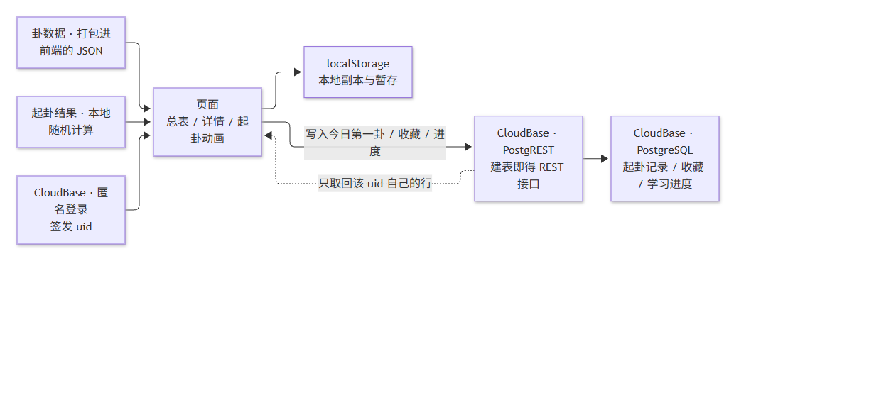
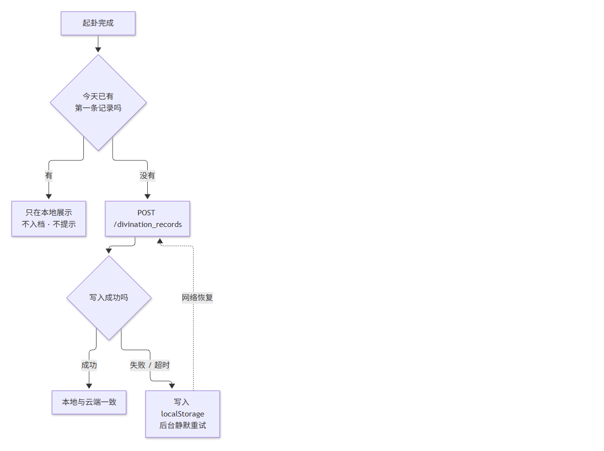

# 技术方案（TECH_DESIGN）· 易经六十四卦学习

> **项目名称**：易经六十四卦学习
> 文档版本：**v2.16** ｜ 日期：2026-09-26 ｜ 阶段：Day 8（**v2.16：竹简风做旧修订 —— 离散竹片 + 深色做旧木牌 + 全部纸质做旧**）
>
> **v2.5** 随 PRD v1.4 在**文档层**砍掉白话（§5.1 / §5.2 由三类收为**两类**，§13.3「补上白话」一行改为取消），
> 并登记 **G8** 作为待做的代码 / 数据清理项；**v2.6 把 G8 做完**（界面块、`plain`、`meta.pending`、CSS 全清）。
> **v2.7** 把总表每行从「序号 + 卦符 + 卦名」补齐到 **F1 要求的五项**（+ 上下卦 + 卦辞），窄屏折成卡片不横滚。
>
> **v2.4 只做一件事：把悬了很久的两个待核实项——「地域」与「计费」——查清并订正**
> （§6.1 / §6.2 / §14.1 / §14.2 / §16.2 / §17）。其中包含**一处我自己错误估算的更正**（§14.2 的「82 倍」），详见 §18。
> ⚠️ 版本号此前停在 v2.0 —— v2.1–v2.3 只写进了 §18，页头没跟着升，本次一并拉平。
> 上游文档：[`docs/PRD.md`](PRD.md) v1.3（产品需求与验收标准）
> **本文档只回答「怎么落」。** 「做成什么样才算完成」以 PRD 为准。
>
> **v2.0 补齐了四件事**：方案 A / B 四维比较（§2）、项目结构（§4）、已做网页内容与字段（§5）、数据流图（§10）；
> 另把错误处理（§11）、环境变量（§12）、迁移注意事项（§13）从零散段落提升为独立小节，并新增待确认问题清单（§16）。

---

## 0. 三条硬约束（先立规矩）

| # | 约束 | 来源 |
| --- | --- | --- |
| 1 | **只用免费额度**；不开按量计费、不设预置并发 | 用户要求 + PRD §7.3 |
| 2 | **不采集身份信息**；数据库里不出现 IP、设备指纹、邮箱、手机号 | PRD §3.2 / §7.3 |
| 3 | **服务端不可用时核心功能不受影响**（起卦、看卦、答题照常，数据暂存本地） | PRD §6 F6 |

---

## 1. 技术路线（一句话）

> **前端 React + Vite 静态站点（卦数据打包进前端）＋ 后端零云函数（CloudBase PostgreSQL 的 PostgREST 自动出接口 + RLS 行级权限）＋ 部署到 CloudBase 静态网站托管。**

三条配套主张：

| 主张 | 理由 |
| --- | --- |
| **卦数据不进数据库**，打包进前端 | 64 卦约 23KB、永不变更。放数据库只会多一次网络往返、多一份计费、多一个「数据库挂了就看不了卦」的故障点 |
| **本期不写云函数** | PostgREST 建表即得 REST 接口，配合 RLS 已够用。少一层就少一个故障点和一份计费项 |
| **身份用平台匿名登录**，不自造 ID | 自造标识由前端自报、可伪造，RLS 形同虚设。详见 §8 |

---

## 2. 技术路线比较：方案 A / 方案 B（★ v2.0 新增）

> **说明**：任务清单里「方案 A / 方案 B」是空占位符，未指定具体是哪两个方案。
> 我按本项目的实际决策点定义为下面两个——**它们正好是「用不用云端持久化」这一条分岔**。
> 如果你说的 A / B 是别的组合，告诉我，我重做这一节。

### 2.1 两个方案分别是什么

| | 方案 A · 纯前端 + 本地存储 | 方案 B · 前端 + CloudBase PostgreSQL |
| --- | --- | --- |
| 数据存哪 | 浏览器 `localStorage` | 云数据库（本地仅作缓存） |
| 服务端 | **没有** | PostgREST + RLS（不写云函数） |
| 需要开通云资源 | 不需要 | 需要（1 个免费环境） |
| 需要实名 / 授权 | 不需要 | **需要** |
| 交付形态 | 一份静态文件，扔哪都能跑 | 静态文件 + 一个云环境 |

### 2.2 四维比较

| 维度 | 方案 A · 纯前端本地存储 | 方案 B · CloudBase PostgreSQL |
| --- | --- | --- |
| **学习成本** | **低。** 只需 `localStorage.setItem/getItem`，已完全掌握，当天可交付 | **中。** 需要额外学四样：① 匿名登录的调用与生命周期 ② PostgREST 的查询语法（`eq` / `order` / `limit`）③ RLS 策略的写法 ④ CLI 登录与部署流程 |
| **线上持久化** | **✗ 弱。** 清缓存 / 换浏览器 / 换设备 → **全丢**。且这是「静默丢失」，用户不知道哪天就没了 | **✓ 强。** 数据落在云端，只要匿名标识在就还在；且清理浏览器缓存不影响云端记录。**但注意：匿名标识本身仍绑当前浏览器**（见 §17 R1） |
| **费用** | **¥0，且零计费风险**。无任何资源可被计费 | **¥0（免费档）**，但有两个成本口子：① PG 的 CPU 计费口径未知（**§14.2 最大风险**）② 免费环境**有到期时间**，需续期 |
| **排错难度** | **低。** 出错只可能在前端，DevTools 一看便知，问题面 1 层 | **中高。** 故障面 4 层：前端 → 匿名登录 → REST 鉴权 → RLS 策略。**最坑的是 RLS 写错时不报错、只静默返回空数组**，看着像「没数据」，实际是权限拒绝 |

### 2.3 推荐：方案 B，理由是它是方案 A 的超集

**推荐方案 B。** 四条理由，按重要性排序：

**① 方案 B 天然包含方案 A，反过来不成立。**
本方案的降级策略（§11）就是「云端写不进去 → 写 `localStorage`」。也就是说**选了 B，等于同时拿到 A 的全部好处**（离线可用、零延迟、无网也能起卦），只是多了一层「写成功就上云」。
**这是最关键的一条：B 不是「A 之外再加东西」，而是「A 之上加了一个不那么容易丢的副本」。**

**② 产品核心卖点直接依赖「留存」，而 A 的留存是易失的。**
PRD v1.3 的功能主线是：

```
一键起卦（愿意打开）→ 三层解读 → 每日第一卦存档（愿意再打开）→ 回看时进总表深读
```

F8「过往起卦记录」的价值**全部来自「用户下次还看得到」**——回看「那天起的正是这一卦」，才是加深理解的机制。
用方案 A 意味着：**用户清了浏览器缓存，这个产品的核心卖点就归零了，而且他不知道发生了什么。** 这不是体验瑕疵，是把卖点做成了一次性的。

**③ 费用风险有封顶动作，不是开放式的。**
免费档**官方明确不支持按量计费**（§6.1），所以「账单失控」这条路本身是堵死的。剩下的风险是「额度被耗尽 → 服务停用」，而这有明确红线与回退路径（§14.3）。**最坏结果是退到方案 A，产品功能不受影响。**

**④ 唯一真实代价是排错难度，而这个可以用顺序压低。**
做法：**先建 1 张表、先跑通 1 条读写、再加第 2 张表**。把 4 层故障面拆成「一次只引入一层」，而不是一次性铺开三张表和四套策略。

### 2.4 回退条件（写清楚，这样推荐才是可证伪的）

| 触发条件 | 动作 |
| --- | --- |
| **若控制台实测** PG 的 CPU **按常驻计费**（官方口径是「共享实例按使用计量」，见 §14.2 —— 仅当实测与之相反时触发） | **立刻回退方案 A**：前端全本地存储，F6/F8 的云端部分暂缓。**产品功能一点不受影响**，只是回到 PRD v1.0 的存储方式，并在 PRD 记一笔 |
| V2 证实免费档**不能用静态托管** | 不构成回退理由。拆开处理：前端托管到别处，数据库仍在 CloudBase |
| V1 证实 PG **只在新加坡** | 不构成回退理由，只是延迟升高 |
| 云端不可达 | 不构成回退理由，走 §11 降级 |

### 2.5 被排除的方案 C：云函数路线

| | 方案 C · 前端 + 云函数 + 数据库 |
| --- | --- |
| 为什么排除 | PostgREST + RLS 已经能满足本期的全部读写需求（三张表、无跨行统计、无隐藏密钥）。走云函数等于**多一层故障点、多一份计费项、多一套部署流程**，换来的只是「逻辑更熟悉」 |

**保留的例外**：若将来出现「必须服务端计算」的需求（如全站正确率统计、调用第三方密钥服务），再补云函数。**本期没有这类需求**（PRD §6 F6 已明确不做学习报告图表）。

---

## 3. 技术栈与选型理由

| 层 | 选型 | 理由 |
| --- | --- | --- |
| 前端框架 | React 19 + Vite 8（**已实现**） | 已跑通；构建产物为纯静态文件 |
| 卦数据 | 项目内 JSON（`data/64卦.json` + `data/64卦-爻辞.json`） | 数据量小且不变，打包进前端 → **零延迟、零请求、零计费** |
| 数据库 | CloudBase PostgreSQL | 用户指定。关系型、标准 SQL、**建表即得 REST 接口** |
| 权限 | PostgreSQL RLS | 用同一套 SQL 表达「谁能看什么」，不需要自建鉴权服务 |
| 身份 | CloudBase 匿名登录（见 §8） | 满足「打开即用、无注册登录」，同时让 RLS 有主体可依 |
| 托管 | CloudBase 静态网站托管 | 用户指定。HTTPS + CDN |
| 前端依赖 | **本期不新增** | PostgREST 用普通 `fetch` 即可；是否需要 SDK 待 V4 核实后再定，**不预先写死包名** |

---

## 4. 项目结构（★ v2.0 新增）

```
yijing-64/
├─ index.html                  # Vite 入口：中文 lang、viewport、挂载 #root
├─ package.json                # 依赖：react/react-dom ^19.3；devDep：vite ^8.3 + @vitejs/plugin-react ^6.1
├─ vite.config.js              # 端口 5173、strictPort；**无代理、无后端**
├─ README.md                   # 项目说明、本地运行、产品边界、进度表
├─ AGENTS.md                   # 给 AI 的规则：Day 1 基线 6 条 + R1–R4 + 检查项（只允许追加）
├─ .gitignore                  # 排除 .workbuddy/ · Claw/ · .env · 密钥 · node_modules · dist · data/__*.json
│
├─ src/                        # 前端源码（共 3238 行，v2.15 按实际重数）
│  ├─ main.jsx                 # 挂载入口（10 行）
│  ├─ App.jsx                  # 总表页 + 详情页 + 起卦逻辑 + **hash 路由**（401 行）
│  ├─ CastingAnimation.jsx     # F7 起卦动画：太极 + 三圈爻 + 虚圆 + 水墨云团（508 行）
│  ├─ CastResult.jsx           # 起卦结果页：三层解读 / 两个交互键 / 边界声明（215 行）
│  ├─ Records.jsx              # F8 过往起卦记录与收藏（184 行）
│  ├─ storage.js               # 本地存储层：接口按**云端形状**设计，将来只换这一层（108 行）
│  ├─ mockApi.js               # 主视图的 mock 数据接口（v2.13：加载/空/错误/成功四态；F6 时只换这层）
│  ├─ InkTransition.jsx        # 总表→详情的墨侵染转场（v2.15：石头入水涟漪/侵染/墨散/竹简展开/墨起浮现，?transFreeze 逐帧核对）
│  ├─ HexagramFigure.jsx       # 六爻卦象图组件，从下往上渲染（40 行）
│  ├─ SourceTag.jsx            # 来源标注（只有两类：《周易》原文 / 本项目的理解）（21 行）
│  ├─ index.css                # 主样式：总表、详情、起卦按钮（332 行）
│  └─ casting.css              # 起卦动画样式：宣纸底、虚圆、动画按钮（264 行）
│
├─ data/                       # 数据（前端直接 import，不走网络）
│  ├─ 64卦.json                # 64 卦：结构 + 拼音 + 卦辞 + 象辞 + 吉凶平（24KB）
│  ├─ 64卦-爻辞.json           # 384 条爻辞 + 小象（55KB）
│  └─ 64卦总表.csv             # 原始索引：序号 / 卦名 / 卦符 / 篇章（1.2KB）
│
├─ db/
│  └─ schema.sql               # ★ 建表 + RLS（§7 的可执行版）—— §15 第 5 步执行件，**尚未在真库跑过**
│
├─ docs/                       # 文档（与代码同等重要）
│  ├─ research.md              # Day 3 需求研究：目标用户、竞品、25 天最小版本
│  ├─ PRD.md                   # 产品需求 v1.4（含验收标准与砍掉的功能）
│  ├─ TECH_DESIGN.md           # ★ 本文件
│  ├─ CLOUD_SETUP.md           # ★ 云端开通与建库：控制台逐项清单（§15 第 1–4 步给你照着点）
│  ├─ 01-学习笔记.md            # 逐卦笔记模板
│  └─ img/                     # 文档配图：*.mmd 源码 + *.png 渲染结果（成对进仓库）
│
└─ .workbuddy/                 # 工作过程记录（自检脚本 / 截图 / 工作日志）—— 不进仓库
```

**结构上的两个刻意安排：**

| 安排 | 理由 |
| --- | --- |
| **`data/` 与 `src/` 平级，不在 `src/` 里面** | 数据是长期资产（要人工校订），代码是要重构的。分开才能一眼看出「哪些改动动了数据」 |
| **`db/` 单独一层**（v2.10 新增） | SQL 是「**要被执行的东西**」，不是文档也不是前端代码 —— 放在 `db/` 里，落成文件、可 diff、可复核，避免「建表语句只活在聊天记录里」 |
| **`.workbuddy/` 不在仓库里** | 内含本机路径与工作日志，属本机私密内容，已在 `.gitignore` 排除 |

---

## 5. 目前已做的网页内容及字段（★ v2.0 新增）

### 5.1 页面上已经有什么

| 位置 | 已实现的内容 | 对应 PRD |
| --- | --- | --- |
| **总表页**（首页） | 标题「易经六十四卦学习」+ 副标题「认识卦象 · 读懂原文 · 记住卦序」 | F1 |
| | **「起一卦」按钮**：墨色、全页视觉权重最高，副文案「成事在人，莫问前程」 | **F7**（含边界声明 §1.3） |
| | 边界声明「运随时变，莫问前程」（Day 13 改，原「本页不提供占卜、预测与运势判断」） | §1.3 |
| | 按上经（1–30）/ 下经（31–64）分组的 64 行，每行含**序号 + 卦符 + 卦名 + 上下卦 + 卦辞**（**v2.7 补齐**；卦辞用衬线字体栈，与原文同款）；窄屏折成三行卡片，**不出现横向滚动** | F1 |
| | **键盘操作（v2.9）**：列表里 ↑ / ↓ 在卦之间移动焦点（到头停住、不绕回），**回车即进入**（`<button>` 原生行为） | F1 交互 |
| | 页脚「共 64 卦 · 每卦含六爻爻线与上下卦 · 数据来源：…」 | F5 |
| ⚠️ | ~~尚未做：F1 交互里的「键盘上下移动 + 回车进入」~~ → **v2.9 已完成** | F1 |
| **起卦动画**（F7） | 第一段：太极双鱼**逆时针** + **三圈交错阴阳爻**（不同圈不同方向、速度不同）+ 两条**虚圆**，9 秒后同步停住并**归回标准位置** | F7 |
| | 墨从四周翻涌遮住图案（**双鱼与三圈同步渐隐**）→ **保持 1 秒** → 散去时卦象浮现（**墨散到一半才开始显**，逐帧交叉淡入淡出，不按阶段跳变） | F7 |
| | 第二段（点击「看这一爻」触发）：墨再涌、卦象随墨隐去 → 散去后**只突出那一爻，其余淡化至 10%**（淡化在墨还遮着时就完成） | F7 |
| | ⚠️ **一卦最多一个变爻**：起卦时先按「至少一爻变」的概率（≈82%，即「每爻 1/4」传统取法的期望）判定有无变爻，再在六爻中均匀取一爻 —— **解读聚焦一爻**，不做多爻齐亮 | F7 |
| | 背景黑墨**全程翻涌旋转**（含动画结束后），中心浓周边淡，不遮挡图案。**v2.11：周边加墨到会真翻涌** —— 云团 36→78、分布指数 0.44、遮罩外缘 0.10→0.52；同一定格相隔 1.2 秒的画面对变化 45%→88%（§18 v2.11） | F7 |
| **起卦结果页**（F7） | 卦头（卦名 + 第 N 卦 + 吉凶徽章 + 上下卦）→ **存档提示** → 变爻按钮 → **两个交互键**（查看解读 / 进入卦象爻辞总表）→ 三层解读（展开后自动滚到解读区）→ 收藏 / 再起一卦 → **边界声明** | F7 / F8 |
| **详情页** | 返回（**按来源**回到总表或记录页）+ **翻页（‹ 上一卦 · 名称 / 名称 · 下一卦 ›，首尾卦对应按钮置灰）** + 收藏按钮、卦头（大卦符 + 卦名 + **拼音**（v2.9）+ 吉凶徽章） | F2 |
| | **可直接打开、可分享的链接**（**v2.8**）：`#/h/<卦序>` → 该卦详情；`#/records` → 记录页；空 → 总表。**极简 hash 路由，不引路由库**（`parseHash()` + `hashchange`） | F2 边界条件 |
| | **六爻卦象图**（`HexagramFigure`）+ 上卦 / 下卦及其自然象 | F2 |
| | **卦辞 · 象辞**、**六爻爻辞**（含小象）、**吉 · 凶 · 平 + 判定依据** | F2 |
| | 来源标注（**只有 `text` / `ours` 两类**）+ ~~白话「暂无」说明块~~ —— **v2.6 已按 G8 移除** | F5 |
| **测验页**（F3） | **v2.12 新增**：看卦象选卦名，一轮 20 题。题面是**大号六爻图且不显示爻题**（爻题属于额外信息，会变成提示）；进度条「第 N / 20 题」+ 连对 / 本轮正确；答后**立刻**给出对错 + 正确答案的**卦名 + 卦符 + 序号 + 上下卦**；结果页给本轮成绩、最长连对、**错题清单（每项可点进详情页复习）**、累计与「再来一轮」。颜色语义：**朱色只表示「正确答案」**，答错用与「凶」同款的深墨（不跟正确答案抢红） | F3 |
| | **干扰项只从两处取**（PRD F3「干扰项生成规则」）：**相邻卦序（±1…±3）** 与 **同族卦（同一上卦或同一下卦）**。已用脚本跑 **500 轮 / 10,000 题、规则违例 0**，且 64 卦都会作为题面出现（`.workbuddy/check-quiz.mjs`） | F3 |
| | **进度写本机**：每轮存 `{ date, score, total, answeredIds, wrongIds }`（**只存卦序号与数字**，没有时刻、没有身份信息）；**错题本以「最后一次答到它」为准**（答对过一次就移出）；「清空我的记录」把**记录 / 收藏 / 测验进度一起清** | F3 / F8 |
| **主视图的四态**（Day 8） | **v2.13 新增**：主视图数据改走 **mock 接口**（`src/mockApi.js`，本周不接真实 API）——「成功」态内容与原来完全一致（同一份本地 JSON），但 **加载（骨架行）/ 空 / 错误 / 成功**四种状态真实出现、可单独触发：`?mock=slow`（3.5s 骨架）、`?mock=empty`、`?mock=error`。⚠️ 错误态按**时间窗**实现（页面加载后 5 秒内必失败、之后成功）而非「只失败第一次」——dev 下 React StrictMode 会把 effect 跑两遍，「只失败第一次」会被第二遍调用直接救回。错误态给明确出路（重试），空态说明为什么空。**为 F6 预演：届时只换 mockApi 的实现，状态机不动** | Day 8 课程 / F6 |
| **调试开关** | `?castSpeed=0.5` 半速播放；`?castFreeze=10100` 定格在 10.1 秒；转场用 `?transSpeed=0.5` / `?transFreeze=毫秒` ——**仅供开发核对，不是产品功能** | — |
| **转场：墨侵染**（Day 8 追加） | **v2.14 新增**：总表点某一卦 → **全屏涟漪（0–0.7s，从点击点扩出）→ 淡墨侵染（0.25–3s，墨痕累积 + 前沿亮墨，屏幕同步模糊到 7px 并压暗）→ 约 3 秒后墨散（3–3.8s）→ 卦象在屏幕中央浮现（3.5–4.6s）→ 约 1 秒后移到详情页里它本来的位置并缩放对齐（4.6–5.5s），其余内容随之浮现**。实现：`InkTransition.jsx`，两张画布（stain **不清空**累积墨痕 = 侵染感 + main 每帧合成）；墨点纹理复用起卦动画的 `makeDotTexture`；**`?transSpeed=0.5` / `?transFreeze=毫秒`** 逐帧核对；portal 挂到 body（⚠️ `.page` 上的 filter 会把 fixed 的定位基准从视口改成页面，转场层放里面「屏幕中央」会变成「整页中央」）。**实测**：blur 2.08→6.39→7.00px、墨透明度 1→0.5→0、卦象 4300ms 时在视口正中 (712,450)、5100ms 时位移 (−119,−209) 且 scale 0.816 向目标收敛；7 秒后无残留（转场层卸载、blur 变量与类名清除）；181 fps；键盘回车同样触发（涟漪起点取行中心） | F1 / F2 |
| **传统竹简风改版**（Day 8 追加） | **v2.15 新增（用户点题：不要简约风）**：① **总表** = 竖向竹条背景上的**宣纸**页面，每卦一行做成**木牌**（令牌）造型（上圆下方 `border-radius:11px 11px 5px 5px` + `::before` 挂孔），「起一卦 / 我的记录 / 测一测」做成**木匾**（起一卦为深色主匾）；② **详情页** = **竹简记录**风（`page-slips`：竹简底 + 半透宣纸压字，原文仍衬线字体栈）；③ **转场**改为用户描述的时序——**石头投入水激起的波动涟漪 → 淡墨侵染 → 墨散 → 竹简展开占满整屏（`scaleX .04→1`，`repeating-linear-gradient` 模拟竹条）→ 内容以「墨起」浮现（radial-gradient 暗层渐褪）**，取代 v2.14 的「卦象中央浮现 → 归位」。传统材质色板集中在 `index.css` 末尾（`--paper` 宣纸 / `--wood` 木牌 / `--slip` 竹简 / `--seal` 印泥红），靠层叠覆盖前面的简约样式。**实测（截图见 `.workbuddy/checkin/day8e/`）**：总表宣纸 + 木牌 ✓、详情竹简 ✓、转场定格六帧（浓墨完全遮挡 → 竹简浮现 → 墨起渐清晰）✓、完整跑完无残留 ✓ | F1 / F2 |

### 5.2 数据文件与字段

**① `data/64卦.json`** —— 顶层 `{ meta, items }`，`items` 64 条，每条 14 个字段（**v2.5 实测更正：白话字段从来没有进过数据** —— 只在 `meta.pending` 里登记过名字；**v2.9 补上了 `pinyin`**）：

| 字段 | 类型 | 含义 | 状态 |
| --- | --- | --- | --- |
| `id` | int | 卦序 1–64（通行本） | ✓ |
| `name` | str | 卦名，如「乾」 | ✓ |
| `symbol` | str | 卦符，Unicode U+4DC0–U+4DFF，单字符 | ✓ |
| `volume` | str | 上经 / 下经 | ✓ |
| `upperTrigram` / `upperNature` | str | 上卦名（乾）/ 自然象（天） | ✓ |
| `lowerTrigram` / `lowerNature` | str | 下卦名 / 自然象 | ✓ |
| `lines` | int[6] | 六爻爻线，1=阳 0=阴，**从下往上** | ✓ |
| `judgment` | str | **卦辞原文** | ✓ |
| `image` | str | **象辞原文** | ✓ |
| `fortune` | str | **吉 / 凶 / 平** | ✓ |
| `fortuneBasis` | str[] | 判定依据（可追溯的卦辞片段） | ✓ |
| `pinyin` | str | 卦名拼音（**v2.9 已补齐 64/64**；多音字按卦名传统读音人工裁定，见 `meta.verified.pinyin`） | ✓ |
| ~~`judgmentPlain` / `imagePlain`~~ | — | ~~卦辞 / 象辞白话~~ | **v2.5 更正：该字段从未进过数据**（只在 `meta.pending` 里登记过），故无需删数据 |

**② `data/64卦-爻辞.json`** —— 顶层 `{ meta, byId }`，`byId` 以卦序字符串为键，每卦 6 条，共 **384 条**，每条 3 个字段：

| 字段 | 类型 | 含义 |
| --- | --- | --- |
| `label` | str | 爻题，如「初九」「六三」 |
| `text` | str | 爻辞原文 |
| `xiang` | str | 小象 |

**③ `data/64卦总表.csv`** —— 序号 / 卦名 / 卦符 / 篇章，源数据索引。

**数据可信度（这一点值得单独说）：**

| 校验 | 方法 | 结果 |
| --- | --- | --- |
| 六爻爻线与上下卦 | 6 组自动校验 + **41 条外部全名**（百度百科）逐条比对 | **0 矛盾** |
| 爻题阴阳 与 `lines` | **384 条交叉验证**——爻题来自文本转录、`lines` 来自上下卦推导，**两个独立来源** | **0 不一致** |
| 卦辞 vs 通行本 | 与王弼本逐条核对 | 一致（另修正源数据 2 处瑕疵） |
| 卦符码点 | U+4DC0–U+4DFF 连续 | 通过 |

> **v2.5（对应 PRD v1.4）：白话整层砍掉。** 原先的「一律留空、显示待补」升级为「**不做**」——
> 版权与准确性两个问题都没有干净解法，而「原文与解读分层可见」这一条边界已经承担了「看得懂」的职责。
> **数据字段、界面说明块、`plain` 标注类型全部移除 —— v2.6 已完成**（见 §5.3 G8）。

### 5.3 代码与数据的差距（G1–G8 全部已修）

**2026-09-21 记录时的状态**：数据已补齐，但界面还停留在旧状态。原登记 7 项差距，**G1–G6 当晚已修完**：

| # | 差距 | 状态 | 实现方式 |
| --- | --- | --- | --- |
| G1 | 详情页仍显示「待补内容」块，而数据已入库 | ✅ **已修**（v2.5 再调） | 换成真实的卦辞 / 象辞 / 六爻爻辞；~~「待补」只保留白话一项~~ —— **v2.5：白话层砍掉，这一项也随之删除，见 G8** |
| G2 | 详情页未展示 `judgment` / `image` / `fortune` | ✅ **已修** | 新增「卦辞 · 象辞」「六爻爻辞」「吉 · 凶 · 平」三节，每节带来源标注 |
| G3 | 结果页缺**「进入卦象爻辞总表」并定位高亮本卦** | ✅ **已修** | 结果页加交互键 → 回总表并 `scrollIntoView` 定位，本卦加朱色高亮（`.item.is-hit`） |
| G4 | 结果页缺**三层解读** | ✅ **已修** | 新增 `CastResult.jsx`：三层固定顺序 + 第三层必带「非原文」标注；展开后自动滚到解读区 |
| G5 | 结果页缺**边界声明** | ✅ **已修** | 结果页底部「**成事在人，莫问前程**」（主）+「运随时变，莫问前程」（副，Day 13 改）+「卦不替你做决定」说明 |
| G6 | `fortune` 已入库但界面完全未使用 | ✅ **已修** | 吉 / 凶 / 平 徽章 + 第三层方向由它决定 + 详情页显示**判定依据**（可追溯到卦辞） |
| G7 | F8 每日第一卦存档、收藏均未实现 | ✅ **已修（本地版）** | 新增 `src/storage.js`（本地存储层）+ `src/Records.jsx`（记录与收藏页）；起卦时自动判定「今日首卦」并入档，结果页提示「今天的卦已记录」或「人生路远，莫向歧路」（Day 13 改）；结果页与详情页都能收藏 |
| **G8** | 白话层的清理（v2.5 登记 → **v2.6 已完成**） | ✅ **已修（Day 7）** | ① `App.jsx` / `CastResult.jsx` 的「白话译文暂无」块 → **已删**；② `SourceTag.jsx` 的 `plain` 类型 → **已删**，现只剩 `text` / `ours`；**顺带修掉一处隐藏 bug**：`CastResult.jsx` 第一层（卦象说什么）原先写的是 `kind="plain"`，类型删掉后会渲染成**空标签** → **已改为 `ours`**（它本来就是本项目的推导）；③ `data/64卦.json` 的 `meta.pending` → **已改为 `["pinyin","lineTexts"]`**；④ `index.css` / `casting.css` 里 `pending-note`、`cr-pending` 的样式与注释 → **已清理**。**实测**：详情页与起卦结果页搜「白话」**零命中**；三层解读标签依次为「本项目的理解 / 《周易》原文 / 本项目的理解」 |

**G7 的说明：为什么先做本地版**

`storage.js` 的读写接口是按**云端形状**设计的（`loadRecords` / `archiveFirstOfToday` / `toggleFavorite` / `clearAll`），
**将来接 CloudBase 时只替换这一层，上层组件一行不改**。理由有三：

1. **不卡在 V1–V4 待核实上** —— F8 是 P0，但它不该被云环境的未知数阻塞
2. **本地可用本来就是硬约束 3 的要求**（服务端不可用时功能不受影响），所以这不是「临时方案」，而是**必须有的那一半**
3. 存储字段严格照 PRD：起卦记录 `date / hexagramId / changingLines`，收藏 `hexagramId / date` —— **没有精确时刻字段**（验收项明确要求）

**尚未做（等云环境）**：PRD F8 最后一条验收「断网时起卦仍写入本地记录，**联网后自动补写云端**」——
云端那一半要等环境开通，届时补写逻辑加在 `storage.js` 里，不动上层。

**修复时新发现并一并处理的两件事**：

| 发现 | 处理 |
| --- | --- |
| 结果页把文字压在水墨上，**灰色小字与深墨撞在一起读不清** | 面板加**宣纸底衬**（顶部透明 → 往下渐次压实），并把结果页的背景墨浓度由 0.26 降到 **0.14** |
| 多音字 / 生僻字**在页面上可能显示成方块** | 原文块统一用衬线字体栈，末尾带 `SimSun-ExtB`（覆盖扩展区），实测「劓刖」「徽纆」「覆公餗」「繻有衣袽」均正常 |

---

## 6. 平台能力核实结果（★ 请先读这一节）

写方案时实际查证了 CloudBase 官方文档。**以下严格区分「已核实」与「待核实」**——待核实的部分我不会当作事实使用。

### 6.1 已核实

| 项 | 结论 | 来源 |
| --- | --- | --- |
| PostgreSQL 支持 | CloudBase **提供 PostgreSQL 环境**（与文档型 / MySQL 并列的环境类型） | 腾讯云产品页 |
| PG 的接口能力 | 自带 **PostgREST**（建表即得 REST API）、**RLS 行级权限**、`postgresql://` 直连 | 腾讯云产品页 |
| 身份方式 | 支持**匿名登录**，且共 10+ 种（微信 / 手机号 / 邮箱 / Google 等） | 腾讯云产品页 |
| **免费档不含按量计费** | 免费档说明原文：`Resource packs and pay-as-you-go not available` | CloudBase 定价页 |
| 免费档额度 | **¥0/月，每月 3,000 资源点，每账号 1 个免费环境**（1,000 点 ≈ ¥1） | CloudBase 定价页 |
| 静态托管能力 | 支持，含 HTTPS + CDN，可用 CLI 部署 | CloudBase 文档 |
| CLI 命令 | `npm i -g @cloudbase/cli` → `tcb login` → `tcb env list` / `tcb env use <envId>`；部署用 `tcb hosting deploy dist -e <envId>` | CloudBase 文档 |
| WorkBuddy 接入方式 | 官方说明中**点名 WorkBuddy 有内置 CloudBase 连接器**，优先走内置路径 | CloudBase skill 文档 |
| 官方明确禁止 | 「**不要编造 env ID / 密钥**」「**不要跳过登录授权**」「不要用 `tcb deploy`，要用 `tcb fn deploy` / `tcb hosting deploy` 这类明确命令」 | CloudBase skill 文档 |
| **PG 支持地域**（v2.4 新增） | **上海与新加坡都支持 PostgreSQL**；上海同时支持传统模式（文档型 / MySQL），**新加坡为 PG 专属**地域 | 购买指南功能表 + [2026-07-27 官方博客](https://tcb.cloud.tencent.com/blog/2026/07/27/singapore-region) + 产品页 FAQ |
| **PG 计费口径**（v2.4 新增） | CPU `342 点/(核·小时)`、容量 `0.5 点/GB·小时`；备注原文**「共享实例按使用进行计量」** → **按实际用量**扣点 | [资源点价格文档](https://cloud.tencent.com/document/buy-guide/876/127357)（上海地域） |
| **免费档不会产生账单**（v2.4 新增） | 免费环境**不支持加购资源包、不支持按量付费** → 额度耗尽表现为**功能受限，不是扣费** | 购买指南「免费体验」 |
| **免费环境有到期日**（v2.4 新增） | 单次续期 **6 个月**、**到期前 1 个月内可续、不支持自动续费**；到期进停服隔离期，未转付费将**销毁环境** | 购买指南「免费体验」 |
| **创建免费环境需兑换码**（v2.4 新增） | 自 2026-01-16 起，每账号可用**一次性兑换码**创建一个免费体验环境（领取方式见购买页说明） | 购买指南「免费体验」 |
| **静态托管在功能表内**（v2.4 新增） | 静态网站托管在上海 / 新加坡、两种数据库类型下**均标「支持」**；定价页也把它列为免费档包含能力 | 购买指南功能表 + 定价页 |

### 6.2 待核实（**必须在控制台确认，不要当作事实**）

> **★ v2.4 澄清（2026-09-22）：原本的 V1「两处官方口径互相矛盾」是一次误读。**
>
> 购买指南那张表的表头是 **「地域」×「数据库类型」（云数据库 / PostgreSQL）**，**不是**「该地域支不支持 PG」。
> 按两列读，上海那半张表的含义是「选**云数据库**类型 → 文档型 / MySQL；选 **PostgreSQL** 类型 → PG」，
> 而新加坡那半张表只有一个 PG 列（因为它**只**支持 PG 环境）。三处旁证一致：
> ① 2026-07-27 官方博客：「上海地域与云数据库(FlexDB)环境**共存**，新加坡地域为 **PG 专属**」；
> ② 产品页 FAQ：「**当前支持上海、新加坡两个地域**。上海地域 PG 模式与传统模式共存」；
> ③ PG 环境返回示例里写着 `"Region": "ap-shanghai"`。
> **→ 上海、新加坡都支持 PG，且上海单价更低**（CPU 342 vs 587 点/核·小时；容量 0.5 vs 3.68 点/GB·小时）。
> V3 的计费口径也已在文档层面查清（见 §14.2）。**但下面四项仍要在控制台亲眼确认 —— 文档 ≠ 控制台。**

| # | 待确认 | 怎么确认 | v2.4 现状 |
| --- | --- | --- | --- |
| **V1** | 创建环境时**地域选择器里上海能否选到 PostgreSQL 类型** | 购买 / 创建环境页面**亲眼确认** | **文档层面已澄清为「能」**；控制台仍是唯一权威 |
| **V2** | 免费档能否用**静态网站托管** | 创建环境后看控制台是否出现该入口 | **降为低风险**：功能表两个地域均标「支持」，定价页也列为免费档能力 |
| **V3** | **PG 的真实资源点消耗走势**（口径已查清，剩下的是实测） | 建库后**观察 24 小时资源点消耗**再继续开发 | 计费口径已明确（§14.2）；**待观察**的是真实用量与**空闲自动暂停的阈值** |
| **V4** | RLS 当前用户函数名 / REST 路径前缀 / 前端 SDK 包名 | 查 CloudBase PG 官方接口文档 | 不变（**仍不要照抄 §7.3 与 §9 的示意代码**） |

> **纪律**：V1–V4 仍以控制台为准。**在亲眼看到之前，任何涉及数据库写入的操作都不执行。**

---

## 7. 数据库设计

### 7.1 表结构（示意，字段与 PRD §7.3 一一对应）

```sql
-- ① 起卦记录：每日第一卦，一天最多一条（F8）
create table if not exists divination_records (
  uid            text not null,                     -- 匿名登录返回的用户标识
  date           date not null,                     -- 用户本地日期，一天一条
  hexagram_id    smallint not null check (hexagram_id between 1 and 64),
  changing_lines smallint[] not null default '{}',  -- 变爻位置（1-6），可为空数组
  created_at     timestamptz not null default now(),
  primary key (uid, date)                           -- 主键即「一天一条」的强制约束
);

-- ② 收藏
create table if not exists favorites (
  uid         text not null,
  hexagram_id smallint not null check (hexagram_id between 1 and 64),
  created_at  timestamptz not null default now(),
  primary key (uid, hexagram_id)
);

-- ③ 学习进度（F3 测验用，本期为 P1）
create table if not exists study_progress (
  uid            text primary key,
  answered_total integer not null default 0,
  correct_total  integer not null default 0,
  wrong_ids      smallint[] not null default '{}',
  created_at     timestamptz not null default now(),
  updated_at     timestamptz not null default now()
);

-- 每轮成绩：用于「看到分数变化」
create table if not exists study_rounds (
  id         bigserial primary key,
  uid        text not null,
  score      smallint not null,
  total      smallint not null default 20,
  created_at timestamptz not null default now()
);

create index if not exists idx_rounds_uid_time on study_rounds (uid, created_at desc);
```

**三个设计要点：**

| 要点 | 说明 |
| --- | --- |
| **`primary key (uid, date)`** | 用**数据库主键**强制「一天一条」，不靠应用层判断。重复插入会自然失败，服务端不需要额外查重逻辑 |
| **用 `date` 而不是 `timestamptz`** | 落实 PRD §7.3「不存精确时刻」的红线；同时避开时区歧义（存的是用户本地日期） |
| **`changing_lines` 用数组** | 变爻可能有 0 至 6 个 |

### 7.2 明确「不进数据库」的字段（照抄 PRD §7.3 红线）

姓名、手机号、邮箱、第三方账号、身份证件、**IP 地址**、**设备指纹**、**User-Agent 原始串**、地理位置、任何行为埋点 / 点击流 / 停留时长。

> **实现注意**：云函数或网关的默认日志**可能自动记录 IP 与 UA**。本方案不写云函数，天然规避了这一项；若将来补云函数，**必须确认日志级别与字段**，不能出现「业务表干净但日志里全是 IP」的情况。

### 7.3 行级权限（RLS）

思路：**每个用户只能看见和修改 `uid` 等于自己的那一行**。策略写法示意（**函数名待 V4 核实**）：

```sql
alter table divination_records enable row level security;

create policy "read own records"   on divination_records for select using (uid = auth.uid()::text);
create policy "insert own records" on divination_records for insert with check (uid = auth.uid()::text);
create policy "delete own records" on divination_records for delete using (uid = auth.uid()::text);
-- ⚠️ 故意不建 update 策略 —— 对应 PRD F8「记录不可事后编辑」

alter table favorites enable row level security;

create policy "read own favorites"   on favorites for select using (uid = auth.uid()::text);
create policy "insert own favorites" on favorites for insert with check (uid = auth.uid()::text);
create policy "delete own favorites" on favorites for delete using (uid = auth.uid()::text);

alter table study_progress enable row level security;

create policy "read own progress"   on study_progress for select using (uid = auth.uid()::text);
create policy "insert own progress" on study_progress for insert with check (uid = auth.uid()::text);
create policy "update own progress" on study_progress for update using (uid = auth.uid()::text)
                                                                 with check (uid = auth.uid()::text);

alter table study_rounds enable row level security;
create policy "read own rounds"   on study_rounds for select using (uid = auth.uid()::text);
create policy "insert own rounds" on study_rounds for insert with check (uid = auth.uid()::text);
```

> **「不建 update 策略」是刻意的**：让 F8 的「记录不可事后编辑」成为**数据库层的硬约束**，而不是靠前端自觉——前端再怎么改也改不了已存的记录。
>
> 若 V4 确认函数名不同，只需替换 `auth.uid()`，策略结构不变。

---

## 8. 身份方案：用平台自带的匿名登录，而不是自己造 ID

**PRD 的原始设计**是「自造 `anonId` 存本地」。**核实平台能力后，改用更好的做法。**

| | 方案 B1 · 平台匿名登录（**已选定**） | 方案 B2 · 自造 anonId（PRD 原始描述） |
| --- | --- | --- |
| 怎么做 | 调用 CloudBase 匿名登录，拿到标准用户标识 | 前端 `crypto.randomUUID()` 生成，存 localStorage |
| RLS 能否生效 | ✅ 能，权限由数据库层强制 | ❌ 不能，标识由前端自报，**可被伪造** |
| 需要写后端吗 | 不需要 | 需要云函数校验，且校验逻辑本身要靠传参信任前端 |
| 用户感知 | 无感知（不是登录页） | 无感知 |
| 换设备 / 清缓存 | 一样会丢 | 一样会丢 |

**结论：选 B1。** 它同样满足 PRD「打开即用、无注册登录、不采集身份信息」，但多了一层**数据库层强制的数据隔离**——B2 的安全性完全依赖前端自觉，这在生产上不可接受。

> **PRD 已完成同步**：PRD 变更记录 v1.1.1 已补说明——功能语义完全一致，实现主体从「前端自造」变为「平台匿名登录」，**不改产品行为**。

---

## 9. API 列表（★ v2.0 汇总）

**全部由 PostgREST 自动生成——建表即得，本方案不写一行后端接口代码。**
下表路径为示意，**实际前缀与鉴权头以 CloudBase PG 接口文档为准（V4）**。

| # | 方法 | 路径 | 用途 | 对应功能 | 备注 |
| --- | --- | --- | --- | --- | --- |
| 1 | `POST` | `/divination_records` | 写入**今日第一卦** | **F8** | 同日重复写会**主键冲突**，前端据此判断「今天已记录」 |
| 2 | `GET` | `/divination_records?uid=eq.<uid>&order=date.desc` | 过往起卦记录列表 | **F8** | 按日期倒序，供「回看那天起的卦」 |
| 3 | `DELETE` | `/divination_records?uid=eq.<uid>` | 清空我的记录 | F8 / PRD §7.3 | 本地与云端同时删 |
| 4 | `POST` | `/favorites` | 收藏某卦 | **F8** | 重复收藏 → 主键冲突，天然幂等 |
| 5 | `GET` | `/favorites?uid=eq.<uid>&order=created_at.desc` | 收藏列表 | **F8** | |
| 6 | `DELETE` | `/favorites?uid=eq.<uid>&hexagram_id=eq.<n>` | 取消收藏 | **F8** | |
| 7 | `GET` | `/study_progress?uid=eq.<uid>&select=*` | 读学习进度 | F6 / F3 | |
| 8 | `POST` | `/study_progress` | 首次写入进度 | F6 | |
| 9 | `PATCH` | `/study_progress?uid=eq.<uid>` | 更新进度 | F6 | |
| 10 | `POST` | `/study_rounds` | 写入一轮成绩 | F3（P1） | |
| 11 | `GET` | `/study_rounds?uid=eq.<uid>&order=created_at.desc&limit=10` | 最近成绩 | F3（P1） | 供「看到分数变化」 |
| — | — | — | **卦数据不走 API** | — | 64 卦与 384 条爻辞**打包进前端**，零请求 |

**两条约束：**

1. **查询语法是 PostgREST 的通用写法**（`eq` / `order` / `limit` / `select`），不是自造约定。
2. **所有写接口都允许失败**——失败不阻断用户动作，见 §11。这是硬约束 3 的落实方式。

### 9.1 什么时候才需要云函数

只有两种情况：

1. **需要跨行事务的统计**（如全站正确率分布）——本期不做（PRD 明确不做学习报告图表）
2. **需要隐藏的密钥调用**（如接第三方服务）——本期没有

**因此本期计划：不写云函数。**

---

## 10. 数据流（★ v2.0 新增，含数据流图）

### 10.1 数据流图：数据从哪来、到哪去



> **本图的文字源码**保留在 [`docs/img/data-flow.mmd`](img/data-flow.mmd)，改动后重新导出即可。
>
> ⚠️ **为什么不直接写 Mermaid 代码块**：实测 GitHub 的 Mermaid 渲染器对本图报 `Unable to render rich display`（本地同语法、strict 模式下可正常渲染，判定为 GitHub 侧版本差异，见 §10.5），所以**改为提交渲染结果**，保证在 GitHub 上一定能看到图。

### 10.2 数据从哪来

| 数据 | 来源 | 是否走网络 |
| --- | --- | --- |
| 64 卦结构、卦辞、象辞、吉凶平 | `data/64卦.json`（**打包进前端构建产物**） | **不走**。随页面一起下载一次 |
| 384 条爻辞、小象 | `data/64卦-爻辞.json`（同上） | **不走** |
| 起卦结果 | 浏览器本地随机计算（`castOnce()`） | **不走**。断网也能起卦 |
| 用户标识 `uid` | CloudBase 匿名登录签发 | 走（仅首次） |
| 起卦记录 / 收藏 / 学习进度 | CloudBase PostgreSQL | 走（可失败，见 §11） |

### 10.3 数据到哪去（按时间顺序）

1. **首次访问** → 申请匿名身份 → 拿到 `uid`（**失败则退化为纯本地模式**，功能不减）
2. **用户起卦** → 本地算出卦 + 变爻 → **先写 `localStorage`** → 再尝试写云端
3. **写云端失败 / 超时** → 保留本地副本并标记待重试，**页面不弹错误框**
4. **下次打开** → 读云端与本地，**取更新时间较新的一份**
5. **用户清空记录** → 本地与云端**同时删除**，不可恢复

### 10.4 起卦写入的判定流程（含错误分支）

F8 有个关键规则：**每日只记第一卦**，当日后续起的卦**仅作娱乐、不入档**。它的实现与失败处理：



> 源码见 [`docs/img/cast-write-flow.mmd`](img/cast-write-flow.mmd)。

> **「有没有第一条」不需要先查再写**：直接 POST，靠**主键冲突**判断——少一次网络往返，也避免并发下的竞态。

### 10.5 关于 Mermaid 渲染的说明（★ 踩坑记录）

| 情形 | 结果 |
| --- | --- |
| 本地渲染（mermaid 11，`securityLevel` 分别为 `loose` 与默认 `strict`） | **两张图都成功** |
| GitHub 页面渲染（同一份语法） | **两张图都报 `Unable to render rich display`** |

**处理方式**：不再与 GitHub 的渲染行为较劲——**把图渲染成 PNG 提交进仓库**，同时**保留 `.mmd` 文字源码**（可 diff、可重新导出）。这样图一定看得见，源也一定留得住。

> **这个坑值得记住**：文档里内嵌 Mermaid 看似优雅，但**渲染权不在自己手里**。凡是「图必须被看到」的场合，导出成图片更稳。

---

## 11. 错误处理（★ v2.0 独立成节）

### 11.1 一条总原则

> **云端异常绝不能阻断用户动作。** 起卦、看卦、翻页、答题全部在本地可完成；云端的角色是「备份」，不是「依赖」。

实现方式：所有云端调用都包在 **超时 + 静默失败** 里，任何异常都只写日志、不弹框、不阻塞渲染。

### 11.2 逐场景处理

| # | 场景 | 表现 | 处理 | 是否告知用户 |
| --- | --- | --- | --- | --- |
| E1 | 匿名登录失败 | 无 `uid` | 退化为**纯本地模式**，功能不减，只是不同步 | 顶部一行轻提示，不弹窗 |
| E2 | 写云端超时 / 失败 | 请求无响应 | 写 `localStorage` + 标记待重试，后台静默重试 | **不告知**（用户的动作已成功） |
| E3 | 写云端冲突（今日已有记录） | `409` / 主键冲突 | **这是正常业务结果**，不是错误。本地展示，不入档 | 不告知（PRD F8 就是这么设计的） |
| E4 | 读云端返回空数组 | `[]` | **先排查是不是 RLS 拒绝**（RLS 拒绝时不报错、只返回空），再决定是否回退本地 | 若本地有数据则用本地 |
| E5 | 网络完全断开 | 请求不可达 | 全部走本地；恢复后补写 | 顶部一行轻提示 |
| E6 | 数据文件字段缺失（如 `pinyin` 待补） | 渲染出 `undefined` | 显示「待补」占位，**不报错、不空白** | 界面自然体现 |
| E7 | 生僻字字体缺失（如 `𬙊` `𫗧` `𦈡` 三个扩展区字） | 显示成豆腐块 | **已处理**：原文块字体栈末尾加 `SimSun-ExtB`（Windows 自带，覆盖 CJK 扩展区），实测「劓刖」「徽纆」「覆公餗」「繻有衣袽」正常 | 界面自然体现 |

### 11.3 明确不做的错误处理

| 不做 | 理由 |
| --- | --- |
| 不做错误上报 / 埋点 | 违反硬约束 2（不采集行为数据） |
| 不做「重试 N 次后弹窗」 | 用户的动作已经完成，弹窗只会制造焦虑 |
| 不做在线状态指示灯 | 起卦看卦本来就不需要网络，提示反而暗示「本产品依赖网络」 |

---

## 12. 环境变量（★ v2.0 独立成节）

### 12.1 核心结论：**前端不需要密钥**

这是「匿名登录 + RLS」这套设计的目的之一——**前端只放公开配置，不放任何密钥**。理由：

- 匿名登录的凭据由平台 SDK 走自己的流程获取，**不需要我们在前端存**
- 数据隔离由**数据库层 RLS 强制**，即使前端被人改坏，也读不到别人的行

### 12.2 可能需要的变量（**命名待核实，不要照抄**）

| 变量（建议命名） | 用途 | 敏感 | 状态 |
| --- | --- | --- | --- |
| `VITE_TCB_ENV_ID` | 指向 CloudBase 环境 | 否 | 待环境创建后确定 |
| `VITE_TCB_REGION` | 地域（V1 确认后填） | 否 | **待 V1** |
| `VITE_TCB_REST_ENDPOINT` | PostgREST 端点 | 否 | **待 V4** |
| `VITE_TCB_CLIENT_KEY` | **客户端可公开**的 API Key（若平台要求） | **否** | **待 V4** |

> **必须区分两类密钥**：客户端 Key（设计上就是公开的，放前端没问题）vs 服务端密钥（**绝不能进前端、绝不能进仓库**）。

### 12.3 管理纪律

| 规则 | 说明 |
| --- | --- |
| `.env` 已在 `.gitignore` | 且额外忽略 `.env.*`，只放行 `.env.example` |
| 提供 `.env.example` | 只写**变量名与说明**，不写真实值 |
| **不要求用户粘贴真实密钥** | 当前设计下前端根本不需要密钥；若哪一步需要用户提供密钥，**先停下来确认** |
| 服务端密钥一律进**云函数环境变量** | 不进前端、不进仓库（本期无云函数，故暂无此项） |

---

## 13. 部署与迁移注意事项

### 13.1 部署

**前端（静态网站托管）：**

```
npm run build                 # 产出 dist/
tcb hosting deploy dist -e <环境ID>
```

> `tcb app deploy --framework vite -e <环境ID>` 可一条命令跑完「装依赖 → 构建 → 上传」，适合本地不方便构建时使用。

**访问地址**：默认域名为 `<环境ID>.xxx.tcloudbaseapp.com`（**具体域名规则以控制台实际显示为准**）。

**数据库**：建表 SQL 需在环境创建后执行，**执行前给你过目**。

### 13.2 迁移注意事项

| # | 迁移类型 | 注意点 |
| --- | --- | --- |
| M1 | **数据文件结构变更** | `64卦.json` 每加一个字段，受影响的是：`App.jsx` 的渲染、`meta.pending` 列表、PRD §7.1 的字段表、README 的目录说明。**改数据前先列影响面**（见 §13.3） |
| M2 | **数据库迁移** | SQL 放 `db/migrations/`，命名 `001_init.sql`；**全部写成幂等**（`create table if not exists`；建策略前先 `drop policy if exists`），这样重跑不会炸 |
| M3 | **本地 → 云端迁移** | 把 `localStorage` 里的暂存记录补写上去；**冲突靠主键自然去重**，不需要额外的比对逻辑 |
| M4 | **换环境迁移** | ⚠️ **`uid` 由平台签发，换环境等于换身份，云端数据不会跟随**。免费环境**有到期时间**，续期失败会导致环境隔离 → 数据虽保留但访问不了。**这是目前最需要在意的一条**：跨设备/跨环境的恢复能力要靠 v1.1 的「进度码」解决，本期不做 |
| M5 | **域名 / 访问来源变更** | 从 `localhost:5173` 切到托管域名后，需确认 CORS 是否放行新来源（若 PostgREST 有来源限制） |
| M6 | **版本同步纪律** | PRD 改 → 本文件同步 → 用 §13.3 的清单列出受影响文件 → 跑 `.workbuddy/doc-check.py` → 提交推送。**不让文档之间出现互相矛盾的说法** |

### 13.3 方案变化时哪些文件会受影响（余力加练）

| 如果发生这个变化 | 受影响文件 | 现在就要做什么 |
| --- | --- | --- |
| **控制台实测 V3 = 按常驻计费** → 回退纯本地存储 | PRD §7.3（存储方式）、`TECH_DESIGN` §2.4 / §14、`App.jsx`（读写逻辑）、本表 | 无需现在做，**红线已写明**（口径见 §14.2：按使用计量） |
| **V2 证实免费档不能托管** → 前端改托管他处 | `TECH_DESIGN` §13.1、README 技术栈行、PRD §3.2 | 无需现在做 |
| **V1 控制台里真的只能选新加坡**（文档层面已澄清为「上海可选」，见 §6.2） | `TECH_DESIGN` §6.2 / §12.2（`VITE_TCB_REGION`）、README | 环境创建时确认 |
| **PRD 改了功能范围**（如起卦方式、每日记录规则） | `PRD`（本体）+ `TECH_DESIGN` §7.1 表结构 / §9 API 列表 / §17 风险 + `App.jsx` | **每次改 PRD 都要走这一遍** |
| **`64卦.json` 加字段** | `TECH_DESIGN` §5.2 字段表 + `meta.pending` + `App.jsx` + PRD §7.1 | 改数据前先看 §13.3 本行 |
| **新增一种起卦方式**（如蓍草法） | PRD §6 F7 + `CastingAnimation.jsx` + `App.jsx` 的 `castOnce` + TECH §2 技术路线 | 属 v1.3 计划，本期不做 |
| ~~补上白话（`judgmentPlain` 等）~~ | — | **v2.5 取消**：白话整层砍掉（PRD v1.4 §4.2）。反向的**清理**工作已于 **v2.6 完成**（见 §5.3 G8） |
| **换了前端框架** | 几乎全仓库 | 无理由做这件事，记录在案以防动摇 |

---

## 14. 成本控制（对应硬约束 1）

### 14.1 免费档事实

| 项 | 数值 |
| --- | --- |
| 价格 | ¥0 / 月 |
| 资源点 | 3,000 点 / 月（1,000 点 ≈ ¥1） |
| 环境数 | 每账号 1 个免费环境，**创建需一次性兑换码**（领取方式见购买页说明） |
| **按量计费** | **官方明确：免费档不可加购资源包、不可开启按量付费** ← 天然满足硬约束 1 |
| **意外账单** | **不存在**。免费档没有按量付费通道，额度耗尽的表现是**功能受限**，不是扣钱 |
| 续期 | 单次续 **6 个月**；**到期前 1 个月内可续，不支持自动续费** |
| ⚠️ 到期后果 | 到期进**停服隔离期**，未转付费将**销毁环境** → 这是**数据风险**，不是费用风险 |

### 14.2 PG 的 CPU 计费：口径已查清（v2.4 修正，★ 请先读订正说明）

上海地域的官方资源点价格原文：

| 计费项 | 资源点消耗 | 备注（原文） |
| --- | --- | --- |
| PostgreSQL 数据库 - CPU 使用量 | **342 点 /（核·小时）** | **「共享实例按使用进行计量」**；独享实例按实例规格及运行时长计量 |
| PostgreSQL 数据库容量 | 0.5 点 / GB·小时 | 共享实例按**实际存储空间**计量 |

> ### ⚠️ v2.4 订正一处**我自己的错误估算**
>
> 本节原先写着：「若一个 1 核实例持续运行一个月，`720 小时 × 342 点 = 246,240 点`，
> **这不是 24 倍的问题，是 82 倍**」。
>
> **那个算式默认了实例 24 小时满核常驻，与官方计费口径不符。** 共享实例是**按实际使用量**计量的；
> 官方博客另写明「应用闲下来后，系统**自动停止计算资源**，但数据、权限策略和 API 继续保留」。
> 所以正确的问题不是「一个月有多少小时」，而是「**这个应用一个月真实用掉多少核·小时**」。
> 旧的 246,240 点当作「理论最坏值」可以留着，**但它不是预期值**，更不该被当成结论。

**按本项目实际用量粗估**（64 卦数据不进库；每用户每天几次读写）：

| 计费项 | 假设 | 月消耗 |
| --- | --- | --- |
| PG CPU | 累计约 1 核·小时（其余时间空闲） | ≈ 342 点 |
| PG 容量 | 数据量 < 0.1 GB | ≈ 36 点 |
| 云开发 API 调用 | 3 万次 / 月 | 300 点 |
| 静态托管 流量 + 存储 | ≈ 1 GB 流量、< 1 GB 存储 | ≈ 328 点 |
| 身份认证 | 1 万次 / 月 | 500 点 |
| **合计** | — | **≈ 1,500 点 / 月（约五成额度）** |

> **这是粗估，不是结论。** 两个未知数仍在：
> ① 共享实例 CPU 的**计量粒度**（是否存在保底计量）；
> ② **空闲多久触发「自动暂停」** —— MySQL 的同位置文档写明「连续 10 分钟未被访问会自动暂停」，
> **PG 的阈值没有查到**。因此 §14.3 红线 3（建库后观察 24 小时）**不变，仍是必做的一步**。

### 14.3 因此设定的操作红线

1. **绝不开通按量计费**（免费档本来也不支持，但升级按钮不要点）
2. **绝不设置预置并发**（会导致常驻计费）
3. **建库后第一件事是看控制台的资源点消耗**，观察 24 小时的真实走势再继续开发
4. **若发现 PG 的 CPU 计费按常驻计算**：立刻改用「前端全本地存储」的降级形态（§2.4），**F6 的云端部分暂缓**——**产品功能不受影响，只是回到 PRD v1.0 的存储方式**
5. **免费环境有到期时间**：单次续 **6 个月**、到期前 1 个月内可续、**不自动续费**；到期进停服隔离期，未转付费会**销毁环境** → **建议在日历上设一条续期提醒**（这是**数据风险**，不是费用风险）

> 这一节建议**在动手建库前单独确认**。原因很直接：**功能可以实现的东西，不等于成本上划算的东西。**

---

## 15. 实施步骤（含需要你授权的停点）

| 步 | 动作 | 谁做 | 是否需授权 |
| --- | --- | --- | --- |
| 0 | **修复 §5.3 的 G1–G6**（界面落后于数据的部分）：详情页展示卦辞/象辞/爻辞/吉凶，起卦结果页三层解读 + 两个交互键 + 边界声明 | 我 | ✅ **已完成**（2026-09-21，见 §5.3） |
| 0b | **F8：每日第一卦存档 + 收藏**（纯前端 localStorage 起步，不碰云） | 我 | ✅ **已完成**（2026-09-21，见 §5.3 G7） |
| 1 | 连接 WorkBuddy 内置的 CloudBase 连接器 | **你点确认** | ⛔ **需要** |
| 2 | `tcb login` 或连接器内完成账号授权 | **你操作** | ⛔ **需要** |
| 3 | 创建环境（**选地域 + PG 类型，并当场确认 V1 / V2**） | **你操作** | ⛔ **需要**（涉及开通资源） |
| 4 | 确认 V3：看资源点消耗与空闲挂起行为 | 你 + 我 | — |
| 5 | 建表 + 配 RLS（执行 **`db/schema.sql`** —— §7 的可执行版，**v2.10 已就绪**） | 我 | ⛔ 涉及建资源，**执行前给你看 SQL** |
| 6 | 前端接入匿名登录 + 读写 + 降级（§11） | 我 | — |
| 7 | 构建并部署到静态托管 | 我 | ⛔ 涉及发布，**部署前停下确认** |
| 8 | 按 PRD A4 验收：数据库里查到记录，且与页面显示一致 | 你 + 我 | — |

**第 1–4 步全部需要你本人操作**，我在任何一步都不代你点确认。

> **v2.10 补：第 1–4 步的操作已写成 `docs/CLOUD_SETUP.md`（控制台逐项清单）**，你照着点即可 ——
> 里面写清了「点哪儿、看到什么才算过、要记下什么（envId / 地域 / 到期日）」，以及三条不能越过的线
> （**不代点确认 / 不要密钥 / 不编造命令**）。第 5 步要执行的 SQL 也已在 `db/schema.sql` 就绪。
>
> **v2.9 补：第 0 / 0b 步之外，Day 7 已把 §5.3 的 G1–G8 全部修完**，F1 / F2 的验收项逐条对上了
> （总表五项、深链接、翻页、拼音、键盘操作），本地 `npm run dev` 实测 200。
> 也就是说**在等云端之前，产品本身就站得住**。

> **为什么第 0 / 0b 步排在最前面**：**先让产品自己站得住，再考虑云端。** 万一 V3 的结果是「不划算」要退回纯本地方案，这两步的成果**完全保留**，一点不白做。
>
> 第 0 步已完成。**第 0b 步（F8）与云端无关**，可先做——存档先落 localStorage，等云环境通了再迁到数据库。

---

## 16. 待确认问题清单（★ v2.0 新增）

> 本节的用途：**信息不足时先列问题，不编造结论。**
> 任务清单里「我的限制是【电脑 / 时间 / 账号限制】」是**空占位符**，未填写。以下是我需要你补的信息。

### 16.1 关于你的限制（这三项直接影响方案的选择与排期）

| # | 问题 | 为什么必须知道 |
| --- | --- | --- |
| Q1 | **电脑限制**：这台机器能长期开机吗？能否安装 CLI 工具（`npm i -g @cloudbase/cli`）？ | 决定部署走 CLI 还是走连接器；也决定「本地起服务预览」可不可行 |
| Q2 | **时间限制**：每天大概能投入多少小时？ | 决定第 0 步与云端部分怎么排。**如果时间紧，建议先只做第 0 步（纯前端，不碰云）** |
| Q3 | **账号限制**：是否已有腾讯云账号？**是否已完成实名认证**？ | 免费环境需要实名。**没有实名 → 后面的云端部分一步也走不了** |
| Q4 | 是否接受「**一个账号只有 1 个免费环境**」？ | 若你已有其他项目占用，需要换账号或先释放 |
| Q5 | 部署目标：是否**必须**公网可访问？ | 若只是自己学习用，甚至可以不做静态托管（本地跑就行），省掉 V2 这个未知数 |

### 16.2 关于平台能力（V1–V4，必须你在控制台确认）

> **v2.4 更新**：V1 已在文档层面澄清（**上海支持 PG**，见 §6.2），V3 的计费口径也已查清（§14.2）。
> **但控制台仍是唯一权威** —— 下面四项一个都不能跳过。

| # | 待确认 | 怎么确认 | v2.4 现状 |
| --- | --- | --- | --- |
| V1 | 地域选择器里**上海能否选到 PostgreSQL 类型** | 购买 / 创建环境页面**亲眼确认** | 文档层面已澄清为「能」；**控制台待确认** |
| V2 | 免费档能否用静态网站托管 | 创建环境后看控制台是否出现「静态网站托管」入口 | **低风险**（功能表两个地域均标「支持」） |
| V3 | **PG 真实资源点消耗 + 空闲暂停阈值**（最关键） | 建库后**观察 24 小时资源点消耗**再继续开发 | 计费口径已明确；**实测待做** |
| V4 | RLS 当前用户函数名 / REST 路径前缀 / 前端 SDK 包名 | 查 CloudBase PG 官方接口文档 | 不变 |

### 16.3 需要你拍板的两个设计问题

| # | 问题 | 现状 |
| --- | --- | --- |
| D1 | 「**确定好的爻**」= 变爻，还是「逐爻确认」的流程？ | 我按**变爻**实现了。若是后者，交互与实现方式完全不同 |
| D2 | 起卦记录**每天一条**（已确认）；那**同一天多次起卦要不要提示**？ | 按 PRD 是「不提示、只不入档」。若你想给一句轻提示，说一声 |

---

## 17. 风险与待核实汇总

| # | 项 | 性质 | 应对 |
| --- | --- | --- | --- |
| V1 | PG 地域（上海是否支持） | **v2.4 已澄清（文档层面）** | 上海支持 PG；控制台再确认一次，见 §6.2 |
| V2 | 免费档能否用静态托管 | **v2.4 降为低风险** | 功能表两地域均标「支持」；若控制台仍不可用：前端改托管他处，数据库留在 CloudBase |
| V3 | **PG 计费口径与空闲挂起** | **口径已明确，实测待做** | 共享实例**按使用计量**（§14.2）；剩下的是真实用量与空闲阈值 → §14.3 红线 3 必做 |
| V4 | RLS 函数名 / REST 路径前缀 / 前端 SDK 包名 | 待核实 | 以官方文档为准，**不照抄本文件的示意代码** |
| R1 | **匿名身份丢失**（清缓存 / 换设备 / 换环境） | 已知 | PRD 已要求界面明示；跨设备恢复留 v1.1「进度码」 |
| R2 | 服务端故障 | 已知 | §11 强制降级，PRD 验收项已有 |
| R3 | 本机网络需 Steam++ 加速才能连 GitHub | 环境 | 推送与拉取前确认加速器在运行 |
| R4 | ~~**界面落后于数据**（§5.3 G1–G6）~~ | **已解决** | 2026-09-21 修复，见 §5.3。**不修则 F2 / F7 验收不通过** |
| R5 | ~~生僻字字体缺失（3 个扩展区字）~~ | **已解决** | §11.2 E7；原文块字体栈末尾加 `SimSun-ExtB`，实测正常 |

---

## 18. 变更记录

| 版本 | 日期 | 变更 |
| --- | --- | --- |
| v1.0 | 2026-09-19 | 首版。承接 PRD v1.1。完成平台能力核实（区分已核实 / 待核实），确定「PostgREST + RLS、不写云函数」的架构，提出匿名登录替代自造 anonId，列明 PG 计费的重大成本风险与 5 条操作红线 |
| v1.1 | 2026-09-19 | 承接 PRD v1.3。数据库由 1 类数据扩为 **3 类**（起卦记录 / 收藏 / 学习进度）；新增 `divination_records` 与 `favorites` 两张表；**「一天一条」用主键约束实现**（不靠应用层查重）；**故意不建 update 策略**，让「记录不可编辑」成为数据库层硬约束；§6 接口按 F7 / F8 / F3 重组 |
| v2.0 | 2026-09-21 | 按 Day 5 任务清单补齐六块：**§2 方案 A / 方案 B 四维比较**（学习成本 / 线上持久化 / 费用 / 排错难度，推荐 B 并写明「B 是 A 的超集」及回退条件）、**§4 项目结构**、**§5 已做网页内容与字段**（含 7 项「界面落后于数据」的已知缺口）、**§10 数据流图**（Mermaid 渲染导出为 PNG，另存 `.mmd` 文字源码，并记录 GitHub 渲染失败的踩坑过程）、**§12 环境变量**（结论：前端不需要密钥）、**§13.2 迁移注意事项**。另新增 §13.3「方案变化时受影响文件」表（余力加练）、§16 待确认问题清单（含 Q1–Q5 三项限制的追问）、§15 第 0 步「先修界面，再碰云端」 |
| v2.1 | 2026-09-21 | **修完 §5.3 的 G1–G6（§15 第 0 步）**：详情页改用真实数据（卦辞 / 象辞 / 六爻爻辞 / 吉凶平 + 判定依据），起卦结果页新增 `CastResult.jsx`（三层解读 + 两个交互键 + 边界声明），总表支持「定位并高亮刚起的卦」；新增 `SourceTag.jsx` 统一三类来源标注（原文 / 白话 / 本项目的理解）。修复过程中另处理两事：结果页加**宣纸底衬**并把背景墨浓度降到 0.14（原先文字压在水墨上读不清）、原文块字体栈加 `SimSun-ExtB`（生僻字不再显示成方块）。§15 新增第 0b 步（F8），§11.2 E7 与 §17 R4 / R5 标记为已解决 |
| v2.2 | 2026-09-21 | **完成 F8（§15 第 0b 步）**：新增 `src/storage.js` 本地存储层（接口按云端形状设计，将来只换实现）+ `src/Records.jsx` 记录与收藏页（两个分区、日期倒序、点进详情、清空需二次确认）；起卦时判定「今日首卦」自动入档，结果页提示「今天的卦已记录」或「本卦仅作娱乐，不入记录」；结果页新增收藏与再起一卦，详情页新增收藏；§5.3 的 G7 标记为已修（本地版），并说明先做本地版的三个理由与云端补写留待环境开通 |
| v2.3 | 2026-09-21 | **变爻改为「一卦最多一个」**：原先六爻各自 1/4 概率成变爻，一卦可能出现多个（实测出现「看这一爻 · 九四 / 六五」）——解读应当聚焦，第二段动画也只讲一爻。改为先按「至少一爻变」的概率（≈82%，等价于「每爻 1/4」的期望）判定有无变爻，再在六爻中均匀取一爻；`CastResult` 与 `Records` 各加一道 `slice(0, 1)`，即使历史数据带多个变爻也不会多爻齐亮。另修正 §5.1 已做内容里两处过时描述（第二段的「再看一遍」、出口按钮「查看解读 →」已不存在；详情页的「待补内容」块已被真实数据取代） |
| **v2.4** | 2026-09-22 | **平台能力复核：地域与计费查清 + 订正一处我自己的错误估算。** ① **V1 澄清**：原先记的「上海不支持 PG、与产品页互相矛盾」是**误读购买指南那张表**——它的表头是「地域 × 数据库类型」，不是「该地域是否支持 PG」；结合 2026-07 官方博客、产品页 FAQ 与 PG 环境返回示例，**上海、新加坡都支持 PG**，且**上海单价更低**（CPU 342 vs 587 点/核·小时）。② **V3 口径查清**：PG 共享实例**按实际使用计量**（CPU 342 点/核·小时、容量 0.5 点/GB·小时），新增按本项目用量的**粗估表（≈1,500 点/月）**；**订正 §14.2 原「720h × 342 点 = 246,240 点、82 倍」的估算**——它默认满核常驻，与口径不符，只能当理论最坏值。③ **§14.1 补全免费档事实**：不存在意外账单（免费档无按量通道）、**单次续 6 个月且不自动续费、过期未续会销毁环境**、创建需一次性兑换码。④ §6.2 / §16.2 / §17 / §13.3 同步为「**文档层面已澄清 / 控制台仍待确认**」两段式，V2 降为低风险。⑤ 页头版本号从停摆的 v2.0 拉平到 v2.4 |
| **v2.5** | 2026-09-22 | **随 PRD v1.4 砍掉白话层（文档同步，代码未动）。** §5.1 已做内容里「三类来源标注 + 白话待补说明」→ **两类来源标注**，并注明该说明块应移除；§5.2 的 `judgmentPlain` / `imagePlain` 行标记为**移除**（字段数 13 → 11），删去「白话一律留空是有意为之」那段理由，改写为「**不做**」（版权与准确性无干净解法，「原文与解读分层可见」已承担「看得懂」的职责）；§5.3 **新增 G8** 登记代码与数据的清理项（`App.jsx` / `CastResult.jsx` 的「白话译文暂无」块、`SourceTag.jsx` 的 `plain` 类型、`data/64卦.json` 的两个字段），**明确标注不属 Day 6 范围**；§13.3 原「补上白话」一行改为**取消**并指向 G8。**（v2.6 更正：本行里的「字段数 13 → 11」有误 —— 这两个字段从未真正进过数据，一直只在 `meta.pending` 里挂着名字）** |
| **v2.6** | 2026-09-22 | **G8 白话层清理落地（Day 7）。** ① 删掉 `App.jsx` / `CastResult.jsx` 里的「白话译文暂无」界面块；② 删掉 `SourceTag.jsx` 的 `plain` 类型 —— 来源标注**只剩 `text` / `ours` 两类**；**顺带修掉一处隐藏 bug**：`CastResult.jsx` 第一层原本用 `kind="plain"`，类型删掉后会渲染成空标签，已改为 `ours`；③ `data/64卦.json` 的 `meta.pending` 由 `["pinyin","judgmentPlain","imagePlain","lineTexts"]` 改为 **`["pinyin","lineTexts"]`**；④ 清理 `index.css` / `casting.css` 里 `pending-note`、`cr-pending` 的死样式与注释。**实测验证**：详情页与起卦结果页搜「白话」零命中；三层解读标签依次为「本项目的理解 / 《周易》原文 / 本项目的理解」 —— 也就是说**代码与文档在这一点上终于一致了** |
| **v2.7** | 2026-09-22 | **总表补齐 F1 要求的五项（Day 7 第 3 步）。** §5.1 里「64 项列表，每项含序号 + 卦符 + 卦名」→ **每行含 序号 + 卦符 + 卦名 + 上下卦 + 卦辞**：`App.jsx` 每行增加两个 `<span>`（上下卦写成「上坤（地）· 下艮（山）」），`index.css` 把 `.list` 从自适应卡片网格改成**单列行**、`.item` 改 5 列 grid，卦辞沿用衬线字体栈（含 `SimSun-ExtB`）；新增 `@media (max-width:720px)` 折成三行卡片。**实测**：桌面 1440 下 64 行五项齐全且无横滚（`scrollWidth == clientWidth`）；窄屏 390 下同样无横滚。**同时登记两处仍未做**：F1 的键盘上下移动 + 回车、F2 的上一卦 / 下一卦翻页 |
| **v2.8** | 2026-09-22 | **深链接 + 上一卦 / 下一卦（Day 7 第 4 步）。** §5.1 详情页两行同步。做法：**极简 hash 路由，不引路由库** —— `#/h/<卦序>` 详情、`#/records` 记录页、空为总表；`parseHash()` 解析、`hashchange` 回读，地址栏成为状态的唯一来源；`openDetail()` / 返回 / 记录页入口 / 起卦结果页的「进入总表」全部改走 `go()`。翻页加在详情页动作条中间：`‹ 上一卦 · 名称` / `名称 · 下一卦 ›`，**首尾卦对应按钮置灰**（第 1 卦无上一卦、第 64 卦无下一卦）。**实测**：直接开 `#/h/15` 能独立打开谦卦；点「下一卦」→ `#/h/16` 豫；`#/h/1` 左侧置灰、`#/h/64` 右侧置灰；`#/records` 进记录页；点返回 → `#/` 回总表。**F1 的键盘上下移动仍未做** |
| **v2.10** | 2026-09-23 | **云端准备件就绪（Day 8）—— 不碰云、不需要授权的那一半先做掉。** 新增 **`db/schema.sql`**：把 §7.1 / §7.3 从「示意」落成**可执行的幂等 DDL**（4 张表 + 索引 + 全部 RLS 策略 + 执行后自检查询），并把最不确定的 **V4（RLS 当前用户函数名）封进 `public.current_uid()` 一个函数里** —— 名字万一不对只改一处；新增 **`docs/CLOUD_SETUP.md`**：把 §15 第 1–4 步写成控制台逐项清单（点哪儿 / 看到什么才算过 / 要记下 envId·地域·到期日 / 三条不能越过的线 / 24 小时观察 / 回退条件）。§4 项目结构**按实际文件重写**（补齐 `CastResult.jsx`/`Records.jsx`/`storage.js`/`SourceTag.jsx`、`docs/img/`、`db/`，行数与大小重数：src 共 2083 行）；§4 新增「`db/` 单独一层」的理由；§15 第 5 步指向 `db/schema.sql`，并补记 Day 7 已把 G1–G8 全部修完 |
| **v2.11** | 2026-09-23 | **补记 Day 7 后半的三处 UI 微调（文档当时漏记，这里补齐）。** ① 第二段变爻入口的提示文案由「其余各爻会淡下去，只留这一爻给你看」改为 **「卦起.见爻」**（用户指定，半角点号原样保留）；② 该提示行的对比度：`12px/#6b6259` → **`13px/500 字重/#4a4440/字距 .1em`** —— 这行字压在**水墨覆盖层**与宣纸底衬**两者之上**，先查了 `.cast-root` 的 z-index 叠层再改；③ **第一段水墨做出「黑云翻墨」**：`CastingAnimation.jsx` 的 `drawInk` 三处 —— 云团 **36→78**、分布指数 **0.58→0.44**（0.58 其实比「面积均匀」的 0.5 还稀，这是原来「周边空」的第二层原因）、半径收在 `R*0.98`、浓度遮罩外缘 **0.10→0.52**、云团外缘 base **0.10→0.42**，运动从「整体匀速旋转」改为**每团的角速度（内快外慢、约三成反向）+ 径向翻涌 + 切向游移 + 自转 + 体量呼吸**（全部是 `t` 的纯函数，`?castFreeze` 下行为一致）。**实测**：角落墨浓度 0.000–0.022 → **0.05–0.44**；同一定格相隔 1.2 秒画面对变化 **45.1%→88.3%**（平均灰度差 12.35→32.69）；帧率 **181 fps** 未掉速；结果页文字仍清楚 |
| **v2.12** | 2026-09-24 | **F3 记忆测验页上线（Day 8，纯前端、不碰云）。** 新增 `src/quiz.js`（出题逻辑，**刻意不 import 数据**，便于在 Node 里单独验证）与 `src/Quiz.jsx`（测验页）；`HexagramFigure` 增加 `labels` 开关（测验题面不显示爻题）与 `figure-lg` 大号样式；`storage.js` 新增测验进度（每轮 `{date,score,total,answeredIds,wrongIds}`，**只存卦序号与数字**）；`App.jsx` 加 `#/quiz` 路由与首页「测一测」入口。**干扰项严格遵守 PRD F3 的两条来源**（相邻卦序 ±1…±3、同族卦），并用脚本验证 **500 轮 / 10,000 题、规则违例 0**、64 卦全部可作题面（`.workbuddy/check-quiz.mjs`）。**顺带修掉一个真问题**：`Records.jsx` 的「清空我的记录」区块原先只按「记录 / 收藏」判空 —— 只测过一轮、还没起过卦时整个按钮不出现，**测验进度再也清不掉**；现把测验轮数计入空状态，并确认文案改为「记录、收藏与测验成绩」。**实测**：自动打完一轮 20 题（日志见 `.workbuddy/checkin/day8/`）—— 20 题答案互不重复、计分随答题变化、答后立刻出答案（含卦符+序号+上下卦）、结果页 6/20 与错题 14 条相符、错题项点击跳 `#/h/24`、刷新后进度仍在、清空后 `localStorage` 为空；窄屏 390 无横滚（选项折成一列） |
| **v2.13** | 2026-09-26 | **主视图 mock 数据版 + 四种页面状态（Day 8 课程任务）。** 新增 `src/mockApi.js`：主视图（总表）数据改走 mock 接口，本周不接真实 API ——「成功」态内容与原来完全一致（同一份本地 JSON），但**加载（骨架行）/ 空 / 错误 / 成功**四态真实出现，用 `?mock=slow`（3.5s）/ `?mock=empty` / `?mock=error` 单独触发。**两个实现要点**：① 错误态按**时间窗**（加载后 5 秒内必失败、之后成功）而非「只失败第一次」——dev 下 StrictMode 双跑 effect，「只失败第一次」会被第二遍救回（实测踩中）；② 慢网络 3.5s 而非 2s —— 截图工具会等页面稳定，2s 的窗口拍不进去。`App.jsx` 列表渲染改为按状态分支：加载→骨架行（与真行同高，页面不跳动）、错误→暖底说明块 + 「重试」（`role=alert`）、空→说明为什么空 + 重试、成功→原列表；起卦后的高亮滚动加了「列表就绪才滚」的守卫。**实测（截图见 `.workbuddy/checkin/day8b/`）**：默认 64 行；`slow` 骨架 6 条可见、自动转成功；`error` 错误态出现、5 秒后点「重试」回到 64 行；`empty` 空态出现；窄屏不受影响 |
| **v2.14** | 2026-09-26 | **总表 → 详情的墨侵染转场（Day 8 追加，用户点题）。** 新增 `src/InkTransition.jsx`：点击总表某一卦 → **全屏涟漪（0–0.7s）→ 淡墨侵染（0.25–3s，屏幕同步模糊至 7px 并压暗）→ 约 3 秒后墨散（3–3.8s）→ 卦象在屏幕中央浮现（3.5–4.6s）→ 约 1 秒后移到详情页里它本来的位置（4.6–5.5s），其余内容随之浮现**。「动态侵染感」的做法：**两张画布** —— stain 画布**不清空**，每帧把前沿墨点画进去累积（痕迹留下 = 侵染），main 画布每帧合成 + 画前沿亮墨；墨点纹理复用起卦动画的 `makeDotTexture`（两处是同一种墨）。**三个坑（都实测踩中）**：① 转场层放 `.page` 里时，`.page` 的 `filter` 会把 `position:fixed` 的定位基准从视口改成页面 ——「屏幕中央」变成「整页中央」，卦象掉到视口底部 → **用 portal 挂到 body**；② 截图工具等页面稳定，瞬态必须靠 `?transFreeze` 定格核对；③ 模糊/透明度/位移全部写成关于 elapsed 的连续函数（freeze 下行为一致）。**实测**：blur 2.08→6.39→7.00px、墨透明度 1→0.5→0、卦象 4300ms 在视口正中 (712,450)、5100ms 位移 (−119,−209) + scale 0.816 向目标收敛；7 秒后无残留；**181 fps**；键盘回车同样触发（涟漪起点取行中心） |
| **v2.15** | 2026-09-26 | **整体改版：中国传统竹简风 + 转场时序按用户描述重排（Day 8 追加，用户点题「不要简约风」）。** ① **总表**：body 改竖向竹条背景，内容区为**宣纸**，每卦一行做成**木牌**（令牌）造型（上圆下方 + 挂孔），三个入口按钮做成木匾（起一卦深色主匾）；② **详情页**：**竹简记录**风（竹简底 + 半透宣纸压字）；③ **转场**：涟漪改为**石头投入水激起的波动感**，墨散后先**竹简展开占满整屏**（`scaleX .04→1`），内容再以「**墨起**」形式浮现 —— 取代 v2.14 的「卦象中央浮现 → 归位」两步。实现集中在 `InkTransition.jsx`（时间轴重排 + `.ink-trans-scroll` / `.ink-trans-wash` 两层）与 `index.css` 末尾的传统材质变量（`--paper`/`--wood`/`--slip`/`--seal`，靠层叠覆盖简约样式）。**实测（截图 `.workbuddy/checkin/day8e/`）**：总表宣纸木牌、详情竹简、转场定格六帧（浓墨完全遮挡 → 竹简浮现 → 墨起渐清晰）、完整跑完无残留，全部通过 |
| **v2.16** | 2026-09-26 | **竹简风做旧修订（Day 8 追加，用户给三张实物样例后点题）。** 用户反馈：颜色要更深（深棕）、要「竹简样式」而非细密竹纹理、木牌要深色做旧木纹、所有纸质纹理都要做旧。逐项落地：① **竹简 = 一片片离散竹片**（每片 46px + 近黑缝 6px，片内有弧面明暗：中间受光、两缘入影）+ 相邻竹片深浅交替 + 纵向竹纤维细丝 + 横向年久色斑，详情页与转场展开层同用这一套（`.page-slips` / `.ink-trans-scroll`）；② 详情页顶部加**编绳**（`::before` 一根穿过竹片的绳）；③ **木牌全部改深色做旧木**（`#4c3016` 底 + 斜向木纹 + 内阴影），文字反转为浅色（`#f1e4c8` 系）保证可读，`item-*` 四个子元素与「我的记录 / 返回」按钮一并反转；④ **纸质全部做旧**：总表/记录页宣纸与竹简上的宣纸条加茶渍斑（多层 radial-gradient）+ 边缘压暗，起卦动画背景与结果页宣纸底衬同步做旧（`casting.css`）；⑤ 全局变量整体加深（`--slip-1 #9a6a33`、`--slip-2 #1c0e04`、`--wood-1 #4c3016`、`--paper-1 #e9d9b4`、body 深棕木桌面 `#2f1d0d` + 四角压暗）。**实测（截图 `.workbuddy/checkin/day8f/`，用系统 Edge 无头 `--screenshot` 拍摄 —— agent-browser 限流期间的替代手段）**：总表深棕做旧木牌 + 做旧宣纸 ✓、详情离散竹片 + 深缝 + 编绳 ✓、记录页 ✓，文字全部清晰可读 |
| **v2.9** | 2026-09-22 | **拼音补齐 64/64 + F1 键盘操作（Day 7 第 5 步）。** ① **`pinyin` 全部补齐**：`data/64卦.json` 每条在 `symbol` 后插入一个键（就地最小改动，其余格式未动），`meta.pending` 去掉 `pinyin`，并新增 `meta.verified.pinyin` 记录核对来源；**读音用两个来源交叉核对** —— 百度百科「卦名标准读音」逐条比对 + 汉典 / 维基词典 / 山东大学易学研究中心列表验证，机器读音（pypinyin）与人工表差 **8 处**，一律取卦名传统读音：屯 zhūn、小畜·大畜 xù、否 pǐ、贲 bì、解 xiè、艮 gèn；⚠️ **第 21 卦「噬嗑」定为 `shì hé`**（汉典引《经典释文》「嗑，胡腊反」；另有 shì kè 一读，搜狗百科与英文资料多用之）。② 界面：`App.jsx` 卦头在卦名后加 `.detail-pinyin`（detail-name 内的小字），满足 PRD F2 元素 1。③ **F1 键盘操作**：列表内 ↑ / ↓ 移动焦点（到头停住不绕回）、回车进入（`<button>` 原生）。**实测**：真实按键 —— 焦点在 id=15 时按 ↓ 到 16、按 ↑ 回 15、按回车进 `#/h/15` 且卦头显示「谦 qiān」；`#/h/21` 卦头显示「噬嗑 shì hé」 |
| **v2.17** | 2026-09-26 | **Day 9 设计审查与修复（改动仅 `src/index.css`）。** 用 WCAG 对比度实测脚本逐元素算比值，查出 **Day 8 木牌 / 竹简改版是「文件尾部覆盖式」做的、有 5 处样式没跟着迁移**：① 三处关键标签（卦辞/象辞、爻题、上卦/下卦）仍是旧版冷灰 `#8c959f`，压在宣纸底上只有 **2.19–2.28** 的对比度（11.5–12px 小字要求 ≥4.5）；② `.volume-range` 4.06、`.yao-label` 4.31 偏弱；③ 首页三个入口（起一卦 / 我的记录 / 测一测）同宽同形同为深色木匾，且与卦列表同材质同宽度 —— **主操作被淹掉**；④ 手机端详情页顶栏换行后「收藏」孤立左对齐；⑤ 禁用翻页按钮 `opacity:.38` 连边框一起淡进纸里、几乎不可见。修复方式：① ② 迁到既有暖色 token（实测 5.13–5.79）；③ 次级入口改用 `.page-slips .block` 同款做旧宣纸条、主操作保持深色木匾；④ 手机宽度用 `order` 重排（返回←→收藏同行两端、翻页独占一行靠右）；⑤ 禁用态改「纸底 + 虚线边框 + 只淡化文字」。**验证**：修复后全部元素对比度 ≥4.92、块间距 26/26/26 一致、375px 视口无横向溢出、功能回归 7 项全部通过；修复前后各抓同视口同位置截图，并注入还原样式重跑审计（数字精确回到 2.28/2.19/4.31）以证明对照成立 |
| **v2.18** | 2026-09-26 | **转场按用户反馈修订（InkTransition.jsx + index.css）。** ① **动画结束前不露出详情页**：查出卷轴的透明度原写成 `open × opacity` —— 展开时整个卷轴是半透明的，底下的详情页一路透出来；改为**全程不透明、展开完保持占满**，且页面透明度整段压在 0.16、模糊保底 6px，只在最后一层墨起盖到峰值之后才随墨一起亮起来；② **卷轴展开放慢**：1.2 秒 → **2.2 秒**；③ **卷轴边缘淡黑墨流动**：新增画在卷轴之上的独立画布（`.ink-trans-edge`），墨浓在卷轴内侧、随展开往下淌（带底 + 5 条下移墨痕 + 6 道墨滴）；④ **涟漪更慢更有诗意**：1.2 秒 → 2 秒，波圈带角向扰动（不再正圆）、加二次溅落的淡波与抛物线水珠；⑤ 总表卦牌/起卦入口从 92° 细密交叉纹（**布纹**）改为顺纹木纹配方（`--wood-grain`：横向生长轮 + 宽色带 + 深纹线，卦牌每 4 块 2 块带木节）。全转场 6 秒 → 7.9 秒。实测：`?transFreeze` 10 帧 + 页面透明度全程 ≤0.20（7050 墨起峰值时满屏卷轴）、真实跑完落在详情页且无残留模糊 |
| **v2.19** | 2026-09-27 | **转场再修订：竹简出现时机与立体感（InkTransition.jsx + index.css）。** ① **「出现太早」的实锤**：主循环每帧都把卷轴 opacity 写成 1（只有结尾才淡出），那条 scaleX(0.04) 的细缝从第 0 帧就立在屏幕中央 —— 改为随**墨散**（3600–4600）淡入（3850 起 550ms），4500 墨将散尽才开始展开；② **立体感**：展开从 scaleX（纹理横向压扁再拉宽，像拉贴图）改为 **clip-path 从中间向两侧揭开**（纹理不变形，才是展卷）；新增**两根卷轴轴杆**（圆柱明暗渐变 + 上下轴头 + 投影，贴着展开边随展开外推）；简面加**弧面受光**（中间亮、两侧渐暗）与上下卷曲暗带。时间轴顺延：全转场 7.9 秒 → 8.0 秒。实测：transFreeze 定格 1500（卷轴 op=0 不可见）/ 4200（墨散中淡入 0.64、仍是卷着的细卷）/ 4800（展开 35%、轴杆外推）/ 7100（墨起峰值满屏盖住详情页）；真实跑完落在详情页、无残留模糊 |
| **v2.20** | 2026-09-27 | **Day 10 截图审查修复：测验页页脚冷灰（`index.css` 一行）。** `.q-foot`（「一轮 20 题 · 同一轮不重复…」说明行）仍是旧版冷灰 `#8c959f`，12.5px 压在纸面实测底色 `#e9d9b4` 上对比度 **2.18**（WCAG 对该字号要求 ≥4.5）—— Day 9 的审查只跑了总表与解读页，测验页漏网。改为 Day 9 同族暖色 token `#6f5330`，实测 **5.09** 达标。功能回归：答题反馈正常。**同根因未修的遗留**（如实记录）：记录页 `.rec-date` / `.rec-id` 两处同支冷灰，按「一次只改一个」留待下次 |
| **v2.21** | 2026-09-27 | **Day 10 追加：记录页两处同支冷灰收掉（`index.css` 两行）。** `.rec-date` / `.rec-id`（记录列表的日期与卦序号）与 `.q-foot` 同为旧版冷灰 `#8c959f`，按用户确认一并改为 `#6f5330`；实测列表底色 `#e8dab8`，对比度 **2.19 → 5.13**。对照截图用「同会话注入测试记录 + 注入还原样式」取得（浏览器关闭后 localStorage 不保留，注入必须与截图同一会话）；测试数据已清理。**冷灰 `#8c959f` 尚未清零**：底册规则还剩 5 处，其中 4 处已被 Day 9 修订段覆盖（`.volume-range` / `.figure-label` / `.classic-label` / `.trigrams dt`）、`.item-id` 被 Day 8 段 `#c3a476` 覆盖，均非活色；**仍活着的还有 `.foot`（首页底部统计行，12.5px，实测同族对比度 ≈2.19）** —— 按一次只改一个，登记为下一处候选 |
| **v2.22** | 2026-09-27 | **转场接入结果页「读这一卦的全卦」+ 出现时序与涟漪立体化（App.jsx / InkTransition.jsx / CastResult.jsx / CastingAnimation.jsx）。** ① **转场层提为 App 顶层唯一实例**（`overlay` + `viewNode` 重构：各视图分支由提前 return 改为赋值，末尾统一返回 `<>{viewNode}{overlay}</>`）—— 原先挂在详情页分支里导致只有总表路径有动画；⚠️ 事故与修复：列表分支原是无条件赋值且排在最后，会把详情分支的 viewNode 覆盖回列表（详情页永不渲染），已改为「仅当前面分支都未命中才赋值」的兜底；② **换页时机 = 墨盖满屏幕的一瞬**（新增 `onCovered` 回调 + 一次性 latch + `window.scrollTo(0,0)` 同拍执行）—— 涟漪阶段当前界面完整可见（页面透明度 1、模糊 0，压暗/模糊改从 T_FLOOD_START 起随淹没进度生效），换页藏在墨底下，墨散后露出的已是下一界面；回调走 latest-ref（App 在 covered 时换页引发重渲染，若回调直挂 effect 依赖动画会从 0 重播），effect 依赖改为 origin 的原始值；③ **结果页按钮把点击坐标带给转场**（CastResult `onClick={(e)=>onEnterDetail(e)}` → CastingAnimation 透传 → `startTransition(id,e,true)`），涟漪从按钮上冒出；`startTransition` 加「转场进行中忽略新点击」守卫；④ **涟漪立体化**：波峰竖向柱面明暗（顶部受光亮、底部背光沉）+ 波峰在水面上的软影（整环下移）+ 镜面反光只画受光弧。实测（transFreeze 定格 + 探针时间线）：t=1500 页面 opacity=1/blur=0 且主体仍是总表、t=4200 主体已是详情（0.16/6px，墨下换页完成）；结果页路径 covered 精准于 3.6s 触发、8.1s 收尾落详情页；记录/测验/深链/返回回归通过 |
| **v2.23** | 2026-09-28 | **更正 v2.21/v2.22 的误报：`.foot` 并非活冷灰，冷灰活色实际已清零。** 复查发现 Day 8 改版段（`index.css:550`）早已把 `.foot` 覆盖为暖色 `#6f5636`（对纸面实测 **4.92**，达标）—— 此前核对覆盖关系时漏了这条，误登记为「仍活着的冷灰（≈2.19）」。本次顺手把同名的死基座规则（`index.css:229`，被 550 覆盖、不生效）也对齐为 `#6f5330`。**逐条复核后：基座 8 处 `#8c959f` 全部是被后文覆盖的死规则**（.volume-range→776 / .item-id→597 / .figure-label·.classic-label·.trigrams dt→Day 9 ① / .foot→550 / .my-records-n→796），**界面已无任何生效的冷灰文字**。教训：判断「活/死规则」必须对每个选择器全文检索其后文覆盖，不能只查修订段范围 |
| **v2.24** | 2026-09-28 | **总表卡片收藏交互 + 今日首卦银边（前端临时状态，F6 云端化时只换 storage.js）。** ① **收藏钉**：每张卦牌右上角一枚圆形 ☆（兄弟节点绝对定位，不嵌进卡片按钮——嵌套交互元素非法且会误触进详情），点击切换收藏（storage.toggleFavorite），收藏后点亮金星并微光；写入期间按钮 `disabled` 250ms 防连点；② **今日首卦银边**：`dailyId` 从当日存档记录推导（`records.find(date === todayKey)`），对应卡片加 `.item-daily` —— 保留卡片原有内阴影质感、外圈叠两道银环（亮银 + 暗银衬线），令牌上沿挂「今日首卦」小名牌（绝对定位，不占内部布局）；③ **失败可理解**：storage.toggleFavorite 写入失败改为**抛出**（收藏是用户主动动作，静默失败会让人以为存上了），App 捕获后页首显示红棕提示条「收藏没有保存成功：…」，4 秒自动消失；detail / casting / records 三处收藏调用点同样包 try/catch 复用该提示；④ **调试开关** `?storeFail=1`：只让收藏写入失败（不影响起卦存档），用于演练失败路径。布局不变性：全部装饰为绝对定位 / 外圈阴影。实测：收藏 → `[1]` 落库 + 刷新仍在；取消 → `[]`；`?storeFail=1` → 提示条于 800ms/1500ms 均在（文案完整）、星不点亮、存储为空、按钮恢复可点；银边卡 + 名牌 + 点亮星截图核对（day11/silver-fav.png）。事故记录：漏 import `useRef` 导致 App 白屏（build 不报错、运行时崩），页空时先查 import |
| **v2.25** | 2026-09-28 | **每日首卦银边按反馈返工：彝族纹金属质感 + 全历史生效 + 去名牌。** ① **范围扩大**：`dailyId`（仅今天）→ `dailyIds`（集合）—— 每条存档记录都是「某天的第一卦」，**历史每日首卦同样镶边、永不随时间撤销**；② **纹样**：银环改用 `::after + mask`（`border: 5px solid transparent` + `mask-composite: exclude` 挖出随圆角的 5px 环带，不碰卡片自身背景栈）—— 环带内是「金属渐变打底（横向拉丝式明暗）+ 双向 45° 斜线交叉的菱格连锁纹」（彝族织物常见几何纹）；⚠️ 事故：首版用 `padding: 5px` 造环带，但 mask 的 padding-box 包含 padding 区，**环宽为零只剩 1px 亮线**，改用透明 border 后环带成立（6 倍放大截图核对）；③ **去掉「今日首卦」小名牌**（JSX 与 CSS 一并移除）。实测：注入三天历史（乾/讼/谦）→ 镶边卡数 3、乾讼谦命中、名牌无；zoom-edge.png 6 倍核对纹样 |
| **v2.26** | 2026-09-28 | **银边质感按样板返工：凿刻银（engraved silver）。** 用户提供雕花银器样板（抛光亮银底 + 深色凿刻凹槽），据此重调环带纹理：环带加宽 5px → **7px**；纹样从「菱格连锁」改为**凿刻排线**——细暗槽（0.9px 深灰黑）紧邻亮棱（0.9px 近白）密排（4.6px 周期），交叉向更淡更稀垫层次；银底提亮为强高光渐变（高光接近纯白）；环带内外各加一道深色细框线（雕花银器的外缘线）。镂空感的来源：暗槽与亮棱的高对比交替。参数集中在 `.item-daily::after` 的三组 repeating-linear-gradient，便于继续微调 |
| **v2.27** | 2026-09-28 | **首卦卡木面加立体感。** 银环内的木面板做出「嵌进银框的凹板」感：内 bevel 四边加深（`inset 0 2px 4px` 顶部最暗、`inset 0 -2px 3px` 底棱受光、左右各 `3px 6px` 内收、整体内暗加深至 26px/46%），并叠一层「凸面受光」纵向渐变（上下压暗、中段 42–58% 微亮 = 木板鼓起）。仅作用于 `.item-daily`（每日首卦卡），普通木牌不变；凸面渐变会覆盖首卦卡的木节层（4n+1/4n+3 的木节），属已知取舍 |
| **v2.28** | 2026-09-28 | **银框与木面的嵌接感（消除割裂）。** 之前银环与木面 hard cut，两种材质像拼贴。改为「木牌嵌进银框」：① 银框内缘卷一道**亮棱**（`::after` 的 `inset 0 0 0 1px` 近白线，金属唇）+ 其外一圈深色座线；② 木面贴框处加**接缝阴影**（`.item-daily` 的 `inset 0 0 0 2px` 深缝 + `inset 0 0 6px 2px` 向内晕开）—— 银沿压住木面、木面在框下变暗，两种材质才咬合。6 倍放大截图核对（day11/zoom-inlay.png） |
| **v2.29** | 2026-09-28 | **测验改版：照卦名拼卦象（8 题）+ 镀金奖励（用户需求）。** ① 每轮 20 题 → **8 题**（quiz.js 的 QUESTIONS_PER_ROUND，旧的「干扰项」规则随旧题型移除）；② 题型更换：出示**卦名**，用户用「阳爻 / 阴爻」两键从初爻往上拼出卦象（含撤销键），摆满六爻自动判定，答错立刻亮出正确卦象（PRD F3 硬要求保留）；③ **镀金奖励**：答对 ≥6 题 → 随机出示一枚**未镀金**的卦（不重复），点击领取 → `storage.addGilded`（新持久层 `yijing.gilded.v1`，幂等，清空记录不清镀金）→ 总表对应木牌的**卦名与卦辞变金字**（`.item-gilded`，gradient text-clip + 微光）；64 卦全部镀完则出示完满文案。首页入口文案同步。R3 事故：卦名初版用米色压宣纸题面几乎不可读 → 改深墨 `#4a3115`。实测（自动化整轮）：第 1 题故意拼反 → 反馈「拼错了」+ 正确卦象；7/8 ≥6 → 奖励出示「大有」→ 领取 → `yijing.gilded.v1=[14]` → 总表 1 张金字卡（computed: color transparent + bg-clip text） |
| **v2.30** | 2026-09-28 | **阴阳爻按键的乱码修复 + 拼卦区贴主题。** ① 按键标签里的 Unicode 爻字符（━ / ⚏）字体覆盖差、渲染成方框——改为 **CSS 画的爻线图形**（`.q-key-glyph` 内 .yao-bar span，阳一条杠 / 阴两段）；② 新爻线 span 撞了旧测验顶部进度条的类名 `.q-bar`（padding/surface/边框全套）→ 渲染成大块卡片，改名 `.yao-bar` 隔离（6 处 JSX + 2 处 CSS）；③ 拼卦区从深灰面板改贴宣纸主题（浅木底 + 深墨虚线槽 + 深墨爻线，标签 #6f5330）。实测：两键图形正确、点阳爻落初爻（底部）、撤销解锁 |
| **v2.31** | 2026-09-28 | **进测验新增「坠入仙境」转场（用户指定分镜）：云雾升腾 2s → 淡黑墨翻涌遮屏 3s → 墨散露测验页。** 新组件 `MistTransition.jsx`（与 InkTransition 同族：portal 容器复用 `.ink-trans` + 双 canvas + root 的 `--ink-blur/--ink-dim` 管道 + `?transFreeze` 定格支持）；分镜：0–2s 屏幕渐模糊 + 16 团白雾自下错落升腾（radial 渐变、横向摆动、错峰出发）；2–5s 淡黑墨（rgb(24,20,16)，峰值 α≈0.94）两层波面自下翻涌涨满；盖满一瞬 `onCovered` 换页（setView('quiz')+go('#/quiz')），5–6.3s 墨整体上飘散去、页面复明。App：`mistTrans` 状态 + `startQuizTransition`（测一测按钮，转场互斥守卫），mist 槽挂顶层 fragment（与转场层同址稳定）。时间线实测（内联快照）：点击→总表保持 1s/3s → 5.2s 已是测验页 → 7s 稳定；定格帧 t=1000（模糊+雾）/t=4000（墨涌）/t=5600（墨散露题面）逐张核对 |
| **v2.32** | 2026-09-28 | **墨涌段去水波感，改「云涌」质感（用户反馈）。** 墨涌从「两层波面水线填充」改为**确定性流式墨云**：48 团软边大墨云（radial 渐变，淡黑）按 8×6 网格错峰从屏下涌过（出生延迟压缩到墨涌首秒内，升速错落、横向摆动、生命包络淡入淡出），逐帧确定性重绘（同 el 永远同画面，`?transFreeze` 定格才可靠——**首版用「不清空叠加」的累积式，freeze 下同位反复盖章瞬间全黑，已废弃**）；覆盖率靠云团数量 + 3.9s 起渐实的兜底薄纱；散去 = 云整体变淡 + 画布上飘。时间线实测：1.5s blur=10px/dim=1（雾段页面不压暗）、4.5s dim=0.16（墨遮、仍未换页）、5.4s 已落测验页且复明中、6.8s 参数清零完全复明 |
| **v2.33** | 2026-09-29 | **测验页改「水墨国风」（用户需求）。** ① 新增 `QuizInkBackground.jsx`：白宣底 + 云气水墨 canvas（参照用户样例——左上到右下的**毛笔扇束笔触**（每束围绕螺旋位置展开、锥形分段两头尖）、四角浓墨压边、中右侧白色云气团缓慢漂移），整体持续流动；中央留白雾薄纱保证题面可读；确定性逐帧重绘（随机量初始化一次，同 el 同画面，`?transFreeze` 可信）；② **卦名墨散浮现**：每题切换先 0.65s 聚墨，卦名由 blur(14px)+位移中浮出（0.95s），水墨始终在四周流动，下一题重放；③ **阴阳爻交互键改为一条流动的水墨从中间截断**：左半白色一条（阳爻图形，背景渐变流动动画）、右半黑色中间截断两段（阴爻图形，反向流动），标签在下方，撤销改为「撤销一笔」小字；④ 拼卦区/进度条/反馈/结果区统一为半透明白宣 + 墨线；退出按钮改墨色描边。⚠️ 过程记录：笔触首版为细平行线（像刮痕）→ 改粗笔三道 → 仍像木棍 → 终版改**锥形分段毛笔笔触 + 分束扇形**；另：中途一版截图忘了重设视口（1254×564），已按 R3 教训重设 1440×900 重拍。实测：整轮自动化回归 7/8 → 奖励「家人」→ 镀金 [37] → 总表金字；墨散交接帧确认露出的即水墨测验页 |
| **v2.34** | 2026-09-29 | **两处返工（用户截图反馈）。** ① **进测验时短暂「不完整页面」**：水墨画布是 `.page` 的 fixed 子元素，而转场期间 `.page` 带 filter（模糊）—— **filter 会把 fixed 后代的定位基准从视口改成该元素**，画布只盖住 `.page` 盒子、四周露出 body 木底。修复：画布 **portal 到 body + `z-index:-1`**（垫在不透明页面之后、body 木纹之前，测验页背景透明让出底色）；转场时间线复测全程「溢出:false」。② **阴阳爻键改「水流」质感**：原单层匀速滑条改为**多层水纹漂移**——阳（白）：灰墨水纹层（blur 5px、230px 周期左移）+ 高光带（blur 1.5px、250px 周期反向）；阴（黑）：两段墨面内反向水光（blur 4px、190px 周期）；周期与位移严格相等保证无缝循环。定格帧与整轮回归复测通过 |
| **v2.35** | 2026-09-29 | **爻键水流照水花样本重做 + 水墨底加翻涌墨（用户需求）。** ① **爻键水流**：结构改为三层分工——容器整体轻幅上下起伏（4.2s alternate，浪的呼吸）、::before 波体（横向无缝横移 + 纵向形变 yao-churn = 波浪翻涌）、::after 飞沫水珠（2-3px 圆点上浮循环）；阳（白）与阴（黑两段）各配一套（黑段内反向）；周期与位移严格相等保证无缝。② **水墨底加「翻涌的墨」**：15 团贴边分布（沿四边锚点、避开中央题面区）的软边墨团，每团 2-3 个错位子团，位置缓慢滚动 + 半径/透明度呼吸脉动（翻涌感），散处营造神秘感；中央题面区不加，白雾薄纱保证可读 |
| **v2.36** | 2026-09-29 | **墨侵染转场：墨撑到最后一拍，全程不露页面（用户截图反馈：竹简展开阶段两侧露出木桌与旧页）。** 原时间轴墨在 4.6s 散尽、竹简 6.7s 才展开满，中间两侧裸奔。改为：墨浓度侵染起恒为 1，**一直撑到 6.7s 最后一层墨起**，与墨起交叉淡出（墨起 + 残墨 ≈ 恒定遮蔽），竹简改为**浮现于墨面之上**展开；7.1s 峰值后退去才露出详情页。删除已无引用的 T_OUT_END 常量。定格三帧（5.2s 两侧纯墨 / 6.2s 展开满屏 / 7.6s 退去露详情页）核对通过 |
| **v2.37** | 2026-09-29 | **第 6 步完成：前端接入云端（本地优先 + 云端备份）。** `storage.js` 重构为「读写永远先走 localStorage（同步接口与语义不变，上层组件零改动）+ CloudBase PG 异步备份通道」（`@cloudbase/js-sdk` 3.10.1，匿名登录持久会话，`app.rdb()` 按官方 postgREST 式 API）。同步设计：启动后台拉取云端记录/收藏**合并进本地**（只增不删，本地已有键以本地为准）+ 派发 `yijing:cloud-synced` 事件由 App 重读；三处写入（存档/收藏增删/测验成绩与进度）在本地成功后**静默上推**（upsert/delete），异常仅记 `cloud.lastError` 不告知（§11 E2/E5）；「清空记录」连云端一起清（镀金为本地成就不清）。配置：`.env`（VITE_TCB_ENV_ID/REGION/PUBLISHABLE_KEY，gitignored）+ `.env.example`；Publishable Key 经 `ensurePublishableKey` 生成（客户端公开 Key，非密钥）。⚠️ 事故两起：① 重写 storage.js 漏掉 Day 11 的 loadGilded/addGilded → 白屏（App 首渲染抛错），临时启动钩子抓到；② 首测云表空 —— **匿名登录实际未开启**（管理接口核实身份源列表无匿名项，`patchLoginStrategy({anonymous:true})` 开启后打通）。实测：起卦「困」47/变爻{2} → 云库落行（uid=匿名 id、date、changing_lines 全对）。已知边界：镀金暂为本地成就（云端表待后续迁移）；多设备成绩流水展示同步为 v2 |
| **v2.38** | 2026-09-29 | **总表筛选交互（F4）+ 前端规则 Skill 化（Day 12 任务）。** ① **筛选**：总表新增筛选栏（卦名 / 拼音 / 序号 / 上下卦），拼音经 NFD 声调归一化（qián==qian，lǜ→lu）；有结果显示「找到 N 卦」（role=status）、无结果出可理解空态并给出路按钮、一键清空恢复全表；筛选时零命中的篇目整篇隐藏，卡片布局零改动（列表分支内新增，不动 .item）；`?q=` 深链直达筛选态（可分享）。② **frontend-rules Skill**：已确认的前端规则整理为 `.workbuddy/skills/frontend-rules/SKILL.md`（页面层级 / 颜色字体 / 卡片按钮 / 移动端适配 / 修改前检查 / 修改后验证 + 可访问性加练），本条筛选开发即按该 Skill 全流程执行并留调用记录。实测：三情况（坎→15 卦 / zz→空态+出路 / 清空→64 卦恢复）、拼音不带调 kun→坤困、390px 无横向溢出、详情/记录回归通过 |
| **v2.39** | 2026-09-29 | **第 7 步完成：静态托管部署上线（用户确认后执行）。** 重新构建（含 Day 12 筛选）→ `manageHosting upload` 上传 `index.html + assets/{js,css}` 到托管根路径（tool 报 successCount=1 但 listFiles 核实 3 个文件全部落位，以实查为准）→ `setWebsiteDocument(index.html)`。**线上实测**：首页 200 + 64 卦卡/起卦/筛选栏全渲染、筛选「坎」→15 卦、深链 #/h/15 →「谦」、起卦「需」→ 云库落行（生产匿名 uid，date/变爻全对）——端到端全通。⚠️ 关键发现：免费环境测试域名**首次访问显示 CloudBase「未审核内容」确认页**（「确定访问」按钮，每浏览器一次）——此前「域名不可用」即是它，headless 首验被它挡住误判为 auth 卡死；实测点掉确认页后一切正常。已知特性：测试域名非备案域名，正式使用可后续绑自定义域名 |
| **v2.40** | 2026-09-29 | **测验「下一题」黑墨翻涌全屏转场 + 镀金做明显（用户反馈）。** ① 新增 `QuizInkSweep.jsx`：点「下一题」→ 墨云自下涌起 + 墨面铺实遮住整个屏幕（1150ms）→ **遮满一瞬换题**（onCovered 一次性 latch，index/built/judged 重置藏于墨下）→ 墨整体变淡上飘散开露新题（2350ms 收尾）；新题卦名沿用「墨散名浮」时序（换题后 650ms 聚墨、950ms 浮出）—— 与 MistTransition 同族约定（portal 到 body、确定性逐帧重绘、回调 latest-ref、`?transFreeze` 定格支持）；转场进行中忽略重复点击。② **镀金加强**：此前只有卦名/卦辞金字，深木牌上不显眼 —— 追加卡片**金环**（`outline: 2px`，与每日首卦银边的 box-shadow 互不冲突、金银可叠加）+ 外发光 + 卦符微光 + 更亮的金字渐变；首页「测一测」入口显示**镀金进度**（已镀金 N / 64 卦）。③ 实测：内联采样 50/300/700ms 墨涌中题未换、1200ms 遮满已换、2500ms 散开露新题；transFreeze=1400 定格帧全屏墨盖；金环 computed 生效且与银边共存。⚠️ 测试环境事实：agent-browser 每次重开会话 localStorage 全新（注入的记录/镀金不跨会话），验证需同会话完成 |
| **v2.41** | 2026-09-29 | **测验页「不自然白边分割线」修复（用户截图反馈）。** 定位过程：elementFromPoint/DOM 枚举/伪元素枚举全无嫌疑 → 分层截图（藏 DOM 只留 canvas = 无直边；藏 canvas 只留 DOM = 白带仍在）→ 二分（藏 main 全部子元素白带仍在；**去掉 main 的 box-shadow 白带立即消失**）。**根因**：`.page` 的投影（外投影 `0 16px 44px rgba(12,6,1,.55)` + inset 棕晕）画在**背景透明的**测验页 main 上，投影的矩形轮廓压在水墨亮底上形成一圈突兀的亮/暗分割带；总表页自身有纸面背景填充故从不显形。修复：`.quiz-ink.page { box-shadow: none }`（仅测验页，总表/详情投影保留）。实测：修复前后截图对比，白带与矩形轮廓完全消失、水墨整页无缝 |
| **v2.42** | 2026-09-30 | **水墨底构图自适应视口（用户「还是有」追查的真正根因）。** 此前 v2.41 修的是 `.page` 投影（真实存在但非主因）；用户仍见白边 —— 在 **1920×1080** 全分辨率下复现出真正的病灶：canvas 构图参数按 1080 视口设计，大视口下崩坏 —— ① 云气白斑半径固定像素（110–190px）→ 变成**硬边大圆斑**；② 笔触漩涡的笔触溢出主区跑到右缘 → 聚成**「竹节纹」簇带**（锐利竖直边界，即用户看到的分割线）；③ 翻涌墨半径同样不缩放。修复：引入视口缩放因子 `S = min(W,H)/1080`（fit 时更新），云气/翻涌墨/笔宽全部乘 S；云气白斑衰减改四段（0/.4/.75/1）消除硬边圆；笔触加主区边界（右缘 7%、左缘 3% 留白，样例构图右侧本就留给云气）。⚠️ 排查插曲：agent-browser 的 `set viewport` 会话遗留导致先前「1920 复现」实际跑在 1254×564（假阴性）——必须 **close → set → open** 并用 innerWidth 验证后才可信。实测：1920/1536/1080 三视口截图对比，簇带与大圆斑消失、构图与样例一致。已部署线上 |
| **v2.43** | 2026-09-30 | **同步补洞第 1 步（不涉及登录）：测验成绩与错题可下拉回来。** 此前 `pullAndMerge` 只合并**记录 + 收藏**，成绩流水（study_rounds）与累计进度（study_progress）**只上推不下拉** → 同一账号的进度读不回来（「每次进入重置」的成因之一）。修复：启动拉取新增两段 —— ① 成绩流水按 `日期+得分+题数` 去重后补进本地轮次（云端流水不含 answeredIds/wrongIds，留空）；② 把 `study_progress.wrong_ids` 存为本地镜像 `yijing.wrongcloud.v1`，并在 `quizWrongBook()` 里并入，换设备也能把错题本补回来；「清空记录」同步清该镜像。实测：云端插入一条测试成绩（6/8）与错题 {3,7} → 清掉本地后重载 → 本地自动拉回该轮次与错题集（验证后测试数据已删除）。下一步（待用户确认后建表）：`db/migrations/20260930223000_add_gilded.sql` 把镀金成就上云 |
| **v2.44** | 2026-09-30 | **同步补洞第 1 步 ②：镀金成就上云（迁移 20260930223000_add_gilded，用户过目后执行）。** 新表 `public.gilded`（uid 主键 + hexagram_ids 数组，一人一行）；RLS 三策略（select/insert/update 均 uid = current_uid()）+ anon/authenticated 授权；`storage.js` —— `addGilded` 本地写成功后静默上推整列（本地并集为准），`pullAndMerge` 把云上 ids **并集**回本地（成就只增不减，换设备金字自动补回）。实测：整轮测验 8/8 → 领取「艮」→ 云表落 `{52}`；清本地 → 重载 → 本地恢复 `[15]` + 总表金字卡 1 张（测试行已清理）。第 1 步（① 成绩/错题下拉 + ② 镀金上云）至此完成；下一步为恢复码登录（方案 A 的可行实现：口令派生走 CloudBase 用户名密码登录，等用户确认后动工） |
| **v2.45** | 2026-09-30 | **进度码导出/导入（方案 A′，换设备带走进度，零身份零后端）。** CloudBase v3 注册**必须有邮箱/手机**（实测 `signUp({username,password})` → `missing required param 'email\|phone'`），且自定义登录需服务端私钥 —— 「不采身份信息」与「自动跨设备」不可兼得，经用户拍板选进度码方案。`storage.js` 新增 `exportBackupCode` / `importBackupCode`：记录/收藏/镀金/成绩 → 紧凑 JSON → base64url（前缀 `YJ64-`，121 字符级）；导入为**并集合并**（记录按日期补缺、收藏与镀金并集、成绩按 日期+得分+题数 去重），导入内容照常静默上云；错误给可理解中文提示（前缀不对/解析失败/版本不认识）。`Records.jsx` 加「换设备带走进度」区块（生成/复制/粘贴导入/结果提示 role=status）。⚠️ 事故：变爻经 `split('')` 变字符串被 `normChanging`（Number.isInteger）过滤 → 导入后变爻丢失，`map(Number)` 修复。实测：造数据 → 导出 121 字符码 → 清空（镀金按设计保留）→ 导入 → 记录/收藏/成绩/变爻全部恢复；乱码输入给可理解提示 |
| **v2.46** | 2026-10-01 | **测验容错 2→3 + 终局仪式（用户指定分镜）。** ① **容错**：`quiz.js` 新增 `PASS_MIN = 5` —— 8 题最多错 3 道即达成（原「答对 ≥6」）；首页入口与页脚文案同步。② **结果页被终局仪式取代**：新增 `QuizCeremony.jsx`（portal 到 body、rAF 相位状态机、确定性逐帧重绘、相位探针 `data-qc-phase`、调试定格 `?qcHold=`，与另两个转场同族）。**未达容错**：深黑云海翻涌遮屏（68 团深黑/淡黑软雾持续旋涌，遮住后继续涌动）→ 白色**毛笔隶书**大字「运随时变，切勿焦躁」（居中）→ 点击 → 黑云散开露出已切好的主页 → 回总表。**达成**：白云翻涌遮屏（浅底 + 白/浅灰云团）→ **砂金**隶书大字「静神定心，自有所得」→ 点击 → 云雾散开露出**水墨门庭**（墨晕底 + 门后天光 + 带洇边的立柱/楣梁/门扇 + 「太虚幻境」匾 + 四周黑白两色云雾缭绕涌动）→ 定格 1.6s 后门开 + 运镜推近（1→1.95 倍）→ 云雾中浮现**镀金卦象**（屏幕正中只有卦象与卦名，无其他文字）→ 点击 → 白云翻涌再散开 → 回总表。③ **奖励即领**：礼成那一刻即 `store.addGilded`（门后浮现的就是已镀金的它）。④ 仪式期间 `body{overflow:hidden}` 藏掉底层滚动条。⚠️ 三起事故（均由实测抓出）：(a) `frame` 里调用了未定义的 `go()`（只定义在 useEffect 外的 handleClick 作用域）→ 仪式卡在遮屏态，补定义；(b) 云雾团的透明度误用角度字段（`p.a` 既是极角又当 alpha）→ 恒定钳到上限变成一片死黑无层次，改独立 `al` 字段；(c) **python `replace` 短锚点踩坑**：向 `handleClick` 加 gate/door 分支时，锚点 `    } else if (p === 'reward') {` 是 `      } else if ...`（6 空格缩进）那行的**子串**，替换命中了 canvas 相位链 → 分支成了死代码、真 handleClick 从未拿到它，表现为「点击门庭无反应」，改用唯一锚点（`// 先把主页切到云雾后面`）修正并加位置自检。⑤ 实测（1920×1080，相位逐项断言）：全错 8 题 → motto(运随时变…) → 散开 → 回总表 64 卦；全对 8 题 → motto(静神定心…) → gate → door → reward(观 / 镀金 [20]) → 散开 → 回总表 + 金字卡 1 张 | 
| **v2.47** | 2026-10-01 | **终局仪式美术返工（用户分镜 + 两张画风参考）。** ① **题字**：换**毛笔行书**（`STXingkai 华文行楷` 优先栈，次选新魏/舒体/隶书），并按用户要求改为**繁体**（「運隨時變，切勿焦躁」/「靜神定心，自有所得」）；每个字独立 `span`，各带**浮动 + 呼吸**两条无限交替动画（不同相位/周期）→ 字本身随烟在流；新增**前景薄雾 canvas**（`.qc-fg`，压在题字之上）→ 字像浮在烟里而非贴在烟上。② **云海去纯黑**：底改 `#1e1b18`、云团改「淡黑 30,27,24 / 62,57,51」两档灰调，旋涌速度约 ×2，另加 16 条横向**流丝**（细长软椭圆）—— 第一目的改为「飘渺神秘」。③ **门庭重做**：删「太虚幻境」匾额与**门板**，只留 2D 水墨**门洞**；运镜由「开门」改**进门** —— 缩放锚点移到门洞中心、门框在末段**完全淡出**、门后世界（雾带 + 雾中楼阁）在白雾过渡峰值后**渐显**（避免一片死白）。④ **2D 水墨质感**：新增 `brush()`（`ctx.filter: blur()` 画平涂墨块 → 洇边）、`pagoda()` 楼阁剪影（三层檐 + 翘角 + 刹顶），远景楼阁群 + 门内 + 门后共三层景深；保留一点朱红（画风参考里那点红）。⑤ 调试：新增 `?qcStart=<相位>` 起始定格 + 本地预览页 `.workbuddy/art-preview.html`（免跑整轮即可核对美术，不进仓库）。⚠️ **规范例外**：题字用繁体是用户对这两句的明确要求，与 AGENTS.md R2「界面文案简体中文」冲突，已在 AGENTS.md 追加例外条目并限定范围（仅仪式两句题字）。实测：双路径相位逐项断言全通过（全错 → motto「運隨時變…」→ 回总表；全对 → motto「靜神定心…」→ gate → door → reward「同人」/镀金 [13] → 回总表 + 金字卡 1 张） | 
| **v2.48** | 2026-10-01 | **仪式三处返工（用户反馈：墨气太阴森 / 字要虚化云气 / 回主界面太生硬）。** ① **墨气去阴森、走仙境水墨**：底 `#1e1b18` → **中灰 `#504d48`**（80,77,72），云团改「亮雾 176,171,162 / 暗墨 54,51,47」两档拉浓淡层次（原来近黑压死一片）；白色题字对中灰底实测仍 ≈7:1。② **字边缘虚化云气**：每个字加 `::after` 复刻同字（`content: attr(data-ch)`）`blur 14px / opacity .45 / z-index -1` 压在本字之后 → 笔画边缘化开成云；柔光晕由三层加到四层（6/18/40/88px）。③ **返回不硬切、延长散开做「迷途知返」的朦胧**：原 `T_DISPERSE` 拆为 **PASS 1400ms**（白云散开露门庭）/ **FAIL 2800ms**（淡墨散开露主页）；收尾 `T_EXIT_COVER 760 + T_EXIT_FADE 2300`；两处散开都改为「底墨/纸底渐薄 + 云团上飘 + **后段整层 `rootAlpha` 淡出**」—— 之前画布底是**不透明**的，云散完了整体仍在，`onHome()` 一卸载就是硬切。实测透明度曲线：fail `1.00→1.00→0.98→0.74→0.18→0.01→0`（2.8s 内），exit `1.00→1.00→0.77→0`（长滞留后柔缓淡出） |
| **v2.49** | 2026-10-01 | **门庭改水墨画 + 仪式音效（用户原话：「门和楼阁做好看一些，不要简笔矢量图形拼接，要水墨画」；「还有加音效」；实现方式经用户选定为「两者结合」）。** ① **远景楼阁**：原 `pagoda()`（矩形 + 三角形拼三层塔）整段删除，换成生成的水墨山水画 `src/assets/ceremony-landscape.jpg`（生成图清掉右下角水印后存 JPEG q90，1536×1024 / 410 KB，作为 **runtime 资源**进仓库并随构建打包 —— 这是 R1 之外的新类别（不是文档配图、也不是调试产物），登记在此以免下次被误判为越界）。绘制改用 **multiply** 混合：画的白底乘上去等于没乘（不压暗宣纸），只有墨色压深，于是它真是「画在纸上」，而不是贴一张比纸暗的方块；焦点从画面正中平移到主楼所在的（0.53, 0.24）并放大 1.85 倍 → 进门即「推近到楼阁前」，与门的放大有视差（不是撞墙）。预渲染时对图做**四边线性羽化**，整层淡入淡出都不与宣纸底产生直角硬边。② **门**：原 `brush() + fillRect()` 拼立柱 / 楣梁 / 檐（模糊矩形）换成新模块 `src/inkBrush.js` 的「一笔墨」—— 沿路径按**笔宽包络**算出左右两条边界、连成**封闭带**一次填掉（湿墨、有笔锋），再用 `destination-out` 在带上啃出**成簇的飞白**（枯笔透气，啃掉的地方透出的正是背后的山水）；造型仍是两柱 + 楣梁 + 飞檐（人字坡 + 两端撇捺式翘角）+ 台基 + 一点朱红，比例沿用旧构图（进门运镜的手感因此不变）。门与山水都**离屏预渲染一次**（门按 1.6 倍分辨率烘，放大到 2.75 倍仍不糊），主循环只做 drawImage + 变换 —— 所以能画到上千个墨点而不掉帧。③ **音效**：新模块 `src/ceremonyAudio.js`，**全程序化合成、零音频资源**（没有加载等待、没有体积、也不碰静态托管的 MIME 坑）—— 题字一声**古琴**（Karplus-Strong 拨弦：噪声激励跑平均衰减延迟线，fail 落低音 C3 / pass 落 G4）、**环境风声**（白噪声 → 带通 460 Hz → 低通，外加慢 LFO 让它一呼一吸）、进门风势扬起 + 上行泛音、镀金卦象一记**清铃**（三个不成整数倍的正弦各自不同衰减）、收尾钟声；右上角加**静音开关**（`.qc-sound`：仪式会自动出声，必须给用户留一个出口；按钮自带半透明墨底，墨底与宣纸底上都读得清）。各声源按**相位各触发一次**（挂在 effect 而不是点击回调 —— `?qcStart=` 调试直达也能出声，且相位回退不会重复触发）；建不起音频上下文时静默降级，不带崩整个仪式。⚠️ 三起事故（都由截图 / 探针抓出，是本次最值钱的三条教训）：(a) **`destination-in` 把山水擦得只剩四个角** —— 它是「源没盖到的地方一律清空」，而四条羽化边带盖不到的恰好是画面正中，于是整张图几乎全没；改 `destination-out`（源的不透明度 = 要擦掉的程度）才对；(b) **白噪声边界抖动把柱子做成电锯** —— 相邻采样点各取随机数能差出整个抖动幅度，边缘就成了一排尖齿；改 `mkWave()`（几个随机相位的低频正弦叠加，相邻点自然相关）之后边界才是「一条抖的线」；同理**飞白必须成簇**，均匀撒洞会让整片墨变成筛子（屋顶一度像顶了一头雪花）；(c) **山水被雾洗白、整层看不见** —— 两层原因叠在一起：普通叠加下画的米白底把整屏压灰（multiply 解决），以及上下压角墨晕 + 8 条中景雾带的 alpha 叠加过厚（降到 0.26 / 0.32，并让雾带避开楼阁所在的上三分之一）。实测：`?qcStart=gate / door / reward` 三相位 + 预览页 `.workbuddy/art-preview.html` 定格截图逐张核对（门前水墨门庭与雾中楼阁、穿门后山水楼阁推近、镀金卦象浮现）；`npx vite build` 通过（410 KB 图片正常打包）；`doc-check.py` 全绿 |
| **v2.50** | 2026-10-01 | **浅底文字可读性修复（用户：「有点看不清字」）+ 查实一条无头验证的假阴性。** 定位到 **pass 变体的砂金题字**：白云底上用 `#a9762c` 加三层金色光晕 —— 白底已接近亮度上限，**发光在浅底上是反效果**（越发光越往外晕、越糊），而 v2.48 给深底加的「边缘化开成云气」的 `::after` 模糊影在浅底上等于把字再糊一层。改法反过来做：字色加深到 `#8a5713`、三层金色光晕换成**极淡的深色投影**（把字从白底托起来）+ 一丝暖光，`::after` 云气影在 pass 下收到 `blur 9px / opacity .15`（深底那套保留，浅底几乎撤掉）；对宣纸底实测约 **5.5:1**。同根因一并修掉两处：① `.qc-reward-name` 卦名压在**水墨山水**上（有深有浅、还带密集山石线条），由 `#b8863a` + 金色光晕改为 `#8a5c18` + **深色描边**（把笔画从杂乱背景里择出来）+ 极淡浅色柔光（兜住墨深处），深浅底都能读；② `.qc-hint`「点击继续」14px 小字三处 alpha 由 .45 / .45 / .5 提到 .72 / .7 / .7（原来对底色只有约 3.2:1，压线）。⚠️ **顺带查实一条无头环境的假阴性（以后别再被它骗）**：`--virtual-time-budget` 下 **CSS `@keyframes` 动画几乎不推进** —— 用「记录历史最大值」探针实测，题字动画最高只到 opacity **0.26**、卦象只到 **0.03**，于是截图看起来像「元素根本没显示」（一度以为卦象被我改坏了）；实际浏览器里动画正常跑完。**凡是要核对依赖 CSS 动画的元素，必须用预览页的 `?noanim=1`（注入 `animation:none`）截终态，或读 computed 的历史最大值 —— 不能凭无头截图判断元素是否存在 / 是否可见。** 实测：题字、卦名、卦象三处在 1440×900 终态截图逐张核对通过 |
| **v2.51** | 2026-10-01 | **题字改为「诏书式」逐字落定（用户原话：「字不要呼吸，直接从左往右从上往下，分左右两句依次浮现【要有诏书一般的庄严和神秘感】」）。** ① **删掉「浮动 + 呼吸」**：v2.47 那套两条无限交替动画（`qcCharFlow` 位移加旋转摆动 / `qcCharBreathe` 明暗呼吸）整段移除 —— 会晃的字是「飘」，不是庄重。改成**单次**动画 `qcCharRise`（`animation-iteration-count: 1` + `fill: both`）：每个字从 `blur(16px) + 上移 12px + 放大 1.06` 显形，落定后**完全静止**；缓动 `cubic-bezier(.18,.72,.26,1)`（起手快、落定慢＝有分量），关键帧在 46% 处就到全清晰、后段只做位置落定。② **节奏改由 JS 逐字发**（新增 `mottoSequence()`）：**逐字间隔恒定 0.19s**（匀速才有「一字一字落下来」的秩序感，忽快忽慢会显得俏皮）、**逗号处多停 0.42s**（左右两句自然分成两段：左句落定，右句才起）、单字浮现 1.35s → 全句约 3.3s 落齐。未出现的字靠 `fill: both` 停在起始帧（不可见但**占位**），所以已落定的字位置固定、不会跳。③ **验证方法（新增，因 v2.50 查实无头虚拟时间下 CSS 动画不推进）**：给预览页加 `?freeze=<秒>` —— 把每个字的 inline `animationDelay` 减去该秒数并 `animation-play-state: paused`（同时把**容器自身**的整体淡入 `animation: none` 掉，否则容器卡在 opacity 0 会让整块题字看不见、盖住要看的逐字效果）。定格 **0.35 / 1.05 / 2.30s** 三帧逐张核对：0.35s「靜」已落定而「神」仍是雾中虚影、1.05s 第一句落齐而第二句未起、2.30s 整句将近落齐；fail 变体同帧核对一致（白字在中灰墨气上仍清晰） |
| **v2.52** | 2026-10-01 | **题字方向返工：竖排两列、右列先（用户反馈：「效果不对，第一方向错了，第二没有落下感，第三停留时间太短」）。** ① **方向**：v2.51 做成了横排一行逐字向右，错在把用户的「分左右两句」当成了「同一行的左右半句」—— 实际是**两句分列左右**、并且按传统诏书与中式书写是**右起**（先右列后左列）。改法：`text.split('，')` 分列，**DOM 顺序 = 书写顺序（第一句在前）**，摆成「右列在前」交给 CSS 的 `flex-direction: row-reverse`；竖排字号改按**视口高度**取 `clamp(36px, 7.6vh, 80px)`（用 vw 在宽屏会把一列撑爆），字距 / 列距放开到 0.18em / 0.62em —— 竖排要**疏朗**才像诏书，贴太近会被看成「一列被劈成两半」。② **落下感**：原来「一边淡入一边小幅下移」（-0.62em + 慢起慢停）出来的是「飘」。改成**分段**做：0–26% **先显形**（字停在上方、只从雾里变实 —— 这一拍是「神秘」）→ 26–70% **清晰的字可见地坠下**（-0.8em，位移用 em 随字号缩放）→ 70–100% 触底**微沉 0.028em 再回正**（落地那一记「顿」）；缓动换 `cubic-bezier(.4,.04,.22,1)`（加速下坠）。**关键：清晰必须早于位移到位**，否则字还在雾里就已落地，人会以为它压根没落过。③ **停留**：根子不在动画长度 —— 是**「点击继续」提示 1 秒后就冒出来**（`qcHint … 1s both`），字还没落齐就把人的手带走了。改为延迟由 JS 给：`motto.finish + HOLD_AFTER(1.7s)`，即整句落齐后再**静默 1.7 秒**提示才出现。④ 验证：`?freeze` 定格 **0.32 / 0.50 / 0.75 / 1.10s** 四帧横向拼成一条，对比**同一个字**的纵向位置（脚本 `strip-fall3.py` 同时量金色像素上边缘）—— 0.32s 是一团虚影悬在上方、0.50s 已清晰并降下来、0.75s 落定，位移逐帧可测；`?noanim` 核对终态为「右列 靜神定心 / 左列 自有所得」的竖排两列 | 
| **v2.53** | 2026-10-01 | **镀金卦象背后加白色云气（用户：「最后的黄金卦象后面加一些浮动翻涌的白色云气，不然看不清」）。** 症结不是明暗对比、而是**背景纹理干扰**：卦象是金色、山水是浅色，两者明度贴得很近，而山石与楼阁的细线条正好从爻块中间穿过去（顶两条爻的位置就是屋脊），笔画与线条绞在一起就糊了。做法：在 canvas 里、**卦象之下**垫一层绕中心旋涌的白云气（14 团软雾 + 6 道横向流丝 + 正中一团脉动垫底），进门快完成（`ek > 0.7`）时才起 —— 作用是「衬」不是「遮」：先把背后那片杂纹理虚掉，金色才有干净的底可依。⚠️ 两个踩过的点：(a) **第一版铺满全屏**（20 团、半径 110–314、范围 ±673px）等于给整幅画加了一层白滤镜，山水发灰发白、云团自己也看不出形状；(b) **第二版收得太狠又淡成「整体提亮」** —— 云团要看出形态，靠的是**半径与浓度的大幅脉动**（±28% / ±0.24）加明显的位移摆动（±48px），小幅度堆叠的圆团只会像斑点而不是云。另：`.qc-reward-symbol` 的 `drop-shadow` 由纯暖光改为**深色投影 + 弱暖光** —— 白云垫上之后金色对白底其实偏淡，发光只会更糊（同「浅底不发光」那条）。验证：定格两个时刻（虚拟时间差 5s）算中央区域像素差，**平均 4.85 / 最大 43**，证明云确实在翻涌而不是一张静止白斑；终态截图核对卦象与卦名清楚 |
| **v2.54** | 2026-10-01 | **失败界面题字与达成界面拉齐（用户：「失败界面的『运随时变，切勿焦躁』也要改成和胜利界面一样的效果」）。** 先核对：**动效本来就已经一致** —— 两句共用同一套 `mottoColumns()` 时间表与同一个 `qcCharFall` 关键帧、同一套竖排两列（`row-reverse` 右起）、同样的字号与字距，逐字定格比对（0.45s / 1.15s，见 `cmp-motto.png`）两边的落字节奏与位置完全对齐。真正不一致的是**质感**：fail 那句叠了**四层白辉光**（6 / 18 / 40 / 88px）外加 `::after` 云气影 .45 —— 字周围散出一大团白光，观感偏「糊」，不如 pass 那句扎实。按同一条道理收：**近距离一层柔光就够**，远距离大光晕整层去掉，云气影收到 `blur 11px / opacity .22`，字色提亮到 `#f8f6f0`。**深底上的白字不靠发光来「亮」** —— 把发光收掉反而更实、更像碑刻。验证：收光前后同帧并排比对（`cmp-fail-glow.png`），字缘白光晕明显收敛、笔画更利落 |
| **v2.55** | 2026-10-02 | **仪式音效改「空灵」（用户：「声音有点太嘈杂了，空灵一些」）。** 拆成五个来源逐个处理，其中第 ① 条是最根本的结构性缺失：① **没有混响** —— 干声永远显得「近、吵」。新增程序生成的**大空间脉冲响应**（指数衰减的噪声尾巴 + 22ms 预延迟，尾巴再过一道 7kHz 低通），用 dry / wet 两条支路（0.6 / 0.45）把声音从「贴脸」推到「远处」；master 0.9 → 0.72 给湿声留余量。② **风声的高频沙沙**：带通 460→320 Hz、Q 0.55→0.7，低通 1150→620 Hz；并让带通频率随一个 0.047Hz 的 LFO 缓慢漂移 —— 风的「呼吸」是频谱在动，只起伏音量会变成呼吸机。用 RBJ biquad 的解析幅频响应数值估算：**>1kHz 能量占比 5.44% → 0.37%（降到 7%）**。③ **古琴起音的「嚓」**：Karplus-Strong 的激励由纯白噪声改为**低通噪声**，输出低通 6500→4000 Hz，衰减系数 0.9965→0.998（余韵更长、散得更开）。④ **铃的高次泛音**：泛音层由 4 层减到 3 层（去掉 5.27× —— 原来高到 1568×5.27 = 8263 Hz，正是「叮」得刺耳的那层），基频整体降档（1568→880 / 1244.5→987.77 / 784→659.25）。⑤ **宁少勿多**：题字只留**纯五度**两个音（空五度没有三音，最空旷；原来叠的那记高铃反而把「空」填满了），进门由「两个拨弦 + 一记铃」减到「一个拨弦 + 一记低铃（1046.5→880）」。验证：构建通过、仪式页面渲染正常；**音效无法在无头环境试听，听感待用户确认** —— 但高频占比是用解析幅频响应算出来的，不靠感觉 |
| **v2.56** | 2026-10-02 | **第 3 周打卡：首个云函数 `health` + 接口契约 `docs/api-contract.md`**（课程作业；全程只新增、零改动既有代码与文档 —— 提交 `6034f73` 为 3 文件 +439 / −0）。 ① **云函数形态选事件型 + HTTP 访问服务路径路由**，而不是 HTTP 云函数 —— 后者要 `scf_bootstrap`、监听固定 9000 端口、打包依赖，对「一个探活接口」是不必要的复杂度。代码 `cloudfunctions/health/index.js`（含 `package.json`）：只实现 `GET /api/health`，**不连数据库、不写业务逻辑**，返回 `{ "ok": true, "service": "yijing-64" }`。⚠️ **关键点（官方文档「识别规则」原文）：返回值含 `statusCode` 字段时平台识别为「集成响应」** —— `statusCode / headers / body` 才真正决定 HTTP 响应，只 `return { ok: true }` 会被统一包成 200，**405 根本发不出去**。另：不返回 event / context / process.env（网关可能注入 `x-cloudbase-context` 临时凭证，原样透出等于泄露）。部署：`manageFunctions(createFunction, functionRootPath=<项目>/cloudfunctions, func={ name: health, type: Event, runtime: Nodejs18.15, handler: index.main, timeout: 5 })` —— ⚠️ `func` 里**不能带 `description`**（`additionalProperties` 校验直接拒）。路由：`manageGateway(createRoute, targetName: health, upstreamResourceType: SCF, path: /api/health, auth: false)`，不需要额外配函数资源权限即已允许匿名调用。实测：`GET` → 200 `{"ok":true,"service":"yijing-64"}`（上游 49ms）；`POST` → 405 `{"ok":false,"error":"Method Not Allowed"}`。② **接口契约**：`docs/api-contract.md`（394 行）登记 **16 个接口**（health 已实现 + 15 个待实现），是第 3 周建表的唯一依据；字段**不是凭空设计** —— 取自 `src/storage.js`、`src/mockApi.js` 与 `db/migrations/`。含「表 ↔ 接口」与「页面 → 接口」两张对照表。统一信封：成功 `{ ok: true, data }` 或 `{ ok: true, items, meta }`、失败 `{ ok: false, error: { code, message } }`；**health 是刻意例外**（不套 data，且**不为了迁就文档去改已上线的函数**）。⚠️ 记了一条待核实：**云函数运行环境默认 UTC** —— 「服务器本地日」必须显式按 `Asia/Shanghai` 取，否则跨零点会错一天。③ **静态托管**：`npx vite build --outDir .workbuddy/dist-week3 --emptyOutDir` → `manageHosting(upload, cloudPath=/, localPath=…)`，文件数 23 → 26（**只新增或覆盖同名文件，旧文件未删**）。⚠️ 三处新踩的坑（已回灌技能 `cloudbase-deploy`）：(a) 托管工具报的 `successCount: 1` **又是失真的**（实际传了 4 个文件）→ 一律 `queryHosting(listFiles)` 实查；(b) `queryHosting(findFiles)` 的 prefix **被当目录自动补斜杠** → 查 `index.html` 变成查 `index.html/`，永远 0 条，精确核对要用全量 `listFiles`；(c) `curl -o /dev/null -w "%{size_download}"` 在本机 Git Bash 下**恒为 0**（exit 23），但 `%{http_code}` 是准的 —— 别把 size=0 当成「没上传成功」。另：默认测试域名**每浏览器首次**访问有腾讯云开发「页面访问提示」确认页，无头截图第一屏拍到的是它不是页面本身，**这不是部署失败**。验证：构建通过 + 云端部署 + 公网 GET / POST 实测；同一份 dist 用本地静态服务托管后截图，总表页完整渲染 |
| **v2.57** | 2026-10-02 | **界面文案：免责句改箴言（用户原话：「把所有『本卦不提供……』字样的表述改为『运随时变，莫问前程』，以给用户更好的情绪价值」）。** ⚠️ 先核对：**站内并没有「本卦不提供」这种串**，实际是三处免责式表述。① 首页页脚（`App.jsx`）：「本页不提供占卜、预测与运势判断」改为「运随时变，莫问前程」；② 结果页页脚副句（`CastResult.jsx`）：「本页不预测、不建议，请把它当作一段古文的解读。」改为「运随时变，莫问前程」，其后的「卦不替你做决定——它只是让你多一个看当下的角度。」保留；③ 当天第 2 次起卦的存档提示（`CastResult.jsx`）：「本卦仅作娱乐，不入记录」改为「人生路远，莫向歧路」（按用户给定原样 —— 注意是「莫向歧路」而不是「莫问前程」）。替换范围经用户选定为「最小改动」：结果页页脚主句「成事在人，莫问前程」与凶卦第三层的「运随时变，成事在人」均未改，故页脚会同时出现两句近义箴言（用户明确接受的取舍）。⚠️ 过程中自己踩的两点：(a) 直接替换后新箴言与下一句挤在同一行（「运随时变，莫问前程 卦不替你做决定——…」），箴言被埋进正文、情绪价值反而打折 —— 加一个 `<br />` 让它独占一行（不动任何字词）；(b) 被替换掉的「不入记录」本是功能说明，删掉后用户不知道这一卦为什么没进记录（PRD A6 验收条已同步改写）。验证：本地构建后起服务，用浏览器自动化真实起卦两轮，取 `.cr-boundary` 与 `.cr-archive` 的渲染文本逐条核对并截图 |
| **v2.58** | 2026-10-02 | **把被箴言替换掉的功能说明补回（用户：「在每日卦象的部分单独加注『只收录每日第一次起卦』来替代原功能说明」，位置经确认为记录页「起卦记录」分区）。** 起因：v2.57 把「本卦仅作娱乐，不入记录」换成箴言后，**功能信息（这一卦为什么没进记录）随之消失**。做法：在 `Records.jsx` 的「起卦记录」分区顶部加一条常驻注「只收录每日第一次起卦」（新增 `.rec-note` 类；`--ink-soft` #5f4d3e 对宣纸 #e9d9b4 实测 **5.75:1**，小字达标）。⚠️ **只在有记录时显示**（`records.length > 0`）—— 空态那句提示本来就自带同一规则，同屏会同一件事说两遍。⚠️ 定位过程：站内**没有任何区块叫「每日卦象」**（记录页叫「起卦记录」、首页叫「我的记录」），所以先问清位置再动手，没有凭字面猜。验证：本地构建后起服务，用浏览器自动化起一卦到记录页，取 `.rec-note` 读到该句、`.rec-empty` 不存在，并截图 |
| **v2.59** | 2026-10-02 | **第 3 周打卡：数据模型 + 建表脚本 `db/schema.full.sql` 与示例数据 `db/seed.sql`（课程作业）。** ① 表结构**从 `docs/api-contract.md` 推导**，不另造：仍是既有 5 张表（records / favorites / study_progress / study_rounds / gilded）。⚠️ **未覆盖 `db/schema.sql`** —— 按 R1「已存在的文件不覆盖」，它是 Day 12 的 4 表草稿，保留作历史；新文件是它的完整取代版（补第 5 表、授权、约束），并在头部写明三者分工（`schema.sql` 历史草稿 / `migrations/` 已执行流水 / `schema.full.sql` 可重复执行的现状）。② **幂等且不删数据**：全部 `create ... if not exists`、`or replace`、`drop ... if exists`（约束与策略都写成「先删后加」—— 直接 add 会在已存在的表上报 duplicate_object，脚本就不再可重复执行）。⚠️ 刻意**不含 `drop table`**：只读实测发现线上库已有真实数据（13 条记录、23 个匿名 uid 的进度、27 条成绩、14 条镀金），drop 一次就是全部清空；需要从零重建的版本单独放在文件末「附录 A」，默认注释掉。③ **新增 4 条 CHECK 约束**（变爻属于 1–6、镀金元素属于 1–64、正确数不超过作答数且非负、得分不超过题数且题数为正）—— 把契约 2.2 / 4.2 / 4.4 / 5.2 的 422 规则下沉到数据库层。加之前先只读扫了现有数据，5 项违规检查**全为 0 行**，可安全添加。④ **外键如实说明「没有」**：五表都以 uid 隔离而库里没有用户表、卦象主数据又不入库（契约 §三），硬加只能造一张把只读素材复制进库的参照表；因此契约里写明理由，并把「必须体现外键」时的可选方案（加一张只存 64 个序号的 `hexagrams` 参照表 + 两条外键）放在附录 B，**默认不执行**。⑤ **seed 的安全设计**：不用 drop / truncate，先删只删两个示例 uid（明文假标识 `demo-yijing64-user-a` 与 `-b`，与匿名登录生成的 UUID 形状 uids 不可能相同），每条 insert 带 `on conflict`，故重复执行不产生重复数据；15 行示例刻意覆盖「有变爻与无变爻」「及格与不及格」「连用三天与刚开始用」三种对照。⑥ **契约回写**：`docs/api-contract.md` 第三节由 5 行概览升级为**字段级数据模型**（列 / 类型 / 约束 / 默认值 / 说明）+ 无外键的理由 + 行级权限一览 + 索引 + 执行步骤，契约版本记为 v1.1。**验证**：(a) 只读查询线上库的 `information_schema.columns` / `pg_constraint` / `pg_policies` / `pg_class`，23 列、14 条策略、5 条主键与授权逐项核对一致；(b) 用 **libpg_query（pglast，即 PostgreSQL 官方解析器）** 逐条解析两个脚本，schema 71 条 + seed 15 条**全部通过**；(c) 用 AST 逐元组校验 seed —— 每一行的值个数与 insert 列清单一致、取值落在 CHECK 范围内、省略的列都有默认值，15 行全过（这一层是语法解析抓不到的语义错）。⚠️ **两个脚本尚未在真库执行过**：读通道拒绝 DDL，写通道需用户授权，按 AGENTS §5 先停下等确认 |
| **v2.60** | 2026-10-02 | **`db/schema.full.sql` 与 `db/seed.sql` 已在真库空跑通过（事务内执行、末尾 rollback，未落库）。** 做法：在 CloudBase PG 上 `begin; <脚本> <脚本> <自检 select>; rollback;` —— **同一个事务里把整份脚本连跑两遍**，第二遍专门撞「重复执行」的报错路径（`duplicate_object` / already exists）。结果：schema 两遍零报错，事务内实测 RLS 开启 5 张、策略 14 条、新索引 1 个，4 条新约束的 `pg_get_constraintdef` 与脚本逐字一致；seed 两遍零报错且行数**没有翻倍**（4 / 3 / 2 / 4 / 2，共 15 行）→「先删 + `on conflict`」确实可重复。回滚后只读复查：新增约束 0 条、新索引 0 个、示例行 0 条，真实数据原样（13 记录 / 23 进度 / 14 镀金）。**措辞更正**（v2.59 末句「两个脚本尚未在真库执行过」）：准确说法是**已空跑验证、但未真正落库** —— 结构变更仍未应用到线上，要应用得在控制台执行或走 `applyMigration`。⚠️ 空跑用的是「去掉注释并压成单行」的等价文本：压平前必须先把**跨换行的相邻字符串字面量**合并（PostgreSQL 只把跨换行的相邻字面量拼成一个常量，只留一个空格会变成语法错误）；且合并时要取**内容**再拼 —— 把两条字面量整条相接会得到 `'A''B'`（内容变成 `A'B`），**pglast 照样解析通过，属于假通过**（本次真踩了两次）。已用 AST 级比对（两边 `CommentStmt` 文案一字不差）加语句数一致（67 / 13）确认压平无损 |
| **v2.61** | 2026-10-02 | **结构与示例数据已真正落库（用户：「你来做」）。** ① 结构变更走 **`applyMigration`**（平台规则：建表 / ALTER 必须用它，不能走 `execute`）：迁移名 `add_check_constraints_and_index`、版本 `20261002234609`（14 位时间戳、须大于远端 LatestVersion `20260930223000`；名称只能小写字母加下划线、**不能含数字**）。任务 `TaskId=task-2f2c6bba` → `Status: Succeed` / `Phase: RunMigrations` / `verified: true`，远端历史的 `listMigrations` 现有 3 条。迁移内容 = 相对线上库的**精确差异**：1 条索引 `idx_records_uid_date` + 4 条 CHECK 约束 + 1 条列注释（`study_rounds.total`）；**既有注释文案刻意不改写**（避免无意义改动）。② 示例数据走 `execute`（DML 不需要 `allowDdlViaExecute`）。③ **落库后实测**：索引 1 条、约束 4 条、列注释到位、策略仍 14 条；真实数据未被波及（记录 13 → 17，即 13 真实加 4 示例；收藏 2 → 5；进度 23 → 25；成绩 27 → 31；镀金 14 → 16）。④ **反向验证**：故意插入 `changing_lines = 7` → 被 `divination_records_changing_lines_check` 拒（`SQLSTATE 23514`），复查 `stray_rows = 0`，证明约束**真的在拦**，不是只挂在目录里。⑤ 平台生成的迁移文件落在 MCP 运行目录（**没有污染仓库根**，仓库里根本没出现 `cloudbase/`），已按项目惯例原样收进 `db/migrations/20261002234609_add_check_constraints_and_index.sql`（sha256 比对一致）。⚠️ **顺带查出自己写错的两处**：`db/schema.full.sql` 的自检注释与契约的执行步骤里都写「约束 5 主键 + 5 检查」，真库实测是 **5 主键 + 6 检查**（原有 2 条加新增 4 条），已更正 |
| **v2.62** | 2026-10-04 | **按课程验收清单跑四项检测；seed 扩容到「每表 ≥ 5 行」，修掉一个原本不合格项。** ① **检测 1（数据可见）原本不合格**：`study_progress` / `gilded` / `favorites` 的示例行只有 2 / 2 / 3 行，达不到「每张表至少 5 行」。根因是示例用户只有 2 个，而前两张表是「一人一行」—— 行数上限被用户数卡住。修法：示例用户扩到 **5 个（a~e）**，每种状态各代表一类典型（连用五天的老用户 / 刚上手 / 一轮未达容错 / 从没进过终局仪式 / 两天连做），seed 扩到 **36 行（9 / 8 / 5 / 9 / 5）**。其中 d 的 `gilded` 是**空数组** —— 他一轮只考 3 分（低于 PASS_MIN）、从未进过终局仪式，这是有意的对照，不是漏写。② **检测 2（可重复执行）通过**：同一段 SQL 连跑两遍，第二遍零报错且行数与第一遍**完全一致**（22 / 10 / 28 / 36 / 19，示例 9 行），没有翻倍 → 「先删后建 + on conflict」确实到位。③ **检测 3（契约一致性）通过**：新增 `.workbuddy/contract-check.py` 做**三方逐字段比对**（`api-contract.md` §三.2 从 markdown 里解析出来 → `db/schema.full.sql` → 线上实测），覆盖列名与顺序、类型、可空性、默认值、主键、CHECK 数量 —— **一致 79 项、表述差异 0、真不一致 0**。④ **检测 4（仓库留痕）发现一个真问题**：两个文件都在仓库里、都能打开，但 **`db/schema.sql` 是 Day 12 的 4 表旧草稿**（grep 结果：`gilded` 出现 0 次、4 条新约束出现 0 次）。老师打开它看到的是**过时的模型**，缺第 5 张表与新约束 —— 这是「文件存在」与「内容正确」的区别。⚠️ 过程中自己踩了一次**校验器自身的 bug**：`sql-check2.py` 比对 delete / insert 的 uid 集合时正则写死 `[ab]`，示例用户扩到 5 个后误报「delete 与 insert 不一致」—— 脚本本身是对的（delete 段 a~e 齐全），是检查器窄了。**教训：校验器自己也会过期；扩大了数据规模就要同步放宽它的假设，否则会出现「假失败」** |
| **v2.63** | 2026-10-04 | **`db/schema.sql` 归并为唯一权威建表脚本（用户选定）。** 起因是课程验收清单的第 4 条写「在仓库里能找到 `db/schema.sql` 和 `db/seed.sql`」，而当时 `db/schema.sql` 仍是 Day 12 的 **4 表旧草稿**（grep 证据：`gilded` 出现 0 次、4 条新约束出现 0 次）—— **文件存在 ≠ 内容正确**，老师打开看到的是过时模型。做法：用 `git mv` 保留双份历史 —— `db/schema.sql` → `db/schema.day12-draft.sql`（4 表草稿，留档），`db/schema.full.sql` → `db/schema.sql`（正本）。因此**推翻了 v2.59 里的那条判断**（当时按 R1「已存在文件不覆盖」保留草稿、另起新名），现在改为「正本归位 + 草稿改名留档」。同步：README 目录树与 Day 14 行、契约的四处指引性引用、seed.sql 头部、以及三个本地校验脚本（`sql-check.py` / `sql-check2.py` / `contract-check.py` —— 它们按文件名读盘，不跟着改下次就会「文件不存在」）。**变更记录里的历史引用一律保留**（v2.59～v2.62、契约 v1.1 / v1.3 里的 `schema.full.sql` 记的是当时的状态，读者要顺时间看才不会被误导） |
| **v2.64** | 2026-10-04 | **第 3 周 Day 17：两个 GET 读接口实现并上线（`GET /api/records`、`GET /api/favorites`）。** ① **先把契约里挂了两天的 V2 查实了**（`docs.cloudbase.net/authentication-v2/auth/auth-pg`）：PG 模式的链路是「客户端 `Authorization: Bearer <JWT>` → 网关解析 JWT、注入数据库会话变量 `request.jwt.claims` → PostgREST 以对应角色执行 → 表级 GRANT + 行级 RLS 双重校验」，而 `auth.uid()` 就是 `auth.jwt()->>'sub'`。**所以 RLS 自己就能完成按 uid 隔离，接口不必自己拼 uid 过滤** —— 这一点决定了整个实现形态：函数只**原样透传**调用方的 Authorization 头，查询里不带任何 uid 条件。 ② **验证 RLS 的手法（可复用）**：`managePgDatabase(action=execute, role=anon, sql=…)` 里用 `set_config('request.jwt.claims', '<claims JSON>', false)` 模拟网关注入，实测三种身份 —— `sub=demo-yijing64-user-a` → 只看到自己的 5/3/1 行；陌生 UUID → **0 行**；`sub=anon`（Publishable Key）→ 9 条 demo 行且**真实数据泄漏 0 条**。三向都验了才算证明。 ③ **示例数据读通道**：为了能在浏览器里直接打开接口验证（验收要求截图带地址栏），新增 `?uid=demo-yijing64-user-*` 通道，用函数环境变量里的 `PUBLISHABLE_KEY`（`role=anon`、`sub='anon'`）。**它的安全边界由数据库兜底**：迁移 `20261004221126_add_demo_read_policy` 加了 `using (uid like 'demo-yijing64-user-%')` 的 SELECT 策略，真实 uid 是 UUID 形状永远匹配不上；函数层再挡一道（非 demo 前缀一律 403）。**双重锁定**，不是只靠函数判断。 ④ ⚠️ **踩了一个网关坑**：`EnablePathTransmission` 默认 false 时，SCF 事件里**连路径都拿不到**（`event.path` 是 `/`），路由到函数后无法判断是 records 还是 favorites，首轮全部返回 404。解法：`updateRoute(enablePathTransmission=true)`，函数侧再取路径最后一段。 ⑤ 参数化：查询走 PostgREST 过滤语法，值一律 `encodeURIComponent`；`limit` 先校验整数与上限、`before` 先校验 `YYYY-MM-DD` 再拼，不做 SQL 字符串拼接。⑥ **自查出的 bug**：`hasMore` 先按截断后的条数算 → 永远是 false；修成用「多取一条」的原始条数判断。后又把布尔值当条数传进 meta（`true > 2` 为 false），改了一次才真正对。实测：两个接口返回真实数据；401 / 403 / 404 / 405 / 422 全部按契约返回；`limit`、`before` 生效；**改一行库数据（hexagram_id 11→44、变爻 → {2,6}）后接口返回立刻跟着变**，验证完已改回 |
| **v2.65** | 2026-10-04 | **前端接入 Day 17 的读接口；⚠️ 过程中查实并修掉一处在昨天就落库的越权读取。** ① **前端接线**：`storage.js` 新增 `apiGet(name, params)` —— 用 `auth.getAccessToken()`（SDK v3 的凭证接口）取真实 accessToken，作为 `Authorization: Bearer` 交给云函数；`pullAndMerge` 里**记录与收藏优先走它**，接口不可用（未配置 / 预检失败 / 超时）时**静默回退**直连 `rdb()`，所以离线与降级行为和 Day 12 完全一致。新增 `cloudReadStatus()` / `refreshFromCloud()`，记录页做「云端读取」面板（`.rec-cloud`）显示接口地址、条数与时间，配色按浅底深墨硬约束核算过（最坏 4.52:1）。② ⚠️ **补 CORS 预检（原来漏了）**：静态托管（…tcloudbaseapp.com）与网关（…ap-shanghai.app.tcloudbase.com）**是两个域名**，前端 fetch 本接口属跨域；而通道 A 必须带 `Authorization` 头，**带自定义头的跨域请求一定先发 OPTIONS 预检**。原函数只接 GET，预检直接 405 —— 表现为浏览器控制台报错、真正的请求根本发不出去。改法：`OPTIONS → 204` 并带 `Access-Control-Allow-Methods: GET, OPTIONS` 与 `Access-Control-Allow-Headers: Authorization`（网关会自动回显 `Allow-Origin`，但**不代劳** `-Headers` / `-Methods`，得自己给）；并给所有响应统一补上 `Allow-Origin` + `Vary: Origin`（不依赖网关回显，函数自己保证一份）。实测预检 204、业务 GET 200、错误分支 401/405 未受影响。③ ⚠️ **越权读取（昨天那条迁移留下的，今天实测才发现）**：`20261004221126` 的两条 demo 读策略写成 `for select to anon, authenticated using (uid like 'demo-yijing64-user-%')` —— **`to authenticated` 等于对所有登录用户开放**，前缀匹配形同虚设（真实 uid 是 UUID，匹配不上 demo 前缀，但策略本身对登录用户是开着的）。实测：一个库里 **0 行**的真实匿名用户，经通道 A 读 `/api/records` 拿到**全部 9 条** demo 记录，并被 `pullAndMerge` 合并进了他的浏览器本地存储 —— **数据被凭空写进了用户设备**。修法（迁移 `20261004230153_scope_demo_policy_to_publishable_key_only`）：条件收紧为 `uid like 'demo-yijing64-user-%' and (auth.uid() is null or auth.uid() = 'anon')` —— Publishable Key 的 `sub` 恒为 `'anon'`，真实会话的 `sub` 是 UUID，两者不可能相等，**判据无法伪造**。复测三向：登录用户 `visible=0 / demo_leaked=0`（原为 9）；demo 用户读自己仍 5 记录 / 3 收藏；demo 通道公网仍返回 5 条 / 3 条，真实 uuid 传 `?uid=` 仍 403 —— **封漏洞的同时没修过头**。④ **端到端实测**（浏览器内真实链路）：起卦 → 云端上推 → 通道 A 读回 **完全一致**；改库（`hexagram_id` 15→63、变爻 `{3}`→`{2,5}`）→ 通道 A 立刻返回新值，验完已改回。⚠️ 页面列表**故意不变** —— 合并是「本地为准、只增不删」，记录不可事后改写（PRD F8）；要证明接口跟着变必须绕过合并直接看接口，故加了 `debugApiRead()`（token 只在本机内存用一次，不写盘不打日志）。⑤ 已上传静态托管：线上 `index.html` 指向 `index-CfLVMVhE.js` / `index-aLT7Dtu4.css`（`queryHosting(listFiles)` 实查）。 |
| **v2.66** | 2026-10-04 | **Day 18：`POST /api/favorites`（契约 3.2）实现并上线，真实写入 + 读回验证通过。** ① **防重复按契约的「幂等」口径**（不是拒绝、不是 409）：已存在 → 返回 **200** 且**不写库**，保留最初的 `created_at`；未存在 → 插入并返回 **201**。唯一性由主键 `(uid, hexagram_id)` 兜底。⚠️ **踩到一个反直觉的坑：upsert 在有 RLS 的表上不能用**。先用 `Prefer: resolution=merge-duplicates` （`ON CONFLICT DO UPDATE`）+ `return=representation`，实测**第一次 POST 成功、第二次必然 401**，报 `new row violates row-level security policy (USING expression)`。原因是 DO UPDATE 会先读现有行，于是 **SELECT 策略也参与了判定**；而 `USING` 是给「已存在的行」写的，对刚插入尚未提交的行判不通过。**改法**：先 `GET` 查一次（该查询不带 uid 条件，RLS 保证只看得到自己的行），命中就短路返回 200；没命中才发**纯 INSERT**（不带 `on_conflict`、不带 `return=representation`）。⚠️ 排查时我一度怀疑是 RLS 策略写错，用 MCP 模拟 claims 反复测 —— 那个测法本身有缺陷（**`WITH` 里的 `set_config` 求值顺序不保证**，导致 INSERT 的 RLS 校验时 claims 还没生效）。改成把 `set_config` 作为**独立语句**先执行，upsert 立刻正常 —— 证明策略没问题，问题在 upsert 路径本身。**教训：验证方法的缺陷会被误判成生产代码的缺陷，先证明「测法本身对」再改代码。② 身份**：写入只接受通道 A（真实会话），uid 从 JWT payload 的 `sub` 取。**刻意不支持 `?uid=demo-*` 写入** —— 示例数据是给人看的，让公开凭证能写行等于开一个匿名写入口。这个「解 payload 取 sub」不是 Day 17 说的「后端自己拼 uid 过滤」反模式：token 会被转发给 PostgREST **验签**，且 RLS 的 `with check (uid = current_uid())` 再校验一次，三层里任何一层不过都写不进去。③ ⚠️ **日期格式踩了 ICU 坑**：`Intl.DateTimeFormat('en-CA').format()` 在本机 Node 22 返回 `2026-10-04`，**在云函数（Node 18）返回美式 `10/04/2026`** —— `en-CA` 并不保证输出 ISO 格式，输出取决于运行时 ICU 版本。改用 `formatToParts()` 逐字段取再自己拼，与 ICU 版本无关。日期本身仍要显式带 `Asia/Shanghai`（云函数运行时是 UTC，`toISOString()` 在每天 08:00 前会算成前一天）。④ **校验分四步、逐条给中文原因**：body 非法 JSON → 400；缺 `hexagramId` → 422「缺少必填字段 hexagramId（要收藏的卦序号，1 – 64）」；非整数 → 422「hexagramId 必须是整数，收到的是「abc」」；越界 → 422「hexagramId 必须在 1 – 64 之间，收到的是 65」。⑤ **服务日志**（余力加练）：`logEvent()` 输出 JSON 行（时间 / 级别 / 事件 / 明细），**只记 uid 与 hexagramId，绝不记 token 与完整请求体**；写失败时把 PostgREST 的原文放进 `error.detail` —— ⚠️ 笼统说「会话已过期」会把「token 有效但请求不被接受」误导成前者，排查会走错方向（本次真被误导过一轮）。⑥ **实测结果**（真实会话，浏览器内发请求）：正常 **201** ｜ 重复连发 3 次全 **200** 且**库里仍只有 1 行** ｜ 缺字段 **422** ｜ 越界 **422** ｜ 非整数 **422** ｜ 无会话 **401** ｜ demo 身份写入 **401** ｜ 越界非法 JSON **400**；写入后 `GET /api/favorites` 返回 `count: 3`，与库里 3 行一致；两个 GET 读接口未受影响。⑦ 顺带修掉自己造成的一处代码重复：改写 `main` 时 `postFavorites` / `readOneFavorite` 各被写入两份（Node 里后者静默覆盖前者，`node --check` 查不出来）—— 用 `grep -c` 数定义个数才抓到 |
| **v2.67** | 2026-10-05 | **排查并修掉「用户二次打开网页，记录概率性清零」（用户报）。** **根因不是「记录被清零」，是「云端身份（匿名 uid）变了」** —— 线上按 uid 分组一查，每个真实 uid **都只有 1 条**且 uid 一次性（`n-bTZv…` / `ipcdanEz…` / `rJh3Aeb…`），说明每次访问都是新用户。代码注释里「匿名身份持久在本机」**并不保证**：SDK 会话写进 localStorage 的 `credentials_*`，与本项目的 `yijing.*` 是**两套独立存储**，任何一侧失效都表现为「记录没了」—— 本地记录丢则拉不回来，**uid 变则云端查的是新用户、本地那点记录成了孤儿数据**。无痕模式 / 清站点数据 / 换浏览器 / 隐私策略拦截存储时就会变，所以是**概率性**的。① **先排除**：代码里 `removeItem` 只在手动「清空我的记录」里；复刻合并逻辑推演四种组合（本地1·云端0、本地0·云端1、相同、本地2·云端1）**全部只增不减**；同 origin 二次打开读回一致；`read()` 读失败只影响显示不改数据。② **加断链检测**：记录页在「本地有记录 + 已读到云端 + 云端 0 条」时提示一句「本机记录没有丢，只是没备份到云上，要现在重新备份吗？」，**由用户点确认才重绑** —— 自动重绑等于把本机数据写进当前 uid，万一 uid 其实没变就会重复上传。③ **顺带修掉三处自己的问题**：(a) 判定挂在 `pullAndMerge().then()` 上，而 `pullAndMerge` 失败会 throw → 提示条**永远不出现**；改用 `then(成功, 失败)` 双分支，且**拉取失败时不判断链**（那时云端条数是未知、不是 0，否则网络一抖就误报）；(b) 两个面板都是**一次性读取**异步状态 → 永远停在「读取中」；改为订阅 `yijing:cloud-synced` 加 1.5 / 4 / 9 秒三级兜底重读；(c) `rebindLocalToCloud` 原本用 fire-and-forget 的 `pushRecord()` 然后**无条件报成功** —— 实测界面写「已备份 2 条」而库里 0 行；改为**逐条 await 并检查返回**、统计失败数、全部失败则抛错、界面如实显示「部分完成（N 条没写上云）」。⚠️ 修 (c) 时我一度想用 `cloudRead.records = 0` 强制让判定通过 —— 那是**伪造判定依据**，已去掉。④ 验证（真实会话 + 独立查库）：断链判定 `localCount:2 / cloudCount:0 / broken:true` → 提示条渲染正确 → 点重绑 → 提示「已重新备份：记录 2 条」→ 判定转为 `cloudCount:2 / broken:false` → **数据库查实 2 行**且 uid 一致。验完已清理测试数据 |
